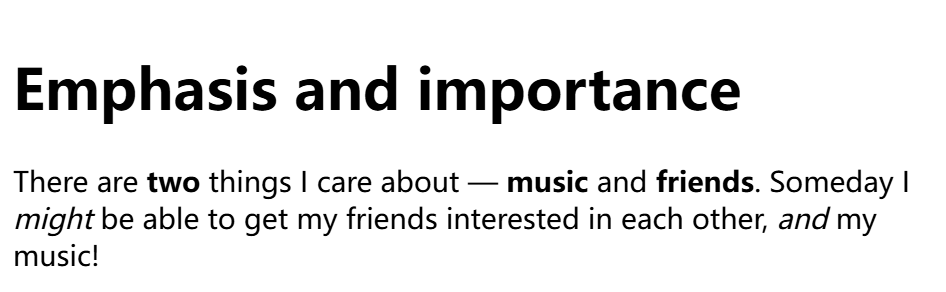

# A12. 元素的基础语法 格式元素

## 2.1 非空元素由标签和内容组成

<https://developer.mozilla.org/zh-CN/docs/Learn/Getting_started_with_the_web/HTML_basics#html_%E5%85%83%E7%B4%A0%E8%AF%A6%E8%A7%A3>

<v-click>


```html
<p>My cat is very grumpy</p>
```

</v-click>

<v-clicks depth="2">

1. <Term en="Opening tag">开始标签</Term>：包含元素名称，被大于号`>`、小于号`<`所包围，表示元素的<Mark highlight>开始</Mark>。（“起始密码子”）
2. <Term en="Closing tag">结束标签</Term>：与开始标签相似，只是其在元素名之前包含了一个斜杠`/`（slash），表示元素的<Mark highlight>结尾</Mark>。忘记包含结束标签可能会产生一些奇怪的结果。（“终止密码子”）
3. <Term en="Content">内容</Term>：元素的内容，一般就是文本本身。
4. <Term en="Element">元素</Term>：开始标签+结束标签+内容=非空元素。

</v-clicks>

## 2.1 练习：Hello, World!

```html
<p>Hello, world!</p>
```

在这段代码中，整段代码表示一个段落元素，`<p>`是元素的开始标签，`</p>`是元素的结束标签，`Hello, world!`是其内容。

<Term en="paragraph"><code>p</code></Term>，表示一个<Mark underline>段落</Mark>元素，默认<Mark underline>前后换行</Mark>。

> "Hello, world!"（你好，世界）是每门编程语言的入门程序，源自 *The C Programming Language* 教材，后被广泛使用。

## 2.2 空元素与非空元素的区别和意义

<https://developer.mozilla.org/zh-CN/docs/Learn/Getting_started_with_the_web/HTML_basics#%E7%A9%BA%E5%85%83%E7%B4%A0>

<v-clicks>

<Term en="Void element">空元素</Term>：<Mark underline>没有内容、没有闭合标签</Mark>的元素。例如：

```html
<br>
<hr>
```

</v-clicks>

<v-click>

<Term en="break"><code>&lt;br&gt;</code></Term>是空元素，表示<Mark underline>换行</Mark>。不过注意，多行文字推荐使用多个`<p>`元素自动换行，不需要`<br>`手动换行。

<Term en="horizontal rule"><code>&lt;hr&gt;</code></Term>也是空元素，表示<Mark>水平分隔线</Mark>。

其语法形式为 `<tag>`，即<Mark circle>单独一个元素名称</Mark>，前后用尖括号包围。

> 有时你可能会见到这样的写法：`<br />`，即在元素名称后面添加一个斜杠`/`，表示自闭合元素（self-closing element），这也是空元素的另一种说法。
>
> 这种语法是为了与XML兼容，HTML中也允许这样的写法，但这**已经过时了**。

</v-click>

<div></div>

## 2.2 空元素与非空元素的区别和意义

为什么要区分空元素和非空元素呢？

<v-clicks depth="2">

1. 大部分元素都有内容（且这一内容可以很长），因此需要开始标签和结束标签标记自己的内容“领地”，就如数学中的<Mark circle>括号</Mark>、生物中的密码子一样。
2. 少部分元素没有内容（换行符中还需要什么内容呢？），因此不需要开始标签和结束标签，为了<Mark underline>简洁性</Mark>，省略结束标签。

</v-clicks>

## 2.3 格式元素

<https://developer.mozilla.org/zh-CN/docs/Learn/HTML/Introduction_to_HTML/HTML_text_fundamentals>

<v-clicks>


> Word 里面能有的，我 HTML 也要做！

HTML 的全称为 HyperText Markup Language，**超文本**标记语言；Word 是由 RTF（Rich Text Format，**富文本**格式）发展而来的。因此，两者有许多功能上的相似之处。

在图中，我们关注被红色方框框起的功能，它们分别是：粗体、斜体、下划线、删除线、下标、上标。我们就以这六个功能为例，探究一下 HTML 里面的格式元素。

</v-clicks>

<v-clicks>

所有文本的格式都需要有一个起始点和一个终止点，因此 HTML 元素再合适不过了。

上述六种格式元素都是<Mark underline>非空</Mark>元素，都具有开始标签和结束标签，内容为直接显示的文本。表格见下一页。

还有一个高亮`<Mark>`元素，它可以<Mark highlight>突出显示</Mark>文本，默认为黄色背景。

> 在 HTML5 规范中，`<b>`、`<i>`元素被定性为：不适合表达强烈的重要性。
>
> 规范更推荐使用更语义化的元素，如`<strong>`、`<em>`等。
>
> 但这并不影响我们现在的使用，我们采用更加易学的前者。
>
> 若对此感兴趣，可以参考<https://developer.mozilla.org/zh-CN/docs/Learn/HTML/Introduction_to_HTML/HTML_text_fundamentals#%E5%BC%BA%E7%83%88%E7%9A%84%E9%87%8D%E8%A6%81%E6%80%A7>。

</v-clicks>

---

<v-clicks>

|  元素名称  |   英语全称    |  含义  |                                              示例                                              |
| :--------: | :-----------: | :----: | :--------------------------------------------------------------------------------------------: |
|   `<b>`    |     bold      |  粗体  | `<b>Warning</b>: Please change your password.`<br><b>Warning</b>: Please change your password. |
|   `<i>`    |    italic     |  斜体  |                        `<i>Up</i> is a film rather than a preposition.`<br><i>Up</i> is a film rather than a preposition.                       |
|   `<u>`    |   underline   | 下划线 |                       `<u>Recipe</u>: Spicy chicken with garlic sauce.`<br><u>Recipe</u>: Spicy chicken with garlic sauce.                       |
| `<del>` | delete | 删除线 |                          `The book's so <del>boring</del> profound!`<br>The book's so <del>boring</del> profound!                          |
|  `<sub>`   |   subscript   |  下标  |                                      `log<sub>2</sub>8 = 3`<br>log<sub>2</sub>8 = 3                                      |
|  `<sup>`   |  superscript  |  上标  |                                     `2<sup>10</sup> = 1024`<br>2<sup>10</sup> = 1024                                      |

</v-clicks>

---

## 2.3 练习：格式元素

格式元素可以进行叠加。其本质是元素的<Term en="Nesting">嵌套</Term>，我们将在本章中学到。

<v-click>

我们在此做一个示例：

```html
<p><b><i>Rough Notation</i></b> is a <u>small</u> JavaScript library
to create and animate annotations on a web page.</p>

<p><i>Rough Notation</i> uses <i>RoughJS</i> to create a <b>hand-drawn</b> look and feel.
Elements can be annotated in <b>a number of</b> different styles.
Animation duration and delay can be configured, or just <u>turned off</u>.</p>

<p>Rough Notation is <mark>3.8kb</mark> in size when gzipped, and the code is available on GitHub<sup>[1]</sup>.</p>

<p>[1]: https://github.com</p>
```

</v-click>

<v-click>

复制一下看看效果吧！

再按照自己的的喜好对上述代码进行修改，实现自己满意的效果。

</v-click>

**HTML中的换行其实都可以删掉**，而不会对浏览器识别产生任何影响。

在HTML中，换行符的作用是给人看的，而不是给浏览器看的。这一点与Python差异很大。

其中的原理就在于HTML语言<Mark highlight>对换行符不敏感</Mark>，只将换行符看作一个空格。

凡是涉及内容的元素，都有起始标签和结束标签包裹，其严谨性远超日常使用的语言。

## 知识回顾

本节介绍了 HTML 元素的基础语法、空元素与非空元素的区别和意义、格式元素的使用方法。

<v-clicks>

1. 非空元素由标签和内容组成，开始标签和结束标签包围元素内容，语法形如<Mark circle>`<tag>content</tag>`</Mark>。
2. 空元素没有内容，只有一个标签，语法形如<Mark circle>`<tag>`</Mark>，如`<br>`表示换行。
3. 格式元素是非空元素，用于设置文本的格式，可以叠加使用，如：
   - 粗体`<b>`/`<strong>`
   - 斜体`<i>`/`<em>`
   - 下划线`<u>`
   - 删除线`<del>`
   - 下标`<sub>`
   - 上标`<sup>`
   - 高亮`<mark>`

</v-clicks>

## 课堂练习

1. 请写出一段 HTML 代码，表示一个段落，内容为`Hello, world!`，要求`world`为粗体，`Hello`为斜体。
2. 请指出代码的错误：`Hello, <b>World<b>!`
3. 请对下列代码进行修改，实现效果图。
   ```html
   <h1>Emphasis and importance</h1>
   <p>There are two things I care about — music and friends.
   Someday I might be able to get my friends interested in each other, and my music!</p>
   ```

   
