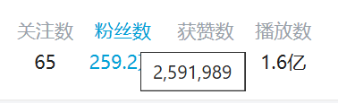
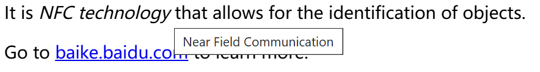

# A13. 元素的属性 超链接与图片元素

## 3.1 元素属性为元素添加额外的信息

<https://developer.mozilla.org/zh-CN/docs/Learn/HTML/Introduction_to_HTML/Getting_started#%E5%B1%9E%E6%80%A7>

之前我们学的元素只能将一个文档分为两部分：元素<mark>内</mark>、元素<mark>外</mark>。

```html
A <b>bold</b> element.
```

这样表示**格式元素**尚且够用，只需要知道哪里开始和结束就行了。

然而，HTML作为“超”文本，很重要的一部分是<u>“超”链接</u>。

超链接除了显示的文本，还有指向其他页面的链接。**文本**和**链接**的指向并不总是一样。

文本可以放到内容中，链接便需要一个单独的存储地——<mark>属性</mark>。属性可以附加到链接上，添加更多的信息。

## 3.2 元素属性的基本语法

因此，我们引出元素属性的基本语法：

```html
<a href="https://www.example.com">Example Domain</a>

```

在上面两个例子中：

- <Term en="anchor"><code>&lt;a&gt;</code></Term>元素表示超链接，是非空元素；
- <Term en="element"><code>&lt;img&gt;</code></Term>元素表示图片，是空元素。

我们得到了属性的基本语法：

```html
<tag name="value"></tag>
<tag name1="value1" name2="value2"></tag>
<tag name="value">
<tag name1="value1" name2="value2">
<tag name="value" />
<tag name1="value1" name2="value2" />
```

所有的<Term en="attribute">属性</Term>都<u>放置在开始标签中</u>。

每个属性为`name="value"`形式，属性名和属性值之间以<mark>等号</mark>分隔。

属性值需<mark>用引号包裹</mark>，以防其中的空格等特殊字符干扰解析。

多个属性间以<mark>空格</mark>分隔。若以自闭合标签形式，斜杠仍需紧贴`>`。

## 3.3 `title`属性为元素添加悬停提示

<https://developer.mozilla.org/zh-CN/docs/Web/HTML/Global_attributes/title>

我们经常为了界面的简洁，将冗长的内容简化为很短的文本。

但这会导致信息的损耗，因此有时我们允许用户<u><Term en="hover">悬停</Term></u>鼠标来查看完整内容。

B站就有这样的操作：



它在HTML中的实现也并不复杂（鼠标悬停在右侧方框内查看效果）：

```html
<span title="2,591,989">259.2w</span>
```

<span title="2,591,989" class="border px-2 border-gray-500">259.2w</span>

> `title`属于[全局属性](https://developer.mozilla.org/zh-CN/docs/Web/HTML/Global_attributes)，对每个元素都适用。属性值为鼠标悬停时弹出的提示文本。

## 3.3 练习：为元素添加`title`属性

请将下列元素各添加一个`title`属性。要求：将括号中的内容作为`title`的提示文本，被解释的元素用`<u>`标签。

```html
Python boasts an extensive standard library. (Python: A popular programming language)

RFID is a technology that allows for the identification of objects. (RFID: Radio-frequency identification)

The land area of India is approximately 3.3 million squared kilometers. (approximately 3.3 million: 3,287.3 kilo)
```

示例：

```html
<u title="A popular programming language">Python</u> boasts an extensive standard library.
```

效果：

<u title="A popular programming language">Python</u> boasts an extensive standard library.

<u title="Radio-frequency identification">RFID</u> is a technology that allows for the identification of objects.

The land area of India is <u title="3,287.3 kilo">approximately 3.3 million</u> squared kilometers.

## 3.4 超链接`a`元素的`href`和`target`属性

<https://developer.mozilla.org/zh-CN/docs/Web/HTML/Element/a>

**超链接<Term en="anchor"><code>&lt;a&gt;</code></Term>**，原义为“锚点”，是指向其他页面的链接。

它有两个常见的属性：

- <Term en="Hypertext Reference"><code>href</code></Term>：<u>指向的页面的URL</u>，<Term en="required"><b>必需</b></Term>。
- `target`：<u>在何处打开链接</u>，<Term en="optional">**可选**</Term>。主要有`_self`（当前窗口，**默认**值）、`_blank`（新窗口）。

例如：

```html
<a href="https://www.example.com">Example Domain</a>

Press <a href="https://www.bing.com" target="_blank">here</a> to search Bing in a new tab.
```

> 此处`href`<u>不能省略`https://` 或 `http://`</u> <Term en="protocol">协议</Term>名。平时我们作为用户使用浏览器时即使只输入<Term en="domain">域名</Term>（如`www.baidu.com`）时，浏览器会自动补全协议名；现在我们作为网页开发者，必须显式指定协议名。


## 3.4 练习：超链接元素

请修改下列代码，在适当位置添加超链接元素，且1、2在新窗口打开，3在当前窗口打开。

```html
For more information, see https://www.example.com

MDN Web Docs is a great resource for learning web development, whose URL is https://developer.mozilla.org

Press here to go to Baidu.
```

效果：

1. For more information, see <https://www.example.com>
2. <a href="https://developer.mozilla.org" target="_blank">MDN Web Docs</a> is a great resource for learning web development.
3. Press <a href="https://www.baidu.com" target="_self">here</a> to go to Baidu in a new tab.

## 3.5 图片`img`元素的`src`、`alt`和`width`属性

<https://developer.mozilla.org/zh-CN/docs/Web/HTML/Element/img>

图片<Term en="image"><code>img</code></Term>元素，是空元素（毕竟不太会在图片内加文字），表示插入图片。

它有三个常见的属性：

1. <Term en="source"><code>src</code></Term>：<u>图片的源URL</u>，**必需**，其他要求与`a`元素的`href`属性一致。
2. <Term en="alternative text"><code>alt</code></Term>：<u>图片的替代文本</u>，强烈建议添加。当图片无法显示时，显示替代文本。
3. `width`：图片的宽度，单位为<Term en="pixel">像素</Term>，**可选**。

示例：

```html


```


> 图片从 [Freepik](https://www.freepik.com/) 上选取。


## 3.5 练习：图片元素

请按照要求写出下列图片对应的HTML代码：

| 序号 | 图片源 | 代替文字 | 宽度 |
| :--: | :--: | :--: | :--: |
| 1 | https://static.hdslb.com/mobile/img/512.png | Bilibili Favicon | 128px |
| 2 | 域名：`i2.hdslb.com`<br>路径：`/bfs/face/8c8062b063092e72b49d4af4f55f4b61af48c151.jpg` | 3B1B Avatar | 默认 |
| 3 | 随意找一张图片 | 图片加载失败 | 自己设定 |


参考答案：

```html
1. 

2. 
```


我们现在所列举的，不过是<mark>常见</mark>的属性，事实上之后学的每一个元素都有多得多的属性可以设置。

这些不常用的属性，需要用的时候再查阅文档即可。

网页开发的文档一般都在[MDN Web Docs](https://developer.mozilla.org/zh-CN/docs/Web)上查询。

当然，其他教程和各博客平台的文章也有很多有用的信息。

## 知识回顾

1. 元素的属性可以为元素添加额外的信息，常见格式为<mark>`<tag name1="value1" name2="value2"></tag>`</mark>：
   - 属性均加在<mark>起始标签</mark>中；
   - 多个属性间以<mark>空格</mark>分隔；
   - 属性名和属性值之间以<mark>等号</mark>分隔；
   - 属性值需用<mark>双引号</mark>包裹。
2. <u><code>title</code></u>属性可以为几乎所有元素添加<u>悬停提示</u>。
3. <u><Term en="anchor"><code>&lt;a&gt;</code></Term>元素表示超链接</u>：
   - <u><code>href</code></u>属性表示指向的**页面的URL**，**必需**；
   - <u><code>target</code></u>属性表示在**何处打开链接**，**可选**，默认在当前窗口打开`_self`；也可选在新窗口打开`_blank`。
4. <u><Term en="image"><code>img</code></Term>元素表示图片</u>：
   - `src`属性表示图片的**源URL**，**必需**；
   - `alt`属性表示图片的**替代文本**，强烈建议添加；
   - `width`属性表示图片的**宽度**，单位为像素`px`。
5. <mark>所有URL都**不**能省略`https://` 或 `http://` 协议名。</mark>


## 课堂练习

1. 请写一个带有`title`属性的超链接，鼠标悬停时提示文本为“进入示例网站”，链接地址为`https://www.example.com`，链接文本为“示例网站”。
2. 请指出代码的两处错误：`<a href="www.baidu.com">进入百度`。
3. 请对以下代码进行修改，实现效果图：
   ```html
   It is NFC technology that allows for the identification of objects.
   Go to baike.baidu.com to learn more.
   ```

   
