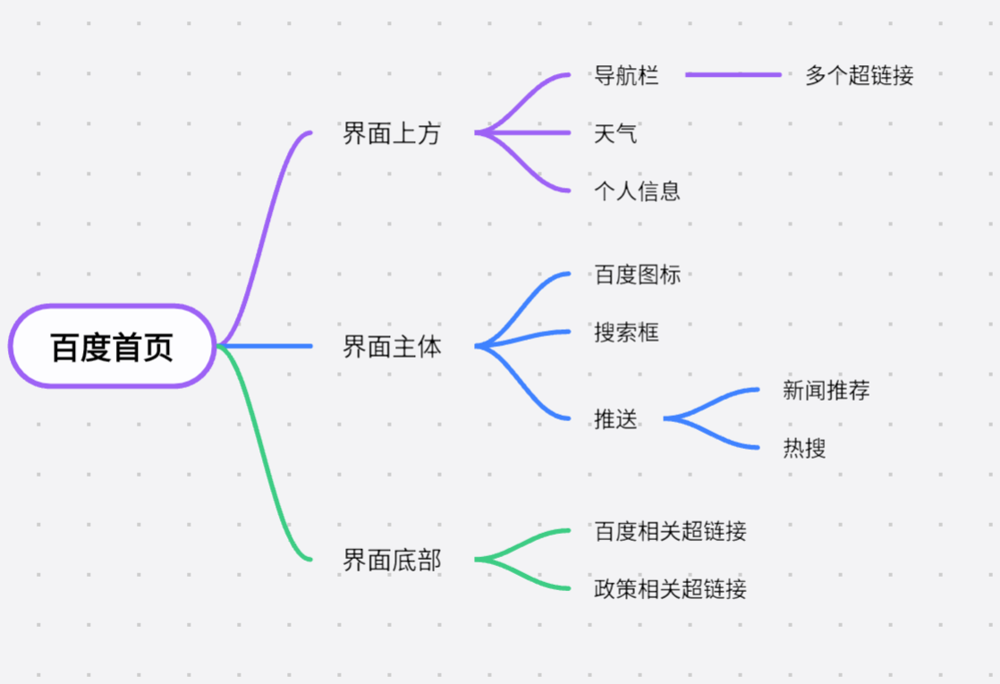

# A14. 元素的嵌套 调试

## 4.1 元素的内容可以包含其他元素

之前我们知道，对同一段文本可以应用多种样式，比如：

```html
<b><u>Bold & Underlined Text</u></b>
```

这本质上其实是`<b>`元素的**内容**中包含了`<u>`元素。

这表明，元素的内容不仅仅可以是文本，也可以包含其他元素，这被称为元素的**嵌套**（nesting）。

不仅如此，每一个元素可以包含多个子元素，也可以**同时**包含文本。例如：

```html
<p>This is a <b>bold</b> and <i>italic</i> text.</p>
```

本质上就是`p`元素中，依次包含了文本`This is a `、`b`元素`bold`、文本` and `、`i`元素`italic`、文本` text.`。

## 4.1 练习：嵌套元素

实现效果：
- 超链接，指向百度搜索页面`https://www.baidu.com/`，**打开新窗口**；
- 内容：\[百度图标\]百度一下，你就知道（百度图标：`https://www.baidu.com/favicon.ico`）。

进一步尝试：
- 文本内容能否加粗？

示例答案：

```html
<a href="https://www.baidu.com/" target="_blank">
  
  <b>百度一下，你就知道</b>
</a>
```

<a href="https://www.baidu.com/" target="_blank">
  
  <b>百度一下，你就知道</b>
</a>

## 4.2 元素嵌套形成树状结构

相信大家对思维导图的概念不陌生，它可以帮助我们更直观地理解元素的嵌套关系。

```html
<body>
    <header>
        <nav></nav>
        <div>19℃</div>
        <div>账号</div>
    </header>
    <main>
        
        <div>搜索框</div>
        <div>
            <div>新闻推送</div>
            <div>热搜</div>
        </div>
    </main>
    <footer>
        <a href="...">关于我们</a>
        <a href="...">备案</a>
    </footer>
</body>
```



## 4.2 元素嵌套形成树状结构

思维导图和HTML本质上都是<mark><Term en="tree">树</Term></mark>，每个节点可以有<Term en="child">子节点</Term>，也可以没有。

因此，进行网页设计的时候，我们一般<mark>自上而下</mark>，就像画思维导图一样梳理清楚元素的嵌套关系。

更加形式化地来说，<Term en="node">节点</Term>主要分为非空元素、空元素、文本，而非空元素可以继续包含其他节点。

以个人作品集项目为例：

```html
<div>
    <h1>个人作品集</h1>
    <p>[xxx]的作品集</p>
</div>
<div>
    <h2>作品1</h2>
    
    <p>作品1简介</p>
</div>
...
<div>
    <span>访问量</span>
    
</div>
```

## 4.3 `div`、`span`等常见无语义元素

除了我们之前学的`b`、`mark`、`a`、`img`等有特定含义的元素，还有一些常见的无语义元素。

它们不表示特定的含义，只是作为<mark>结构</mark>的占位。它们之间略有不同：

- <Term en="division"><code>div</code></Term>元素。默认<mark>独占一行</mark>，类似`p`元素。
- <Term en="span"><code>span</code></Term>元素。默认<mark>不独占一行</mark>，类似`a`元素。

这种是否独占一行的性质通常是符合直觉的，这种性质将元素分为两大类：

- <Term en="block-level element">块级元素</Term>：独占一行，默认宽度为父元素宽度，如`div`、`h1`、`p`等。
- <Term en="inline element">行内元素</Term>：又称行内元素，不独占一行，默认宽度为内容宽度，如`span`、`a`、`img`等。

现在，你可以解释一下刚才的个人作品集模板是什么了。

## 4.4 元素嵌套遵守一定的规则

更具体地说，HTML非空元素分为以下几类（此处已进行简化以便于理解）：

- 普通块级元素：如`div`、`body`等，它们默认<mark>独占一行</mark>，可以嵌套<mark>任意元素</mark>。
- 终端块级元素：如`p`、`h1`等，它们默认<mark>独占一行</mark>，但<mark>不能嵌套块级元素</mark>。
- 普通行内元素：如`span`、`a`等，它们默认<mark>不独占一行</mark>，只能嵌套<mark>行内元素</mark>。
- 透明元素：如`b`、`i`等，它们默认<mark>不独占一行</mark>，但可以嵌套<mark>任意元素</mark>，将其去除不影响结构的完整性。

空元素不能嵌套任何元素。

<mark>错误</mark>示例：

```html
<p>
    <div>Text</div>
</p>
```

我们稍后可以通过调试查看浏览器将其解析的结果。

## 4.5 使用Emmet加速HTML代码的编写

Emmet是一款**HTML代码编写的插件**，可以帮助我们更快速地编写HTML代码。

其基础来源于HTML代码的**冗余性**，学会Emmet可以提高我们的HTML代码编写效率。

其基本使用方式为：输入缩写代码，然后<mark>按<kbd>Tab</kbd>键</mark>。

作为工具，此处不多讲，此处放几个示例自行领悟，感兴趣的同学可以自行搜索。

| 缩写代码 | 效果 |
| :---: | :---: |
| `div` | `<div></div>` |
| `span[title="tooltip"]` | `<span title="tooltip"></span>` |
| `div*3` | `<div></div><div></div><div></div>` |
| `div>a+img` | `<div><a></a></div>` |

## 4.6 使用`F12`开发者工具进行调试

在编写HTML代码的时候，我们可能会遇到错误；我们有时也希望学习优秀的网站代码。

这时，我们就需要使用浏览器的<mark><Term en="developer tools">开发者工具</Term></mark>进行调试。

开发者工具的打开方式是按下<kbd>F12</kbd>。第一次可能遇到的问题有：

- 没有任何反应：检查`FnLock`是否开启，可能按到了功能键（如：打开计算器）。
- 右上角弹出提示窗口：点击确认即可。

然后，浏览器窗口的右侧就会出现开发者工具的窗口。

在上方导航栏中点击“<Term en="elements">元素</Term>”，即可查看和HTML相关的一切。

有些元素左端会有一个小箭头，点击它可以展开该元素的子元素。

或者你也可以用左上角的图标，单击**一次**使其成为蓝色，在左侧窗口选择元素，就会自动展开到这一层。

若想要取消选择，**再单击**即可恢复为灰色。

双击属性可以**修改**属性，双击内容可以修改内容。

## 4.6 练习：使用`F12`开发者工具调试HTML代码

- 进入百度百科。
- 随意选择一个内容更改其文本。
- 随意选择一个超链接更改其链接指向。
- 随意选择一个图片更改其源URL，如改为`https://profile-counter.glitch.me/[any-text]/count.svg`。
- 思考：网页截图可信吗？

## 浏览器解析原理

HTML代码是如何被浏览器解析的？

浏览器先阅读代码，进行词法分析，确认HTML符合基本语法，并将其分割为一个个有意义的<Term en="token">标记</Term>。

浏览器再逐个阅读这些标记，遇到起始标签时，创建一个元素，将其加入父元素的子元素列表中，并以它为接受文本的活跃元素。

遇到结束标签时，元素完成，将活跃元素控制权转交给父元素。

当遇到`p`嵌套`div`等不合法的结构时，浏览器会启动修复机制，尝试修复错误。但这种修复结果常常是不可预测的，比如`<p><div></div></p>`会被修复为`<p></p><div></div><p></p>`。

## 知识回顾

1. 元素的内部既可以是文本，也可以是其他元素，层层嵌套形成**树状结构**。
2. `div`、`span`等常见**无语义元素**，不表示特定的含义，只是作为结构的占位。
3. 元素嵌套遵守一定的**规则**：
   - 普通块级元素（`div`、`body`等）：独占一行，可以嵌套任意元素。
   - 终端块级元素（`p`、`h1`等）：独占一行，不能嵌套块级元素。
   - 普通行内元素（`span`、`a`等）：不独占一行，只能嵌套行内元素。
   - 透明元素（`b`、`i`等）：不独占一行，可以嵌套任意元素。
4. 使用Emmet可以加速HTML代码的编写，使用方式为缩写+<kbd>Tab</kbd>。
5. 使用`F12`开发者工具可以调试HTML代码，查看元素的结构、属性、内容等。

## 课堂练习

1. 请说说`p`、`span`、`div`、`b`元素中，哪些元素可以嵌套自身？哪些对元素可以互相嵌套？
2. 试一试，`div>span*3+b`展开的HTML代码是什么？
3. 请纠正代码中的错误：`<p><b><div></div></p></b>`。
4. 完成效果：实现一个点击可跳转的图片，图片URL为`https://profile-counter.glitch.me/[any-text]/count.svg`，跳转的URL与图片URL相同。
5. 尝试完善个人作品集。
