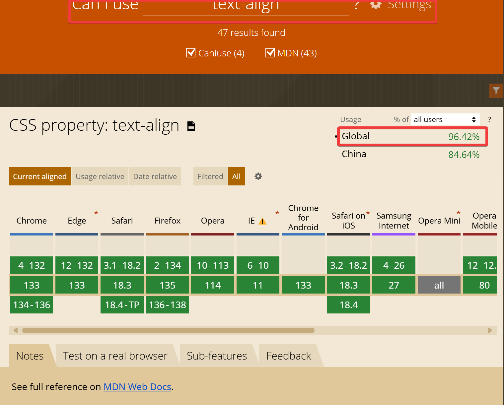

# A25. CSS 常用属性 兼容性

## 🌟 5.1. 元素显示属性 display

> 为什么导航栏的选项能横着排列？还记得我们用 `<div>` 和 `<span>` 时的困惑吗？通过 `display` 属性，我们可以让元素“变身”！

### 5.1.1. 改变元素渲染特性

`display` 的属性值可以有：

- `none` 隐藏元素，不显示，且不占位。
- `inline` 行内元素，不支持宽高设定，遵循行内布局（默认不换行）。
- `block` 块级元素，支持宽高设定，遵循块级布局（默认独占一行）。
- `inline-block` 行内块级元素，支持宽高设定，遵循行内布局（默认独占一行）。

总结为下表：

|   `display`    | 默认独占一行 | 宽高设定 |
| :------------: | :----------: | :------: |
|    `inline`    |      ❌       |    ❌     |
| `inline-block` |      ❌       |    ✔️     |
|    `block`     |      ✔️       |    ✔️     |

示例效果如下：

:::code-group

```css
.menu-item {
  display: inline-block; /* 把块级元素显示为行内块 */
  width: 80px;
}
```

```html
<div>
  <div class="menu-item">首页</div>
  <div class="menu-item">关于</div>
  <div class="menu-item">联系我们</div>
</div>
```

:::

### 5.1.2. 隐藏元素

`display: none;` 将元素完全隐藏，不保留元素在布局流中的位置；而 `visibility: hidden;` 则保留。

将下列两种 CSS 分别尝试，查看效果：

:::code-group
```css
/* 1. 不占位隐藏（更常用） */
.hidden {
  display: none;
}

/* 2. 占位隐藏 */
.hidden {
  visibility: hidden;
}
```

```html
<div>
  <div class="hidden">加入 CSS 以隐藏此元素</div>
  <div>这是一段文本。</div>
</div>
```
:::

:::tip

行内元素（如 `<span>`）直接设置 `width/height` 属性无效，需先改为 `inline-block`。

:::

## 🌟 5.2. 文本对齐属性 text-align

> 如果所有的网页文本都默认左对齐的话，未免有些过于单调。别担心，`text-align` 祝你一臂之力！

属性值：

- `left` 左对齐（**默认设置**）；
- **`center` 居中对齐**（若特别设置该属性，一般都是居中对齐）；
- `right` 右对齐。

:::code-group

```css
.container {
  width: 200px;
  background-color: green;
  text-align: center; /* 容器内文本居中 */
  /* margin: 0 auto; */ /* 容器本身居中 */
}
```

```html
<div class="container">
  <div>这是一段内部文本。</div>
</div>
```

:::

:::tip
该种属性只能控制文本的**水平位置**，若要控制竖直位置，推荐使用 [B33.3. flex 布局](../B3/B33.md)。

若要控制块级元素本身的水平位置而非其中的内容，需使用 `margin: 0 auto;`。
:::

:::warning

在**行内元素**上直接使用 `text-align` **无效**，必须作用于其父级块元素。

:::

## ⭐ 5.3. 字体家族属性 font-family

> 为什么我在自己电脑显示好看的字体，在别人电脑就变丑了？系统字体差异怎么办？

代码示例：

:::code-group

```css
div {
  font-size: 2rem;
  font-family: Georgia, "楷体", sans-serif; /* 尝试上网搜索常见字体名，进行修改。 */
}
```

```html
<div>中文 / Chinese</div>
```

:::


如图所示，设置 `font-family` 后中英文字体可以不同。

**语法**：

1. 可以设置**多个字体**作为**回退方案**。如果**没有**第一个字体（或者字体**不支持**对应文本，如英文字体不支持中文）就用第二个，第二个没有就用第三个……（比 Word 只能设置一个字体贴心多了）。
2. 多个字体间用**英文逗号**分隔，从前到后优先级逐级递减。
3. **最后**必须指定**通用字体**族（`serif`/`sans-serif` 等），以保证每个电脑都可以正常渲染界面。
4. 含**空格**的字体名需要加**引号**，含中文的字体也建议加引号。

:::warning

不设置通用字体族会导致某些系统无匹配字体时使用默认字体。

:::

## 🌟 5.4. 溢出处理属性 overflow

> 当文字太多撑破容器怎么办？图片太大破坏布局怎么办？`overflow` 属性就像给容器装了个“安全阀”！

子属性：

- `overflow-x` 水平溢出
- `overflow-y` 垂直溢出

若统一设置 `overflow` 属性，则会同时处理两个方向的情况。

属性值：

- `visible`（默认，溢出部分照常显示）
- `hidden`（**常用**，溢出部分全部隐藏）
- `scroll`（强制出现滚动条，较少用）
- `auto`（**常用**，当未溢出时不出现滚动条，溢出时对应方向出现滚动条）

尝试修改下面的 `overflow` 属性值：

:::code-group

```css
.article {
  width: 200px;
  height: 100px;
  overflow: auto; /* 自动出现滚动条 */
}

p {
  font-size: 3rem;
}
```

```html
<div class="article">
  <p>Long long long long long text</p>
</div>
```

:::


:::warning

该属性常与**固定宽高**配合使用，以阻止内部元素“撑大”容器的默认行为。忘记设置容器尺寸时，`overflow` 可能不生效。

:::

## ⭐ 5.5. 圆角边框属性 border-radius

> "如何让头像变圆形？如何做圆角按钮？" 这个属性能让你告别直角审美疲劳！

`border-radius` **一般只使用单值**，表示四角**圆角的半径**。值既可以是 `<percentage>`，也可以是 `<length>`。可以想到，如果元素为正方形，圆角半径为 `50%` 的宽/高，那么整个元素就变成了圆形。

:::code-group

```css
.circle {
  width: 32px;
  height: 32px;
  text-align: center;
  background-color: khaki;
  border-radius: 50%;  /* 圆形 */
}

.button {
  width: 8rem;
  text-align: center;
  border-radius: 8px 4px; /* 左上右下8px，右上左下4px，不太常见 */
  background-color: violet;
}

/* 高级用法，不常见 */
.fancy-shape {
  width: 150px;
  height: 150px;
  text-align: center;
  border-radius: 10px 20px 30px 40px / 50px 60px 70px 80px;
  background-color: green;
}
```

```html
<div>
  <div class="circle">圆形</div>
  <div class="button">高级圆角按钮</div>
  <div class="fancy-shape">高级圆角形状</div>
</div>
```

:::

## 5.6. CSS 兼容性问题及查询方法

> "为什么我的样式在 Chrome 正常，到其他浏览器就乱套了？" 浏览器兼容性是一个棘手的历史遗留问题，在产品发布时需要谨慎对待。

这个方法兼容性好不好？**Can I Use** it?

—— 使用 <https://caniuse.com> 查询属性支持情况。



一般来说，如果没有特别高的要求，对应的属性兼容度（右上角的数字）达到 90% 以上即可。

尝试在 Can I Use 搜索框中输入 `overflow: hidden` 试试看吧！

::: info

由于众多国内浏览器（如百度、QQ 浏览器等）兼容状况未知，但兼容大部分属性，所以实际的兼容率应该更高。

:::


## 知识回顾

1. `display` 控制元素显示类型：
   - `none` 不显示
   - `block` / `inline-block` / `inline`
2. `text-align` 作用于文本容器内部 `left` / `center` / `right`，居中元素本身需用 `margin: 0 auto;`
3. `font-family` 需要设置回退字体和通用字体族。字体间用逗号隔开，字体有空格时外层要添加引号
4. `overflow` 处理内容溢出，常配合固定尺寸使用
   - `hidden` 隐藏溢出
   - `scroll` 强制显示滚动条
   - `auto` 根据内容智能显示滚动条
   - `visible` 默认显示
5. `border-radius`可用百分比创建圆形
6. 使用 Can I Use 查询兼容性

## 课后练习

1. （单选）想让`<span>`元素设置宽度生效，需要：

   - A. 直接写`width`
   - B. 添加 `display: inline-block;`
   - C. 添加 `overflow: hidden;`

2. （填空）实现块级元素本身水平居中的代码是：_____
3. 纠错：
   ```css
   /* 期望：段落右对齐 */
   p {
     align: right;
   }
   ```
4. （单选）font-family正确写法是：
   - A. `font-family: "楷体";`
   - B. `font-family: "Microsoft YaHei" serif;`
   - C. `font-family: "华文行楷", SimSun;`
   - D. `font-family: Arial, sans-serif;`

:::details 参考答案
1. `B`
2. `margin: 0 auto;` （备注：0 是可以改成其他长度的，此处只是用作占位）
3. `text-align: right;`
4. `D`（`AC` 没有设置通用字体族；`B` 没有加逗号）
:::
