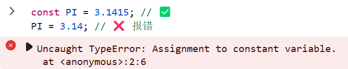

# A31. 语句 数据类型

## 1.1. 🌟 运行 JavaScript

> 完成了 HTML 和 CSS 的入门后，让我们步入 JavaScript 的世界。这是一个真正意义上的编程语言，和 Python 等语言类似。同样地，作为**脚本语言**，其语法比 C++/Java 等更加简单。

脚本语言依靠**解释**（interpretation）的方式执行代码。这需要一个解释器，它负责将抽象代码实时转化为底层指令执行。因此，JavaScript 的内存管理由解释器自动处理，开发者无需手动分配或释放内存，降低了编程复杂度。

::: warning

本节含有巨量内容，若读者无法一下子接受可以先略读 1.4，但是要留意课后练习，其中反映本节内容的应用方法。

本节内容在读者进阶之前，都可以常看常新。

:::

### 1.1.1. 🌟 在控制台调试


打开控制台，**可直接输入代码并查看结果**。其步骤如下：

1. <kbd>F12</kbd> 或右键+检查打开控制台。
2. 在上方菜单栏选中 `Console`（控制台）
3. 将焦点移至控制台底部的文本输入。

将这两段代码**分别输入**控制台中，查看效果：

```javascript
console.log("Hello World!");
console.log(2 + 3);
2 + 3
```

::: tip
控制台是调试代码的“即时反馈工具”，建议每节课都尝试用它验证代码逻辑。
:::

### 1.1.2. 🌟 引入 JavaScript 文件

在 HTML 文件中通过 `<script>` 标签引入外部 JS 文件：

```html
<!-- 在 HTML 的 <body> 或 <head> 中 -->
<script src="./index.js"></script>
```

确保 JS 文件路径正确，且文件内容如：

```javascript
console.log("外部文件已加载");
```

此时，应能在控制台中看到消息。

### 1.1.3. 🌟 注释

在代码中，我们需要对代码进行阐释，它们不需要被运行。JavaScript **使用 `//` 表示注释，本行在此之后的内容都不会运行**。

此外，还有一种语法：`/* 注释内容 */`。这种注释可以跨越多行。

### 1.1.4. ⭐ 分号规范

在 JavaScript 中，语句之间可以用英文分号 `;` 分隔，也就是行末加上一个分号。当然，单纯的换行也可以分隔不同的语句，所以你可以看到具有分号和不具有分号的写法同时出现。为了避免歧义，本教程建议使用分号。

## 1.2. 🌟 变量定义语句

> 编程的基础是数据和指令，而存储数据的容器便是变量。变量声明、赋值和引用的简单赋予了编程解决实际问题的工程特性。

### 1.2.1. 🌟 变量名规则

与 Python 对比：

- 相同点：
  1. **区分大小写**，**不能以数字开头**。
  2. **不能**是**保留字**（如 `var`, `let`）。
  3. 允许使用大小写字母、数字、下划线的任意组合。
- 不同点：
  - JavaScript 还允许变量任意位置出现 `$` (如 `$`、`$root`、`a$`)，注意该符号一般只在大型模块（如 jQuery）中使用。

```javascript
// 有效变量名
let myName = "Alice";
let _age = 20;

// 无效变量名
var class = "10A"; // "class" 是保留字
let 1stPlace; // 以数字开头
```

### 1.2.2. ⭐ 变量名命名规范

“规则”是强制的，而“规范”是建议的。变量命名规范有助于代码可读性。

**变量的名字应当能表示充分的含义**，因此常需要不只一个单词。对于**多单词变量**的命名，一般遵循以下两种方法：

- **驼峰命名法**：`myVariableName`（**在 JavaScript 中推荐**）
- **下划线命名法**：`my_variable_name`（在 Python 中常用）

```javascript
let userName = "Alice"; // ⭐ 驼峰命名法
let user_name = "Bob"; // 下划线命名法
```

驼峰命名法规则：将除了第一个单词以外的单词首字母大写，去除空格。

而对于**多单词常量**来说，一般采用**全部大写字母**，单词间用**下划线分隔**：

```javascript
const MAX_LENGTH = 100; // ⭐ 常量命名法
```

::: tip
变量命名时，尽量选择能表达其含义的名称。避免使用 `a`、`b` 等字母作为变量名。
:::

### 1.2.3. 🌟 var 声明

使用 关键词 `var` 声明变量（variable）：

```javascript
var foo = 5; // 声明并赋值
console.log(foo); // 输出 5
foo = 10; // 可重新赋值
```

这是一个历史遗留问题，JavaScript 最初只能通过 `var` 声明变量，但它可能导致意外的变量覆盖，**不推荐使用**。

::: info

这里我们使用了 `foo` 作为变量名，它是一个常见的占位符变量名，表示“任意变量”。

`foo` 和 `bar` 是编程界的传统命名习惯，常用于**示例代码中**。它们没有实际意义，仅作为占位符。在实际开发过程中不应使用。

```javascript
let foo = 5; // foo 代表一个变量
let bar = 10; // bar 代表另一个变量
```

:::

### 1.2.4. 🌟 let 和 const 声明

ES6（2015 年发布的新规范）新特性：

- **`let`**：声明**可变变量**：
  ```javascript
  let count = 0;
  count = 1; // 允许修改
  ```
- **`const`**：声明**常量**（constant，不可重新赋值）：
  ```javascript
  const PI = 3.1415; // ✅
  PI = 3.14; // ❌ 报错
  ```
  

::: warning
与 Python 的不同：JavaScript 要求**显式声明**变量（如 `let x = 5;`），而 Python 直接写 `x=5` 即可。
:::

::: info

如果你尝试直接写 `x = 5`，那么实际上也可以运行。但是**并不推荐这样使用**，因为它会创建一个全局变量，从而导致作用域污染。在学完函数之后，你也许会有更深刻的体会。

:::

## 1.3. 🌟 变量的使用与赋值

> 变量是存储数据的容器，赋值是将数据存入变量的过程。理解变量的使用与赋值是编程的基础。

### 1.3.1. 🌟 声明与赋值

::: tip
为理解下列代码，建议先阅读 [1.5.1. console.log 打印日志](#151-console-log)
:::

在 JavaScript 中，变量声明后可以通过赋值操作存储数据：

```javascript
let a = 5; // 声明变量 a，并赋值为 5
console.log(a); // 输出 5
```

变量的值可以随时修改：

```javascript
a = 10; // 修改变量 a 的值
console.log(a); // 输出 10
```

### 1.3.2. 🌟 变量之间的赋值

变量之间的赋值是将一个变量的值复制到另一个变量中：

```javascript
let a = 5; // 声明变量 a，并赋值为 5
let b = a; // 将 a 的值赋给 b
console.log(b); // 输出 5
```

注意：**基础类型变量之间的赋值是值的复制，仅限于一行**，修改一个变量**不会影响**另一个变量：

```javascript
let c = 1;
b = c; // 将 c 的值赋给 b
console.log(b); // 输出 1
c = 2;
console.log(b); // 输出 1（不受影响）
console.log(c); // 输出 2
```

### 1.3.3. ⭐ 变量的作用域

变量的作用域决定了它的可访问范围。稍后我们会详细学习作用域的概念，但目前可以简单理解为：在同一个**代码块**（code block）中声明的变量可以互相访问。

::: info
目前可以简单理解为，一对“大括号”内的代码处于同一代码块中。此后学到的 if、for、函数定义都是代码块。
:::

```javascript
{
  let x = 20; // 在代码块中声明变量 x
  console.log(x); // 输出 20
}
console.log(x); // ❌ 报错：x 在代码块外不可访问
```

::: tip
变量的值可以是任何数据类型（如数字、字符串、布尔值等）。在后续章节中，我们将学习如何使用变量存储和操作不同类型的数据。
:::

## 1.4. 🌟 基础数据类型

> JavaScript 的数据类型分为两大类：基础数据类型和引用数据类型。基础数据类型包括数字、字符串、布尔值、`undefined` 和 `null`。它们比较简单，我们先进行学习。

### 1.4.1. 🌟 数字（Number）

JavaScript 中的数字字面量写法包括以下几种：

| 字面量写法      | 示例值                  | 描述                                                |
| --------------- | ----------------------- | --------------------------------------------------- |
| **整数**        | `1`, `42`, `-7`         | 表示正整数、负整数或零的。                          |
| **小数**        | `3.14`, `-0.01`         | 表示小数。                                          |
| **科学计数法**  | `1e7`（表示一千万）     | 使用指数形式表示的数字，`aeb` 表示 `a*10^b`，下同。 |
| **科学计数法**  | `2.5e-3`（表示 0.0025） | 负指数表示小数值。                                  |
| **`Infinity`**  | `1 / 0`                 | 表示正无穷大，通常由超出最大值的运算产生。          |
| **`-Infinity`** | `-1 / 0`                | 表示负无穷大，符号与正无穷大相反。                  |
| **`NaN`**       | `"abc" * 2`             | 表示非数字，由非法的数学运算产生。                  |
| **`NaN`**       | `0 / 0`, `0 * Infinity` | 未定式等非法运算结果。                              |

但是如果你有所了解，这些数字类型最终**存储**的时候并无不同，使用时也完全相同。它们都是 **64-bit 浮点数**。

同时，这可能导致小数运算出现精度问题：

```javascript
console.log(0.1 + 0.2); // 输出 0.30000000000000004
console.log(0.1 * 0.2); // 输出 0.020000000000000004
```

也可能导致整数运算出现精度问题：

```javascript
let a = 1e16 + 1;
console.log(a); // 10000000000000000
```

解决方法：可以使用 `toFixed` 方法限制小数位数：

```javascript
let result = (0.1 + 0.2).toFixed(2); // "0.30"
console.log(result); // 0.3
```

整数过大（超过 `Number.MAX_SAFE_INTEGER`） 时精度损失无法避免，除非使用 `bigint`，有兴趣的读者可以拓展了解。

### 1.4.2. 🌟 字符串（String）

字符串是由一组字符组成的数据类型，必须用引号包裹。可以使用以下三种引号：

- 单引号 `'`：`'Hello'`
- 双引号 `"`：`"World"`
- 反引号 `` ` ``：用于模板字符串（支持插值表达式，本节末会学到）。

**示例**：

```javascript
let name = "Alice"; // 使用双引号
let greeting = 'Hello'; // 使用单引号
let message = `Hi, ${name}!`; // 使用模板字符串
console.log(message); // 输出 "Hi, Alice!"
```

**转义字符**：

在 JavaScript 字符串中，某些特殊字符需要通过反斜杠 `\` 进行转义，以便正确表示它们的含义，补全语言完备性。以下是一些常见的转义字符及其用途：

| 转义字符 | 描述             | 示例代码               | 输出结果           |
| -------- | ---------------- | ---------------------- | ------------------ |
| `\'`     | 单引号           | `'It\'s a sunny day'`  | `It's a sunny day` |
| `\"`     | 双引号           | `"She said, \"Hi!\""`  | `She said, "Hi!"`  |
| `\\`     | 反斜杠           | `"C:\\path\\to\\file"` | `C:\path\to\file`  |
| `\n`     | 换行符（新行）   | `"Hello\nWorld"`       | `Hello`<br>`World` |
| `\t`     | 制表符（Tab 键） | `"Name:\tAlice"`       | `Name:    Alice`   |

转义字符通常用于处理包含特殊符号的字符串，避免语法错误。

**字符串运算与方法**：

::: tip
以下涉及“索引”的，和 Python 相同，均从 **0** 开始。
:::

```javascript
let text = "Hello world";
let text2 = "it's good"
```

| 方法             | 示例代码                            | 示例结果                  | 描述                                                             |
| ---------------- | ----------------------------------- | ------------------------- | ---------------------------------------------------------------- |
| **获取长度**     | `text.length`                       | `11`                      | 返回字符串的字符数（包括空格）。                                 |
| **访问字符**     | `text[0]`                           | `"H"`                     | 使用索引访问字符串中的某个字符（从 0 开始计数）。                |
| **访问字符**     | `text.charAt(1)`                    | `"e"`                     | 使用 `charAt()` 方法访问字符串中的某个字符（更安全，推荐使用）。 |
| **查找子串位置** | `text.indexOf("l")`                 | `2`                       | 返回子串首次出现的索引，若未找到则返回 `-1`。                    |
| **查找子串位置** | `text.lastIndexOf("l")`             | `9`                       | 返回子串最后一次出现的索引，若未找到则返回 `-1`。                |
| **截取子串**     | `text.slice(1, 4)`                  | `"ell"`                   | 提取索引在指定范围内（**左闭右开**）的子串。                     |
| **替换子串**     | `text.replace("H", "h")`            | `"hello world"`           | 替换字符串中的某部分，返回新字符串（原字符串不变）。             |
| **转换为小写**   | `text.toLowerCase()`                | `"hello world"`           | 将字符串转换为小写形式。                                         |
| **转换为大写**   | `text.toUpperCase()`                | `"HELLO WORLD"`           | 将字符串转换为大写形式。                                         |
| **去除空白字符** | `(text + "\n").trim()`              | `"Hello world"`           | 去除字符串两端的空白字符（包括空格、制表符等）。                 |
| **分割字符串**   | `text.split(" ")`                   | `["Hello", "world"]`      | 根据指定分隔符将字符串分割为数组。                               |
| **字符串拼接**   | `text + " " + text2`                | `"Hello world it's good"` | 将两个字符串连接在一起，中间用空格分隔。                         |
| **模板字符串**   | <code>\`$\{text} $\{text2}\`</code> | `"Hello world it's good"` | 使用模板字符串连接两个字符串，支持插值表达式，更加简洁。         |

### 1.4.3. 🌟 布尔值（Boolean）

布尔值表示逻辑上的“真”或“假”，只有两个值：

- `true`：表示真
- `false`：表示假

**示例**：

```javascript
let isStudent = true;
let isTeacher = false;

console.log(isStudent); // true
console.log(isTeacher); // false
console.log(3.1415 * 3.1415 < 10); // true
```

布尔值常用于条件判断：
```javascript
if (isStudent) {
  console.log("你是学生");
} else {
  console.log("你不是学生");
}
```

### 1.4.4. 🌟 `undefined` 和 `null`

- **`undefined`**：表示变量已声明但未赋值。
  ```javascript
  let x;
  console.log(x); // undefined
  ```

- **`null`**：表示变量被显式赋值为空。
  ```javascript
  let y = null;
  console.log(y); // null
  ```

**区别**：

- `undefined` 是 JavaScript 自动赋予未初始化变量的值。
- `null` 是开发者主动赋予变量的值，表示“空”或“无”。

### 1.4.5. ⭐ 获取数据类型

使用 `typeof` 运算符可以获取变量的数据类型：

```javascript
console.log(typeof 5); // "number"
console.log(typeof "text"); // "string"
console.log(typeof true); // "boolean"
console.log(typeof undefined); // "undefined"
console.log(typeof null); // "object"（这是一个历史遗留问题）
```

### 1.4.6. 🌟 类型转换

**显式转换**：

通过内置函数将数据从一种类型转换为另一种类型：

以下是用简短表格呈现的代码内容，并补充了更多方法及备注：

| 方法             | 示例代码                | 示例结果 | 描述与备注                                                                                          |
| ---------------- | ----------------------- | -------- | --------------------------------------------------------------------------------------------------- |
| **Number()**     | `Number("123")`         | `123`    | 将字符串 `"123"` 转换为数字。**非数字字符串会返回 `NaN`**。                                         |
| **String()**     | `String(456)`           | `"456"`  | 将数字 `456` 转换为字符串。                                                                         |
| **Boolean()**    | `Boolean(0)`            | `false`  | 将值转换为**布尔值**。`0`、`null`、`undefined`、`NaN`、`""` 转换为 `false`，其余大多转换为 `true`。 |
| **parseInt()**   | `parseInt("2023px")`    | `2023`   | 提取字符串**开头的整数部分**，忽略后续非数字字符。                                                  |
| **parseFloat()** | `parseFloat("3.14abc")` | `3.14`   | 提取字符串**开头的浮点数部分**，忽略后续非数字字符。                                                |
| **toString()**   | `(123).toString()`      | `"123"`  | 将数字或布尔值转换为字符串。                                                                        |
| **toFixed()**    | `(3.1415).toFixed(2)`   | `"3.14"` | 将数字格式化为指定小数位数的字符串，四舍五入。                                                      |

::: info

严谨来说，`toFixed()` 并非严格的四舍五入，而是“四舍六入五成双”的算法，以避免 `0.5` 持续向上舍入造成的误差。在涉及敏感数据时不应使用此方法，而日常呈现不需要规避这个问题。

:::

**隐式转换**：

JavaScript 会在某些情况下自动进行类型转换：
```javascript
console.log("3" + 2); // "32"（字符串拼接）
console.log(3 * "2"); // 6（字符串转数字）
console.log(1 + true); // 2（布尔值转数字）
```

### 1.4.7. 🌟 基础运算

JavaScript 支持常见的数学运算：

- 加法：`+`
- 减法：`-`
- 乘法：`*`
- 除法：`/`
- 模运算：`%`（取余数）

**示例**：

```javascript
console.log(5 + 3); // 8
console.log(10 - 4); // 6
console.log(2 * 3); // 6
console.log(10 / 2); // 5
console.log(10 % 3); // 1
```

**常见陷阱**：

- **字符串拼接**：
  ```javascript
  console.log("3" + 2); // "32"
  ```

  ::: warning
  若加法两端混进了一个字符串，则字符串会被拼接，而不是进行数学运算，可能导致难以排查的错误。在进行加法时，必须保证两端类型一致。
  :::

- **`NaN` 运算的传染性**：
  ```javascript
  console.log(NaN + 5); // NaN
  console.log(NaN * 2); // NaN
  ```

### 1.4.8. 🌟 比较运算

JavaScript 提供了多种比较运算符，用于判断两个值之间的关系。这些运算符返回布尔值 `true` 或 `false`。

**常用比较运算符**：

| 运算符         | 示例代码    | 示例结果 | 描述                                     |
| -------------- | ----------- | -------- | ---------------------------------------- |
| **等于**       | `5 == "5"`  | `true`   | 检查值是否相等（允许类型转换）。         |
| **严格等于**   | `5 === "5"` | `false`  | 检查值和类型是否都相等（**推荐使用**）。 |
| **不等于**     | `5 != "5"`  | `false`  | 检查值是否不相等（允许类型转换）。       |
| **严格不等于** | `5 !== "5"` | `true`   | 检查值或类型是否不相等（**推荐使用**）。 |
| **大于**       | `10 > 5`    | `true`   | 检查左侧值是否大于右侧值。               |
| **小于**       | `3 < 5`     | `true`   | 检查左侧值是否小于右侧值。               |
| **大于等于**   | `10 >= 10`  | `true`   | 检查左侧值是否大于或等于右侧值。         |
| **小于等于**   | `5 <= 6`    | `true`   | 检查左侧值是否小于或等于右侧值。         |

**常见陷阱**：

- **隐式类型转换**：
  ```javascript
  console.log(5 == "5"); // true（字符串 "5" 被转换为数字 5）
  console.log(5 === "5"); // false（类型不同）
  ```

  ::: warning
  使用 `==` 和 `!=` 时，JavaScript 会尝试进行隐式类型转换，可能导致意外结果。**建议始终使用 `===` 和 `!==`**。
  :::

- **NaN 的特殊性**：
  ```javascript
  console.log(NaN == NaN); // false
  console.log(NaN === NaN); // false
  ```
  **`NaN` 是唯一一个与自身不相等的值**。可以使用 **`isNaN()`** 或 `Number.isNaN()` 来检测 `NaN`。

**字符串比较**：

字符串比较基于字符的 Unicode 编码值，逐位进行比较：

```javascript
console.log("apple" < "banana"); // true
console.log("apple" > "Banana"); // true（小写字母的编码值大于大写字母）
```

::: tip
字符串比较是区分大小写的，且从左到右逐字符比较。
:::

**布尔值比较**：

布尔值可以直接参与比较，`true` 被视为 `1`，`false` 被视为 `0`：

```javascript
console.log(true == 1); // true
console.log(false == 0); // true
console.log(true > false); // true
```

**null 和 undefined 的比较**：

- `null` 和 `undefined` 在宽松比较中相等：
  ```javascript
  console.log(null == undefined); // true
  console.log(null === undefined); // false
  ```

- 与其他值比较时表现不同：
  ```javascript
  console.log(null == 0); // false
  console.log(null > 0); // false
  console.log(null >= 0); // true
  ```

  ::: info
  `null` 和 `undefined` 的行为有时不符合直觉，**应尽量避免将其与其他值直接比较**。
  :::

### 1.4.9. 🌟 逻辑运算

逻辑运算符用于组合多个条件表达式，返回布尔值。

#### **常用逻辑运算符**

| 运算符       | 示例代码        | 示例结果 | 描述                                                           |
| ------------ | --------------- | -------- | -------------------------------------------------------------- |
| **与 (AND)** | `true && false` | `false`  | 当所有条件均为 `true` 时返回 `true`，否则返回 `false`。        |
| **或 (OR)**  | `true\|\|false` | `true`   | 当任意一个条件为 `true` 时返回 `true`，否则返回 `false`。      |
| **非 (NOT)** | `!true`         | `false`  | 取反操作，将 `true` 转换为 `false`，将 `false` 转换为 `true`。 |

#### **短路求值**

- **与 (AND)**：如果第一个条件为 `false`，则直接返回 `false`，不再计算后续条件。
  ```javascript
  console.log(false && console.log("不会执行")); // false
  ```

- **或 (OR)**：如果第一个条件为 `true`，则直接返回 `true`，不再计算后续条件。
  ```javascript
  console.log(true || console.log("不会执行")); // true
  ```


## 1.5. 🌟 浏览器基础函数

> 浏览器提供了多种内置函数，用于与用户交互或调试代码。这些函数虽然简单，但在学习和开发过程中非常实用。

### 1.5.1. 🌟 console.log 打印日志 {#151-console-log}

`console.log()` 是开发者最常用的调试工具之一，用于在控制台中输出信息。

```javascript
console.log("调试信息");
console.error("错误信息"); // 红色输出
```

**控制台 `console` 功能**：

- **`console.log()`**：打印普通信息。
- **`console.error()`**：打印错误信息，通常以红色显示，便于快速定位问题。
- **其他常用方法**：
  - `console.warn()`：打印警告信息（黄色）。
  - `console.info()`：打印提示信息（蓝色图标）。
  - `console.table()`：以表格形式展示数组或对象数据。
  - `console.time()` 和 `console.timeEnd()`：用于测量代码执行时间。

**示例**：

```javascript
console.log("普通日志"); // 输出普通日志
console.error("发生错误！"); // 输出错误日志
console.warn("这是一个警告！"); // 输出警告日志
console.info("这是提示信息"); // 输出提示信息

let data = [
  { name: "Alice", age: 25 },
  { name: "Bob", age: 30 }
];
console.table(data); // 以表格形式展示数据

console.time("计时器");
for (let i = 0; i < 1e6; i++) {} // 模拟耗时操作
console.timeEnd("计时器"); // 输出计时结果
```

**使用场景**：

- 调试代码逻辑。
- 检查变量值或程序状态。
- 记录运行时信息。

**注意事项**：

- 控制台输出仅在开发环境中使用，正式上线前应移除或注释掉调试代码。
- 避免在循环中频繁调用 `console.log()`，可能导致性能问题。

### 1.5.2. ⭐ alert 弹窗

`alert()` 是一种简单的弹窗方式，用于向用户显示消息。

```javascript
alert("欢迎来到我的网站！"); // 弹出对话框
```

**功能**：

- 显示一段文本信息。
- 用户需点击“确定”按钮关闭弹窗。

**示例**：

```javascript
alert("欢迎访问我们的网站！");
alert("您的订单已成功提交！");
```

**使用场景**：

- 提醒用户重要信息（如登录成功、操作完成等）。
- 快速测试代码逻辑。

**注意事项**：

- **阻塞性**：`alert()` 会暂停页面的所有操作，直到用户关闭弹窗。这可能影响用户体验，因此**在正式开发中较少使用**。
- 替代方案：使用 DOM 交互，即 JavaScript 的重点之一。

### 1.5.3. ⭐ prompt 获取用户输入

`prompt()` 用于从用户处获取输入，返回一个字符串。

```javascript
let name = prompt("请输入你的名字"); // 返回输入的字符串
console.log(`你好，${name}！`);
```

**功能**：

- 弹出一个输入框，提示用户输入内容。
- 用户点击“确定”后返回输入值（字符串类型），点击“取消”或关闭弹窗则返回 `null`。

**示例**：

```javascript
let age = prompt("请输入你的年龄：");
if (age !== null) {
  console.log(`你输入的年龄是：${age}`);
} else {
  console.log("用户取消了输入");
}
```

**使用场景**：

- 获取用户的简单输入（如用户名、年龄等）。
- 快速验证输入逻辑。

**注意事项**：

- **返回值类型**：`prompt()` 始终返回字符串。如果需要数字类型，需手动转换：
  ```javascript
  let num = Number(prompt("请输入数字："));
  ```
- **用户体验**：`prompt()` 的界面较为简陋，且同样具有阻塞性。建议在正式开发中使用表单或其他交互方式替代。

### 1.5.4. confirm 确认

`confirm()` 用于向用户确认某个操作，返回布尔值。

```javascript
if (confirm("确定要删除吗？")) {
  console.log("已确认删除");
} else {
  console.log("已取消操作");
}
```

**功能**：

- 弹出一个确认框，包含“确定”和“取消”两个按钮。
- 用户点击“确定”返回 `true`，点击“取消”或关闭弹窗返回 `false`。

**示例**：

```javascript
let isConfirmed = confirm("是否保存更改？");
if (isConfirmed) {
  console.log("用户选择了保存");
} else {
  console.log("用户取消了保存");
}
```

**使用场景**：

- 确认用户操作（如删除文件、提交表单等）。
- 验证用户意图以避免误操作。

::: warning
`alert`、`prompt`、`confirm` 在正式开发中很少使用，因为它们会阻塞页面操作。建议使用更现代的交互方式（如 DOM 操作）。
:::

## 1.6. 🌟 模板字符串

模板字符串（Template Literals）是 ES6 引入的一种新的字符串书写方式，使用反引号 `` ` `` 包裹内容。相比传统的字符串拼接方式，模板字符串更加简洁、直观，并支持嵌入变量和表达式。

### 1.6.1. 基本用法

模板字符串允许在字符串中直接嵌入变量或表达式，使用 `${}` 语法。

```javascript
let name = "Alice";
let age = 18;

// 传统写法
console.log("姓名：" + name + "，年龄：" + age); 
// 输出：姓名：Alice，年龄：18

// 模板字符串（更简洁）
console.log(`姓名：${name}，年龄：${age}`);
// 输出：姓名：Alice，年龄：18
```

##### **优点**
- **可读性更强**：避免了繁琐的字符串拼接操作。
- **灵活性更高**：支持嵌入变量、表达式甚至函数调用。

### 1.6.2. 嵌入表达式

模板字符串不仅支持变量，还可以嵌入任意 JavaScript 表达式，包括计算、函数调用等。

```javascript
let a = 10;
let b = 20;
console.log(`a 和 b 的平均值是 ${(a + b) / 2}`);
// 输出：a 和 b 的平均值是 15
```

### 1.6.3. 多行字符串

传统字符串需要通过换行符 `\n` 或字符串拼接来实现多行文本，而模板字符串可以直接跨行书写。

```javascript
// 传统写法
let message = "这是一个\n" +
              "多行字符串";

// 模板字符串
let message = `这是一个
多行字符串`;

console.log(message);
// 输出：
// 这是一个
// 多行字符串
```

**注意事项**：

- 模板字符串会保留字符串中的空格和缩进，因此需注意格式化代码时的排版。

### 1.6.4. 转义字符

模板字符串中的特殊字符（如反引号 `` ` ``、`${}` 等）需要通过反斜杠 `\` 转义。

```javascript
let text = `这是一个反引号：\` 和一个插值符号：\${}`;
console.log(text);
// 输出：这是一个反引号：` 和一个插值符号：${}
```

## 1.7. 示例：剪刀石头布

这段代码演示了一个简陋的通过浏览器 API 完成的剪刀石头布游戏。你不必弄清每个细节，只需要关注运用到本节课内容的地方即可。

```javascript
const choices = ["石头", "布", "剪刀"];
const computerChoice = Math.floor(Math.random() * choices.length);
const playerChoice = Number(prompt("请选择：石头(0)、布(1)或剪刀(2)"));
const basicMsg = `计算机选择了 ${choices[computerChoice]}，你选择了 ${choices[playerChoice]}。`;
if (playerChoice === computerChoice) {
  alert(basicMsg + "平局！");
} else if ((playerChoice + 1) % 3 === computerChoice) {
  alert(basicMsg + "你输了！");
} else {
  alert(basicMsg + "你赢了！");
}
```

## 知识回顾

1. **JavaScript 的特性**：
   - JavaScript 是一种脚本语言，通过解释器实时执行代码。它自动管理内存，开发者无需手动分配或释放内存。
   - 支持多种数据类型，包括基础数据类型（如 `number`、`string`、`boolean`）和引用数据类型（如对象、数组等）。

2. **变量声明方式**：
   - `var`：旧式声明方式，存在作用域问题（如变量提升），不推荐使用。
   - `let`：块级作用域声明，适合可变变量。
   - `const`：块级作用域声明，用于不可重新赋值的常量。

3. **基础数据类型**：
   - `number`：支持整数、小数、科学计数法、`Infinity` 和 `NaN`。
   - `string`：支持单引号、双引号和反引号包裹，提供丰富的字符串操作方法。
   - `boolean`：表示逻辑值，只有 `true` 和 `false` 两个值。
   - `undefined` 和 `null`：分别表示未初始化和显式为空的值。

4. **类型转换**：
   - 显式转换：使用内置函数（如 `Number()`、`String()`、`Boolean()`）进行类型转换。
   - 隐式转换：在某些运算中自动进行类型转换，可能导致意外结果，建议尽量避免依赖隐式转换。

5. **浏览器基础函数**：
   - `console.log()`：调试工具，输出信息到控制台。
   - `alert()`、`prompt()`、`confirm()`：与用户交互的基本方法，但在正式开发中较少使用。

6. **模板字符串**：
   - 使用反引号 `` ` `` 包裹，支持嵌入变量和表达式，格式为 `${variable}`，增强了代码的可读性和灵活性。

## 课后练习

1. （代码题）声明一个变量并赋值为你的名字，然后打印出“你好，\[名字\]！”

2. （代码题）输入一个数字字符串，并将其转换为数字后加 10 输出

3. （代码题）定义一个字符串 "Hello World"，将其转换为全大写并计算长度。

4. （代码题）比较 `5` 和 `"5"` 是否相等，并输出结果。

5. （代码题）判断用户书输入的数字是否在 1 到 10 之间

6. （代码题）使用模板字符串输出一段多行歌词。

::: details 参考答案

1. 考察模板字符串的使用。
   ```javascript
   let name = "Alice";
   console.log(`你好，${name}！`);
   ```

2. 考察输入、类型转换。
   ```javascript
   let numStr = prompt("请输入一个数字：");
   let num = Number(numStr);
   console.log(num + 10);
   ```

3. 考察字符串方法。
   ```javascript
   let str = "Hello World";
   let upperStr = str.toUpperCase();
   console.log(upperStr);
   console.log(upperStr.length);
   ```

4. 考察比较运算和类型隐式转换。
   ```javascript
   console.log(5 == "5");  // true
   console.log(5 === "5"); // false
   ```

5. 考察输入、类型转换和条件判断综合运用。
   ```javascript
   let userInput = prompt("请输入一个数字：");
   let number = Number(userInput);
   if (number >= 1 && number <= 10) {
       console.log("数字在 1 到 10 之间");
   } else {
       console.log("数字不在 1 到 10 之间");
   }
   ```

6. 考察模板字符串的使用
   ```javascript
   console.log(`Dashing through the snow,
   in a one-horse open sleigh.
   Over the fields we go,
   Laughing all the way.`);
   ```

:::


## 拓展阅读

1. **MDN Web Docs**：
   - [JavaScript 数据类型](https://developer.mozilla.org/zh-CN/docs/Web/JavaScript/Data_structures)
   - [JavaScript 基础教程](https://developer.mozilla.org/zh-CN/docs/Learn/Getting_started_with_the_web/JavaScript_basics)

2. **深入理解 JavaScript 类型系统**：
   - [JavaScript 类型转换详解](https://javascript.info/type-conversions)

3. **ES6 新特性**：
   - [ES6 新特性：let 和 const](https://es6.ruanyifeng.com/#docs/let)
   - [模板字符串](https://es6.ruanyifeng.com/#docs/string#%E6%A8%A1%E6%9D%BF%E5%AD%97%E7%AC%A6%E4%B8%B2)

4. **64-bit 浮点数规范**：
   - [IEEE 754 浮点数理解](https://blog.iyatt.com/?p=17133)
