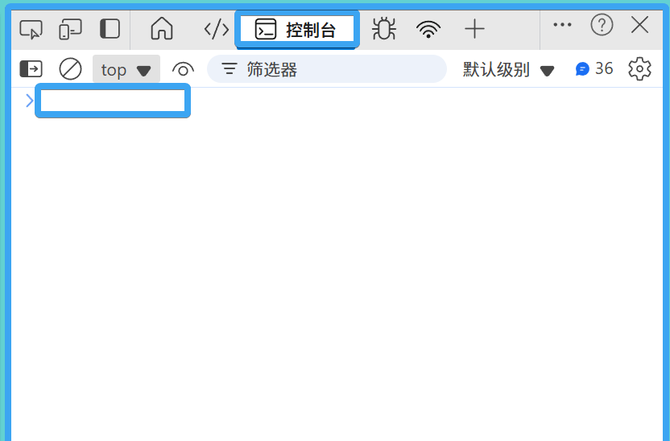

# A31. 语句 数据类型

## 1.1. 🌟 运行 JavaScript

> 完成了 HTML 和 CSS 的入门后，让我们步入 JavaScript 的世界。这是一个真正意义上的编程语言，和 Python 等语言类似。同样地，作为**脚本语言**，其语法比 C++/Java 等更加简单。

脚本语言依靠**解释**（interpretation）的方式执行代码。这需要一个解释器，它负责将抽象代码实时转化为底层指令执行。因此，JavaScript 的内存管理由解释器自动处理，开发者无需手动分配或释放内存，降低了编程复杂度。

### 1.1.1. 🌟 在控制台调试



打开控制台，**可直接输入代码并查看结果**。其步骤如下：

1. <kbd>F12</kbd> 或右键+检查打开控制台。
2. 在上方菜单栏选中 `Console`（控制台）
3. 将焦点移至控制台底部的文本输入。

将这两段代码**分别输入**控制台中，查看效果：

```javascript
console.log("Hello World!");
console.log(2 + 3);
2 + 3
```

::: tip
控制台是调试代码的“即时反馈工具”，建议每节课都尝试用它验证代码逻辑。
:::

### 1.1.2. 🌟 引入 JavaScript 文件

在 HTML 文件中通过 `<script>` 标签引入外部 JS 文件：

```html
<!-- 在 HTML 的 <body> 或 <head> 中 -->
<script src="index.js"></script>
```

确保 JS 文件路径正确，且文件内容如：

```javascript
console.log("外部文件已加载");
```

## 1.1.3. 🌟 注释

在代码中，我们需要对代码进行阐释，它们不需要被运行。JavaScript **使用 `//` 表示注释，本行在此之后的内容都不会运行**。

此外，还有一种语法：`/* 注释内容 */`。这种注释可以跨越多行。

## 1.1.4. ⭐ 分号规范

在 JavaScript 中，语句之间可以用英文分号 `;` 分隔，也就是行末加上一个分号。当然，单纯的换行也可以分隔不同的语句，所以你可以看到具有分号和不具有分号的写法同时出现。为了避免歧义，本教程建议使用分号。

## 1.2. 🌟 变量定义语句

> 编程的基础是数据和指令，而存储数据的容器便是变量。变量声明、赋值和引用的简单赋予了编程解决实际问题的工程特性。

### 1.2.1. 🌟 变量名规则

与 Python 对比：

- 相同点：
  1. **区分大小写**，**不能以数字开头**。
  2. **不能**是**保留字**（如 `var`, `let`）。
  3. 允许使用大小写字母、数字、下划线的任意组合。
- 不同点：
  - JavaScript 还允许变量任意位置出现 `$` (如 `$`、`$root`、`a$`)，注意该符号一般只在大型模块（如 jQuery）中使用。

```javascript
// 有效变量名
let myName = "Alice";
let _age = 20;

// 无效变量名
var class = "10A"; // "class" 是保留字
let 1stPlace; // 以数字开头
```

### 1.2.2. 🌟 var 声明

使用 `var` 声明变量：

```javascript
var x = 5; // 声明并赋值
console.log(x); // 输出 5
x = 10; // 可重新赋值
```

这是一个历史遗留问题，最初只能通过 `var` 声明变量，但它可能导致意外的变量覆盖，**不推荐使用**。

### 1.2.3. 🌟 let 和 const 声明

ES6（2015 年发布的新规范）新特性：

- **`let`**：声明可变变量：
  ```javascript
  let count = 0;
  count = 1; // 允许修改
  ```
- **`const`**：声明常量（不可重新赋值）：
  ```javascript
  const PI = 3.1415; // ✅
  PI = 3.14; // ❌ 报错
  ```

::: warning
与 Python 的不同：JavaScript 要求**显式声明**变量（如 `let x = 5;`），而 Python 直接写 `x=5` 即可。
:::


## 1.3. 🌟 变量的使用与赋值

```javascript
let a = 5; // 声明并赋值
let b = a; // b 现在是 5
b = 10;    // 修改 b，a 仍为 5
console.log(a, b); // 输出 5 10
```

## 1.4. 🌟 基础数据类型

### 1.4.1. 🌟 数字 number

- 包括整数、小数、科学计数法（如 `1e3` 表示 1000）。
- **特殊值**：
  - `Infinity`：超出最大值（如 `1/0`）。
  - `NaN`：非数字（如 `"abc" * 2`）。
- **精度问题**：所有数字以 64 位浮点数存储，可能导致小数计算误差：
  ```javascript
  console.log(0.1 + 0.2); // 输出 0.3000000004
  ```

### 1.4.2. 🌟 字符串 string

必须用引号包裹（单引号 `'`、双引号 `"` 或反引号 `` ` ``）：
```javascript
let name = "Alice"; // ✅
let message = `Hello ${name}!`; // 模板字符串（后续章节详解）
```

### 1.4.3. 🌟 布尔值 boolean

```javascript
let isStudent = true;
let isTeacher = false;
```

### 1.4.4. 🌟 undefined 和 null

- **`undefined`**：变量声明但未赋值：
  ```javascript
  let x;
  console.log(x); // undefined
  ```
- **`null`**：主动表示“无值”：
  ```javascript
  let y = null;
  ```

### 1.4.5. ⭐ 获取数据类型

使用 `typeof` 运算符：
```javascript
console.log(typeof 5); // "number"
console.log(typeof "text"); // "string"
console.log(typeof true); // "boolean"
console.log(typeof undefined); // "undefined"
console.log(typeof null); // "object"（历史遗留问题）
```

### 1.4.6. 🌟 类型转换

- **显式转换**：
  ```javascript
  Number("123"); // 123
  String(456); // "456"
  parseInt("2023px"); // 2023（提取数字部分）
  ```
- **隐式转换**（需谨慎）：
  ```javascript
  "3" + 2; // "32"（字符串拼接）
  3 * "2"; // 6（字符串转数字）
  ```

### 1.4.7. 🌟 基础运算

```javascript
console.log(5 + 3); // 8
console.log(10 - 4); // 6
console.log(2 * 3); // 6
console.log(10 / 2); // 5

// 常见陷阱：
console.log("3" + 2); // "32"（字符串拼接）
console.log(NaN + 5); // NaN（任何与 NaN 的运算结果都是 NaN）
```


## 1.5. 🌟 浏览器基础函数

### 1.5.1. 🌟 console.log 打印日志

```javascript
console.log("调试信息");
console.error("错误信息"); // 红色输出
```

### 1.5.2. ⭐ alert 弹窗

```javascript
alert("欢迎来到我的网站！"); // 弹出对话框
```

### 1.5.3. ⭐ prompt 获取用户输入

```javascript
let name = prompt("请输入你的名字"); // 返回输入的字符串
console.log(`你好，${name}！`);
```

### 1.5.4. confirm 确认

```javascript
if (confirm("确定要删除吗？")) {
  console.log("已确认删除");
} else {
  console.log("已取消操作");
}
```

::: warning
`alert`、`prompt`、`confirm` 在正式开发中很少使用，因为它们会阻塞页面操作。建议使用更现代的交互方式（如 DOM 操作）。
:::


## 1.6. 🌟 模板字符串

```javascript
let name = "Alice";
let age = 18;

// 传统写法
console.log("姓名：" + name + "，年龄：" + age); 

// 模板字符串（更简洁）
console.log(`姓名：${name}，年龄：${age}`);
```


## 知识回顾

- JavaScript 是脚本语言，依赖解释器运行。
- 变量用 `var`（旧）、`let`（推荐）、`const` 声明。
- 基础数据类型包括 `number`、`string`、`boolean`、`undefined`、`null`。
- 类型转换需注意隐式转换的陷阱。


## 课后练习

1. **变量练习**：
   ```javascript
   // 声明变量并赋值：
   let score = 85;
   const MAX_SCORE = 100;
   console.log(`当前分数：${score}，满分：${MAX_SCORE}`);
   ```

2. **类型转换**：
   ```javascript
   let input = prompt("输入数字：");
   let num = Number(input);
   console.log(num + 5); // 将输入转为数字后加 5
   ```

3. **运算陷阱**：
   ```javascript
   console.log("100" + 50); // 输出什么？
   console.log(100 - "50"); // 输出什么？
   ```

::: details 参考答案
1. 输出：`当前分数：85，满分：100`
2. 若输入 `20`，输出 `70`  
3. 输出：`10050`（字符串拼接）、`50`（隐式转数字）
:::


## 拓展阅读

- [MDN Web Docs: JavaScript 数据类型](https://developer.mozilla.org/zh-CN/docs/Web/JavaScript/Data_structures)
- [JavaScript 类型转换详解](https://javascript.info/type-conversions)
- [ES6 新特性：let 和 const](https://es6.ruanyifeng.com/#docs/let)
