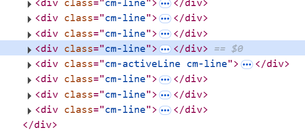

# A33. 函数 事件 DOM

## 🌟 3.1. JavaScript 函数的定义

> 代码并不是一次性的。正如数学中我们将一些基础的运算一样，许多代码要在各处被重复使用，用函数将其封装，增强**可维护性**与**可共享性**。

### 🌟 3.1.1. 普通函数的定义

函数是 JavaScript 中最基础的代码组织方式。通过 `function` 关键字定义函数，可以将一组逻辑封装起来，按需调用。

```javascript
// 函数声明（函数表达式）
function greet(name) {
  console.log("Hello, " + name + "!");
}

// 函数表达式
const sayHi = function () {
  console.log("Hi!");
};

greet("Alice"); // 输出: Hello, Alice!
sayHi(); // 输出: Hi!
```

函数既可以使用 `function name(parameters) { ... }` 形式的声明，也可以使用 `const name = function(parameters) { ... }` 形式的表达式。初学阶段，我们更推荐使用前者。

### ⭐ 3.1.2. 箭头函数的定义

箭头函数（Arrow Function）是 ES6 引入的语法糖，简化了函数定义，尤其适用于回调函数（[B42](../B4/
) 中详细探讨）。

```javascript
// 箭头函数定义
const square = (x) => x * x;

console.log(square(5)); // 输出: 25
```

### 🌟 3.1.3. 函数的参数

函数可以接受参数，参数可以是任意类型的数据。正如 `sin(x)` 接受一个数值（弧度值）作为输入，函数也可以接受**零个、一个或多个参数**。

JavaScript 函数支持动态参数，包括默认值。

```javascript
// 默认参数
function multiply(a, b = 1) {
  return a * b;
}

console.log(multiply(5)); // 输出: 5
```

::: tip 默认值的写法
在 JavaScript 中，函数参数的默认值可以通过在参数列表中直接赋值的方式来指定。这种写法被称为**默认参数**。

但是要注意，所有的默认参数都应该放在参数列表的末尾，否则会导致语法错误。即：**先无默认值参数，后有默认值参数**。
:::

### ⭐ 3.1.4. 函数提升

**函数提升（Hoisting）**：函数**声明**会被提升到当前作用域顶部，因此可以在定义前调用。函数表达式不会被提升。

```javascript
// 函数声明（可提前调用）
sayHi(); // 输出: Hi!
function sayHi() {
  console.log("Hi!");
}

// 函数表达式（不可提前调用）
greet(); // ！报错
const greet = function () {
  console.log("Hello!");
};
greet(); // 输出: Hello!
```

这一特性是为了允许代码主体逻辑出现在最开头，而将辅助的函数放至后方定义。

## 🌟 3.2. JavaScript 函数的返回值与调用

> 在数学中，函数需要经过一系列计算得到一个结果；而在编程中，函数也可以返回一个值（返回值，return value）。这一个值会传递给调用方（caller），便于后续的计算。

### 🌟 3.2.1. 函数的返回值

使用 `return` 语句返回值，函数可以返回任何类型的数据。`return` 后的代码不会再执行，若未显式返回，则默认返回 `undefined`。

```javascript
function add(a, b) {
  return a + b; // 返回结果后函数立即终止
  console.log("不会执行"); // 不会执行
}

function greet(name) {
  if (name) {
    console.log("Hello, " + name + "!");
  }
}

const result = add(2, 3);
const greetResult = greet("Alice"); // 控制台输出：Hello, Alice! （这是函数内部执行的代码）
console.log(result); // 输出: 5
console.log(greetResult); // undefined（函数本身没有返回值）
```

### 🌟 3.2.2. 函数的调用

函数调用时，参数按顺序传递，调用后可获取返回值。若参数未传且未设置默认值，则值为 `undefined`。

```javascript
function calculateArea(radius) {
  return Math.PI * radius * radius;
}

const area = calculateArea(5);
console.log(area.toFixed(2)); // 输出: 78.54

const invalidArea = calculateArea(); // 参数未传
console.log(invalidArea); // 输出: NaN，因为 Math.PI * undefined 没有意义
```

### ⭐ 3.2.3. 递归函数

递归函数包含两个核心部分：**终止条件**（防止无限递归）和**递归逻辑**（调用自身）。

递归函数的本质是函数可以在其内部调用自身，从而解决问题的一部分，然后将问题的剩余部分作为新的输入传递给自身。

这一部分内容比较抽象，读者可以参阅 <https://www.cnblogs.com/jay-huaxiao/p/13812701.html> 来了解递归函数的原理。

```javascript
function factorial(n) {
  if (n === 0) return 1; // 终止条件
  return n * factorial(n - 1); // 递归逻辑
}

console.log(factorial(5)); // 输出: 120
```

::: warning
**注意**：递归函数必须有终止条件，否则会无限递归，导致栈溢出。
:::

## ⭐ 3.3. DOM 模型

> 网页是由一个个元素构成的，这些元素构成了一个**树状结构**，我们可以通过 JavaScript 来操作这些元素，从而实现网页的动态效果。这种对于文档结构的抽象称为 DOM（Document Object Model，文档对象模型）。

DOM 是一种树状结构，每个节点代表 HTML 元素、文本、属性等。通过 DOM API，我们可以：

- 读取和修改文档内容
- 操作元素样式
- 响应用户交互

```
document
├── html
│   ├── head
│   │   └── title
│   └── body
│       ├── h1
│       └── div
│           └── p
```

:::tip
**DOM 操作核心**：选择元素 → 修改内容/属性 → 动态更新界面。
:::

## 🌟 3.4. 选择元素

> 想要操作元素，必先明确操作对象，这与 CSS 十分相似。而选择特定的元素，就需要 DOM 提供的 API。

### ⭐ 3.4.1. 使用 `getElementById` 选择元素

::: warning 注意
以下代码需要复制到 HTML 文件中执行。
:::

```html
<div id="main">主内容</div>

<script>
  const mainDiv = document.getElementById("main");
  console.log(mainDiv.textContent); // textContent 表示获取内部文本。输出: 主内容
</script>
```

**其他方法**：
- `getElementsByClassName("class")`：返回类名为 `class` 的元素集合（HTMLCollection），**实时更新**。
- `getElementsByTagName("tag")`：返回标签名为 `tag` 的元素集合。

:::warning
**大小写敏感**：`getElementById` 和 `getElementsByClassName` 对大小写敏感，需确保与 HTML 中的 ID 或 class 名完全匹配，同时**确保拼写完全正确**。
:::

### 🌟 3.4.2. 使用 `querySelector` 选择元素

```html
<div class="box active">选中我</div>
<div class="box">选中我</div>
<div>选不中我</div>

<script>
  // 选择第一个 .box.active 元素
  const box = document.querySelector(".box.active");
  console.log(box); // 输出: <div class="box active">选中我</div>

  // 选择所有 .box 元素
  const boxes = document.querySelectorAll(".box");
  boxes.forEach((box) => {
    box.style.color = "red";
  });
</script>
```

:::info
- `querySelector` 返回单个元素，若无匹配项则返回 `null`。
- `querySelectorAll` 返回 NodeList（可以先转换为 array），若无匹配项则返回空 NodeList。
:::

### 3.4.3. 在控制台使用 `$0` 选择元素

在浏览器开发者工具中，可以通过 `$0` 直接选择当前**高亮的 DOM 元素**（高亮的元素即为 `$0`）。如图所示。



这时直接切换至控制台：

```javascript
// 在控制台中输入：
$0.textContent = "修改内容";
```

:::tip
**适用场景**：调试时快速修改元素内容，但仅限于开发环境使用。
:::

## 🌟 3.5. 修改元素

> 选择到元素后，就可以对其进行修改，达成 JavaScript 的动态效果。

### 🌟 3.5.1. 修改元素内容

| 方法          | 作用                           | 特点                     |
| ------------- | ------------------------------ | ------------------------ |
| `innerHTML`   | 修改元素的 HTML 内容           | 可解析 HTML 标签         |
| `innerText`   | 修改元素的文本内容             | 自动处理 HTML 转义       |
| `textContent` | 修改元素的文本内容（**推荐**） | 更安全，不解析 HTML 标签 |

这一部分建议读者逐行敲下来，体会这些效果。

```html
<div id="content">原始内容</div>

<script>
  const content = document.getElementById("content");
  content.innerHTML = "<strong>加粗内容</strong>";
  content.innerText = "纯文本内容";
  content.textContent = "最终文本内容";
</script>
```

### 🌟 3.5.2. 修改元素属性

```html


<script>
  const img = document.getElementById("image");
  img.setAttribute("src", "new.jpg"); // 修改属性
  img.getAttribute("src"); // 获取属性值
  img.removeAttribute("alt"); // 删除属性
</script>
```

### ⭐ 3.5.3. 数据绑定范式

数据变化后需要手动更新界面。为了防止**JavaScript 数据与界面状态不一致**，我们将数据与界面绑定，即 JavaScript 的数据与 DOM 的显示一起更新，这是一种常见的编程范式。

```html
<div id="counter">0</div>
<button id="increase">增加</button>

<script>
  let count = 0;

  function setCount(newCount) {
    // 确保 count 和 counter 上的数据一致
    count = newCount;
    document.getElementById("counter").textContent = count;
  }

  document.getElementById("increase").addEventListener("click", () => {
    setCount(count + 1);
  });
</script>
```

注意，在实际开发中，我们通常会使用框架来简化这个过程。在本文的示例中，你不应该再在外部直接对 `count` 赋值，而是统一使用 `setCount` 方法修改 `count` 的值，否则你又忘记更新界面了。

## 🌟 3.6. 在 DOM 树上增删元素

> 除了修改元素内容和属性，我们还可以在 DOM 树上增删元素，进一步加强动态性。

### 🌟 3.6.1. 新建元素

```html
<script>
  const newDiv = document.createElement("div");
  newDiv.textContent = "新元素";
  console.log(newDiv); // 输出: <div>新元素</div>
</script>
```

:::info
**注意**：**新创建的元素不会自动添加到页面中**，需要手动插入。
:::

### 🌟 3.6.2. 添加元素

```html
<div id="container"></div>

<script>
  const container = document.getElementById("container");
  const newP = document.createElement("p");
  newP.textContent = "新增段落";
  container.appendChild(newP); // 添加到末尾
</script>
```

### ⭐ 3.6.3. 插入元素

`children` 属性返回元素的子元素集合（HTMLCollection）：

```html
<ul id="list">
  <li>项目1</li>
  <li>项目3</li>
</ul>

<script>
  const list = document.getElementById("list");
  const newItem = document.createElement("li");
  newItem.textContent = "项目2";
  list.insertBefore(newItem, list.children[1]); // 插入到索引1的位置
</script>
```

### 🌟 3.6.4. 删除元素

删除元素时，先获取子元素，再从父元素中移除子元素：

```html
<div id="parent">
  <div id="child">子元素</div>
</div>

<script>
  const parent = document.getElementById("parent");
  const child = document.getElementById("child");
  parent.removeChild(child); // 从父元素中移除子元素
</script>
```

### ⭐ 3.6.5. 元素增删范式

对于列表型的渲染，我们也需要防止数据与界面的不一致。一个比较简单的范式是，每次数据更新，就清空旧内容，重新渲染新内容。

所以，我们可以将渲染函数封装起来，每次更新数据后手动调用渲染函数。

但注意，每次对列表进行的更新后面要**手动调用**渲染函数。

```javascript
let items = ["苹果", "香蕉"];
const list = document.getElementById("list");

function render() {
  list.innerHTML = ""; // 清空旧内容
  items.forEach((item) => {
    const li = document.createElement("li");
    li.textContent = item;
    list.appendChild(li);
  });
}

render(); // 初始渲染

// 更新数据后手动调用 render()
items.push("橙子");
render();
```

## 🌟 3.7. 绑定事件

> 此前，我们一直围绕着 JavaScript 对网页的自发操作，但网页的动态效果还需要用户的交互。这就需要事件绑定，即用户在特定的操作下，触发特定函数的执行。

### ⭐ 3.7.1. 使用 `onclick` 等属性绑定事件

最原始的方法是 `onclick` 等属性，直接在 HTML 中绑定事件。

```html
<button onclick="alert('点击成功!')">点击我</button>
```

:::warning
**局限性**：只能绑定一个事件，容易覆盖已有功能，且不利于维护。
:::

### 🌟 3.7.2. 使用 `EventListener` 灵活绑定事件

但是，随着 JavaScript 的发展，我们可以使用 `addEventListener` 来更加灵活地绑定事件。

```html
<button id="myButton">点击我</button>

<script>
  const button = document.getElementById("myButton");

  function handleClick() {
    alert("事件触发！");
  }

  button.addEventListener("click", handleClick);

  // 解绑事件
  button.removeEventListener("click", handleClick); // 常在元素生命周期结束时执行（如元素被删除）
</script>
```

`addEventListener` 接受两个参数：

1. **事件类型**（如 `click`、`input`、`mouseover`）
2. **事件处理函数**（即事件触发时执行的函数）

:::info
**优势**：支持多个事件监听器，可动态绑定/解绑，避免内存泄漏。
:::

### ⭐ 3.7.3. 事件参数

| 事件类型 | 常见属性             | 说明       |
| -------- | -------------------- | ---------- |
| 鼠标事件 | `clientX`, `clientY` | 鼠标位置   |
| 键盘事件 | `keyCode`, `key`     | 按键信息   |
| 表单事件 | `target`, `value`    | 输入框内容 |

```html
<div id="box" style="width: 100px; height: 100px; background: lightblue;"></div>

<script>
  const box = document.getElementById("box");
  box.addEventListener("click", (event) => {
    console.log("点击位置:", event.clientX, event.clientY);
  });
</script>
```

如果需要在事件处理函数中访问事件对象的属性，可以将事件对象（`event`）作为参数传递给函数。

### ⭐ 3.7.4. 事件传递

事件传递分为两个阶段：
1. **捕获阶段**：事件从顶层元素向下传递。
2. **冒泡阶段**：事件从目标元素向上传播。

```html
<div id="outer" style="padding: 20px; background: lightgray;">
  <div id="inner" style="padding: 20px; background: lightblue;"></div>
</div>

<script>
  const outer = document.getElementById("outer");
  const inner = document.getElementById("inner");

  outer.addEventListener("click", () => {
    console.log("外层点击");
  }, true); // 捕获阶段

  inner.addEventListener("click", () => {
    console.log("内层点击");
  }, false); // 冒泡阶段
</script>
```

请读者尝试修改上述代码中的 `true` 和 `false`，每次点击 `inner` 元素，观察事件传递的顺序。

### 3.7.5. 事件绑定示例

**计时游戏**：第一次点击开始计时，第二次点击结束计时，显示时间差与误差比例。

```html
<!DOCTYPE html>
<html lang="zh-CN">

<head>
  <meta charset="UTF-8">
  <meta name="viewport" content="width=device-width, initial-scale=1.0">
  <style>
    body {
      text-align: center;
    }

    button {
      font-size: 1.5rem;
      border-radius: 0.5rem;
      padding: 0.25rem 1rem;
    }

    body {
      display: flex;
      flex-direction: column;
      gap: 2rem;
    }

    #score {
      font-size: 1.5rem;
      color: green;
    }
  </style>
</head>

<body>
  <h1>简易掐秒表 目标 2.00 s</h1>
  <div><button id="btn">点击开始</button></div>
  <div id="result">/</div>
  <div id="score">总分: 0 | 轮数: 0 | 平均分: 0</div>

<script>
  let startTime = 0, endTime = 0, totalScore = 0, round = 0;

  document.getElementById("btn").addEventListener("click", () => {
    if (!startTime) {
      startTime = Date.now();
      document.getElementById("btn").textContent = "点击结束";
    } else {
      endTime = Date.now();
      document.getElementById("btn").textContent = "点击开始";
      const diff = (endTime - startTime) / 1000;
      const error = Math.abs(diff - 2);
      const score = Math.round(10 / (error + 0.01));
      totalScore += score;
      round++;
      document.getElementById("result").textContent = 
        `时间差: ${diff.toFixed(3)}s | 误差: ${error.toFixed(3)}s | 分数: ${Math.round(score)}`;
      document.getElementById("score").textContent = 
        `总分: ${Math.round(totalScore)} | 轮数: ${round} | 平均分: ${Math.round(totalScore / round)}`;
      startTime = 0;
    }
  });
</script>
</body>
</html>
```

## ⭐ 3.8. jQuery 框架极大简化了 DOM 操作

> DOM 操作过于复杂，一行只能完成一个操作，且需要不断重复，非常容易出错。而 jQuery 则提供了一种更简单、更优雅的方式来操作 DOM。

### 3.8.1. 引入 jQuery

在 HTML 文件中引入 jQuery：

```html
<script src="https://code.jquery.com/jquery-3.6.0.min.js"></script>
```

开发版（.js）包含注释，便于调试；生产版（`.min.js`）是压缩后的代码，体积小，省带宽。

### 3.8.2. 通过选择器生成 jQuery 对象

```html
<div class="box">jQuery 元素</div>

<script>
  const $box = $(".box"); // jQuery 对象
  console.log($box); // 输出: [div.box]
</script>
```

:::tip
**jQuery 对象**：封装了原生 DOM 元素的集合，支持链式操作。
:::

### 3.8.3. 直接创造 jQuery 对象

```html
<script>
  const $newDiv = $("<div>新元素</div>");
  $newDiv.appendTo("body"); // 添加到 body
</script>
```

### 3.8.4. 链式操作

```html
<script>
  $(".box")
    .css("color", "red")
    .text("修改内容")
    .fadeOut(1000);
</script>
```

:::info
**优势**：返回的 jQuery 对象本身，便于连续调用方法。
:::

### 3.8.5. 属性修改

```html
<button class="btn" disabled>切换样式</button>

<script>
  $(".btn").click(() => {
    $(".btn").toggleClass("active").prop("disabled", false);
  });
</script>
```

:::tip
**`prop` vs `attr`**：
- 固有属性（如 `checked`、`disabled`）使用 `prop`。
- 自定义属性（如 `data-*`）使用 `attr`。
:::

### 3.8.6. 元素增删

| 方法        | 作用           | 示例                                  |
| ----------- | -------------- | ------------------------------------- |
| `append()`  | 添加到内部末尾 | `$("#list").append("<li>项目</li>")`  |
| `prepend()` | 添加到内部开头 | `$("#list").prepend("<li>项目</li>")` |
| `remove()`  | 删除元素       | `$("#list li:last").remove()`         |

### 3.8.7. 事件绑定

| 事件类型 | 绑定方式                       | 事件对象获取              |
| -------- | ------------------------------ | ------------------------- |
| 点击     | `$(".btn").on("click", ...)`   | `function(event) { ... }` |
| 键盘输入 | `$(".input").on("input", ...)` | `function(event) { ... }` |

### 3.8.8. jQuery 示例

**计时游戏优化版**：

```html
<!DOCTYPE html>
<html lang="zh-CN">
<head>
  <meta charset="UTF-8" />
  <meta name="viewport" content="width=device-width, initial-scale=1.0"/>
  <style>
    body {
      text-align: center;
      display: flex;
      flex-direction: column;
      gap: 2rem;
      font-family: sans-serif;
    }

    button {
      font-size: 1.5rem;
      border-radius: 0.5rem;
      padding: 0.25rem 1rem;
      cursor: pointer;
    }

    #score {
      font-size: 1.5rem;
      color: green;
    }
  </style>
  <title>jQuery 计时游戏</title>
  <!-- 引入 jQuery -->
  <script src="https://code.jquery.com/jquery-3.6.0.min.js"></script>
</head>
<body>
  <h1>简易掐秒表 目标 2.00 s</h1>
  <div><button id="btn">点击开始</button></div>
  <div id="result">/</div>
  <div id="score">总分: 0 | 轮数: 0 | 平均分: 0</div>

  <script>
    $(function() {
      let startTime = 0, endTime = 0, totalScore = 0, round = 0;

      // 使用 jQuery 事件绑定

      $("#btn").on("click", function() {
        if (!startTime) {
          startTime = Date.now();
          $(this).text("点击结束");
        } else {
          endTime = Date.now();
          $(this).text("点击开始");

          const diff = (endTime - startTime) / 1000;
          const error = Math.abs(diff - 2);
          const score = Math.round(10 / (error + 0.01));

          totalScore += score;
          round++;

          // 使用链式操作更新界面
          $("#result")
            .text(`时间差: ${diff.toFixed(3)}s | 误差: ${error.toFixed(3)}s | 分数: ${Math.round(score)}`);

          $("#score")
            .text(`总分: ${Math.round(totalScore)} | 轮数: ${round} | 平均分: ${Math.round(totalScore / round)}`);

          startTime = 0;
        }
      });
    });
  </script>
</body>
</html>
```

## 知识回顾

- **JavaScript 函数核心**
  - **函数定义**
    - 普通函数：`function greet(name) { ... }`，支持默认参数（如 `b = 1`）。
    - 箭头函数：`const square = x => x * x;`，无 `this`，适合回调函数。
    - 函数提升：函数声明可提前调用，函数表达式和箭头函数不可提前调用。
  - **函数返回值**
    - 使用 `return` 返回结果，后续代码不再执行；未显式返回则默认 `undefined`。
    - 参数未传且无默认值时，参数值为 `undefined`，可能导致 `NaN`（如 `calculateArea()`）。
  - **递归函数**
    - 必须包含 **终止条件**（如 `n === 0`）和 **递归逻辑**（如 `factorial(n - 1)`），否则导致栈溢出。

- **DOM 操作详解**
  - **选择元素**
    - `getElementById`：通过 ID 获取单个元素。
    - `querySelector`：CSS 选择器获取第一个匹配元素（如 `.box.active`）。
    - `querySelectorAll`：返回 NodeList，支持 `forEach` 遍历所有匹配元素。
    - `getElementsByClassName`：返回 **实时更新的 HTMLCollection**，建议转为数组（`Array.from()`）使用。
  - **修改元素**
    - 推荐使用 `textContent` 获取/设置文本内容（避免 XSS 风险），而非 `innerText`。
    - `innerHTML` 可解析 HTML 标签，但需注意安全性。
    - 属性操作：`setAttribute()`、`getAttribute()`、`removeAttribute()`。
  - **增删元素**
    - 创建：`document.createElement("div")`。
    - 插入：`appendChild()` 添加到末尾，`insertBefore()` 插入到指定位置。
    - 删除：`removeChild()` 从父元素移除子元素。

- **事件绑定与处理**
  - **绑定方式**
    - `onclick`：简单但不灵活（覆盖风险）。
    - `addEventListener("click", handler)`：支持多个监听器，可解绑（推荐）。
  - **事件传递阶段**
    - **捕获阶段**：事件从顶层元素向下传递（设置 `useCapture = true`）。
    - **冒泡阶段**：事件从目标元素向上传播（默认行为）。
  - **事件对象**
    - 常见属性：`clientX/Y`（鼠标坐标）、`keyCode`（按键码）、`target`（触发元素）。
    - 解绑事件：`removeEventListener()`，常用于元素生命周期结束时。

- **jQuery 优势与实践**
  - **链式操作**
    - 返回 jQuery 对象本身，支持连续调用（如 `.css().text().fadeIn()`）。
  - **简化 DOM 操作**
    - 选择器：`$(".class")`、`$("#id")`。
    - 修改内容：`.text()`（文本）、`.html()`（HTML）。
  - **属性与事件**
    - 固有属性（如 `checked`）使用 `.prop()`，自定义属性（如 `data-*`）使用 `.attr()`。
    - 事件绑定：`.on("click", handler)`，动态元素推荐此方法。
  - **性能优化**
    - 批量操作 DOM（如 `innerHTML = ""` 清空内容），避免频繁操作。

- **开发最佳实践**
  - **数据与界面分离**
    - 数据更新后主动调用渲染函数（如 `setCount()` 更新 DOM）。
  - **避免污染作用域**
    - 使用 `let/const` 声明变量，避免全局变量冲突。
  - **调试技巧**
    - 控制台输出日志（`console.log()`）。
    - 使用 `$0` 快速选择高亮的 DOM 元素。

## 课后练习

1. （单选）下列哪个方法返回的是 `NodeList`？
   - A. `getElementById`
   - B. `querySelector`
   - C. `querySelectorAll`
   - D. `getElementsByClassName`

2. （填空）将 `<div id="test"></div>` 的文本内容改为 "Hello jQuery" 的 jQuery 代码是 ______。

3. （纠错）为什么以下代码无法正确绑定事件？
   ```html
   <button id="btn">点击</button>
   <script>
     $("#btn").click(function() {
       alert("点击成功！");
     });
   </script>
   ```

4. （编程题）编写一个函数，接收一个数组，返回数组中所有偶数的平方和。

:::details 答案
1. C
2. `$("#test").text("Hello jQuery")`
3. 确保 jQuery 已正确加载，且代码在 DOM 加载完成后执行。
4. 参考如下：
    ```javascript
    function sumEvenSquares(arr) {
    return arr
        .filter(num => num % 2 === 0)
        .map(num => num * num)
        .reduce((sum, square) => sum + square, 0);
    }
    ```
:::

## 拓展阅读

- [MDN：DOM 概述](https://developer.mozilla.org/zh-CN/docs/Web/API/Document_Object_Model/Introduction)
- [jQuery 中文手册](https://www.lanmper.cn/jquery)
