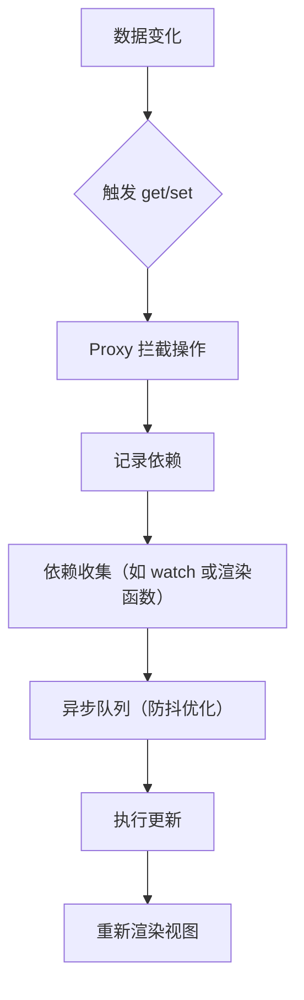

# C43. MVVM 设计与实现

## 3.1. 组合式 API 简化选项式 API 的代码结构和类型推断

> **组合式 API（Composition API）** 是 Vue 3 的核心改进，通过 `setup()` 函数集中管理响应式数据和逻辑，替代 Vue 2 的选项式 API（如 `data`, `methods`）。

### 🔄 对比示例：

#### **选项式 API（Vue 2）**：

```vue
<template>
  <p>{{ message }}</p>
  <button @click="increment">+1</button>
</template>

<script>
export default {
  data() {
    return {
      message: 'Hello Vue!',
      count: 0,
    };
  },
  methods: {
    increment() {
      this.count++;
      this.message = `Count is ${this.count}`;
    },
  },
};
</script>
```

#### **组合式 API（Vue 3）**：

```vue
<template>
  <p>{{ message }}</p>
  <button @click="increment">+1</button>
</template>

<script setup>
import { ref } from 'vue';

const message = ref('Hello Vue!');
const count = ref(0);

const increment = () => {
  count.value++;
  message.value = `Count is ${count.value}`;
};
</script>
```

### 🔍 优势：

1. **代码结构化**：
   - 逻辑按功能组织（如 `setup()` 中定义数据和方法）。
   - 避免选项式 API 的“数据分散”问题。
2. **类型推断**：
   - 使用 TypeScript 时，无需额外注解即可推断类型。
   ```typescript
   const count: Ref<number> = ref(0);  // 自动推断类型
   ```

## 3.2. 响应式的底层是 Proxy 代理

> **Vue 3 响应式系统** 基于 ES6 的 **Proxy 对象**，替代 Vue 2 的 `Object.defineProperty`，实现更全面的拦截和性能优化。

### 🕶️ 核心原理：
1. **Proxy 拦截操作**：
   - 监听 `get`、`set` 等操作，自动触发依赖收集和视图更新。
2. **数组变化检测**：
   - 直接支持 `push`、`splice` 等变异方法的拦截，无需 `Vue.set`。

### 🧪 示例代码：
```javascript
const originalData = { count: 0 };
const reactiveData = new Proxy(originalData, {
  get(target, key) {
    console.log(`读取 ${key} 的值`);
    return target[key];
  },
  set(target, key, value) {
    console.log(`设置 ${key} 为 ${value}`);
    target[key] = value;
    // 触发视图更新
    notifyViews();
  },
});

reactiveData.count++;  // 触发 get 和 set
```

::: warning
- **Vue 内部封装**：开发者无需直接操作 Proxy，通过 `ref`/`reactive` 使用。
- **兼容性**：ES5 环境需 polyfill，但现代浏览器已支持。
:::

## 3.3. watch 函数侦测响应式数据变化的原理

> **`watch`** 是 Vue 监听数据变化的核心函数，通过 **依赖收集** 和 **回调触发** 实现响应式更新。

### 🔄 工作流程：

1. **依赖收集**：
   - 在 `watch` 回调首次执行时，记录依赖的响应式数据。
2. **变化触发**：
   - 当依赖的数据变化时，执行回调函数。

### 📝 基础用法：

```vue
<script setup>
import { ref, watch } from 'vue';

const count = ref(0);
const message = ref('初始');

// 监听 count 变化
watch(
  () => count.value,
  (newVal, oldVal) => {
    console.log(`count 从 ${oldVal} 变为 ${newVal}`);
    message.value = `最新值：${newVal}`;
  }
);
</script>
```

## 3.4. watch 函数的进阶用法

> **`watch`** 支持深度监听、立即执行、手动停止等高级功能。

### 💡 进阶参数：
1. **深度监听（`deep`）**：
   ```javascript
   const user = reactive({ name: '张三', age: 25 });
   watch(
     () => user,
     (newVal, oldVal) => {
       // 监听对象所有属性
     },
     { deep: true }
   );
   ```

2. **立即执行（`immediate`）**：
   ```javascript
   watch(
     count,
     () => {},
     { immediate: true }  // 初始化时立即触发
   );
   ```

3. **停止监听**：
   ```javascript
   const stop = watch(count, () => { /* ... */ });
   stop();  // 停止监听
   ```

4. **异步更新**：
   ```javascript
   watch(
     searchQuery,
     () => {
       // 延迟 500ms 后执行
     },
     { flush: 'post' }
   );
   ```

## 3.5. Vue 处理数据变化的底层逻辑

> **Vue 响应式流程** 可分为 **依赖收集** 和 **触发更新** 两大阶段。

### 🔄 流程图：



### 🔍 关键步骤：

1. **依赖收集**：
   - 在渲染或 `watch` 执行时，Vue 记录当前访问的响应式数据。
2. **触发更新**：
   - 当数据变化时，Vue 将更新任务放入队列，避免重复渲染。
3. **高效渲染**：
   - 通过 **虚拟 DOM** 对比差异，仅更新必要节点。

## 知识回顾

1. **组合式 API**：
   - 通过 `setup()` 集中管理逻辑，提升代码可维护性。
   - TypeScript 类型推断简化开发。
2. **响应式原理**：
   - Proxy 代理实现全面拦截，支持数组和对象的深层变化。
3. **watch 机制**：
   - 监听数据变化，支持深度、异步和手动停止。
4. **更新流程**：
   - 依赖收集 → 异步队列 → 视图更新，确保高效渲染。

## 课后练习

1. **单选题**：
   Vue 3 中，以下哪项是组合式 API 的核心函数？
   - A. `data()`
   - B. `setup()`
   - C. `methods`
   - D. `computed`

2. **填空题**：
   Vue 3 响应式系统的核心是______对象，替代了 Vue 2 的______方法。

3. **代码纠错**：
   修复以下 `watch` 的监听问题：
   ```javascript
   watch(count, (newVal) => {
     console.log('count 变化了！');
   });
   // 假设 count 是 ref(0)
   ```

4. **操作题**：
   使用 `watch` 监听以下对象的 `name` 属性变化，并在控制台输出新旧值：
   ```javascript
   const user = reactive({ name: '张三', age: 25 });
   ```

5. **扩展题**：
   分析以下代码的输出顺序，并解释原因：
   ```javascript
   const count = ref(0);
   watch(count, () => console.log('watch 触发'));
   console.log('初始渲染');
   count.value = 1;
   ```
