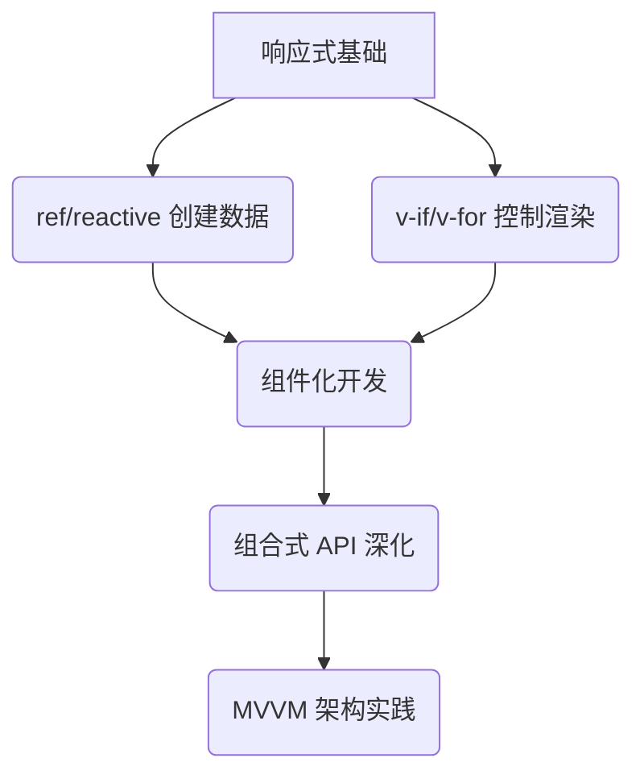

---
next:
  link: ./C41.html
  text: C41. Vue 环境配置
---

# C4. Vue 基础

> 你已经搭建了 Vue 开发环境，但想真正掌握其核心机制，构建动态的单页应用吗？在这一单元，我们将深入 Vue 的基础，从响应式数据到组件化开发，让你的网页能够动态交互、数据驱动，成为真正“活”起来的应用！

## 你将学到：

- **响应式数据**：用 `ref` 和 `reactive` 创建动态数据，让界面随数据实时变化
- **核心指令**：通过 `v-if`、`v-for`、`v-model` 等指令实现条件渲染、列表循环和表单绑定
- **组件化开发**：拆分组件，复用代码，构建模块化应用
- **MVVM 架构**：理解 Model-View-ViewModel 的设计模式，掌控数据与视图的联动
- **组合式 API**：用 `setup()` 函数管理逻辑，让代码结构清晰可维护

## 为什么重要？

- **动态交互**：让用户操作实时反映在界面中，打造“秒响应”的应用体验
- **高效开发**：通过组件复用和声明式语法，减少重复代码，提升开发效率
- **代码可维护性**：清晰的响应式系统和模块化设计让项目易于扩展和调试

## 学习提示：

- **动手实践**：通过创建计数器、待办事项列表等项目巩固概念
- **理解原理**：掌握 `Proxy` 响应式代理和 Diff 算法的核心逻辑
- **组合式优先**：优先使用 Vue 3 的组合式 API，适应现代前端开发范式
- **工具辅助**：善用 Vue Devtools 调试响应式数据和组件状态

## 本章路线图

### 准备好了吗？

让我们一起掌握 Vue 的核心能力，从静态页面跃迁到动态应用开发！你的第一个响应式计数器就在前方，点击开始吧！ 🚀
