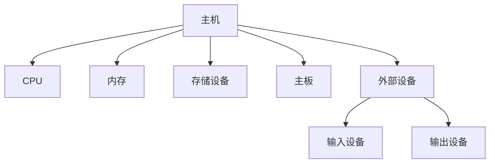

# D41. 计算机硬件

## 1.1. 计算机分为主机和外部设备
> 计算机硬件系统由**主机**和**外部设备**两部分组成。主机是计算机的核心，包含CPU、内存、存储设备等关键部件；外部设备则用于与用户或外部系统交互。

### 核心概念
- **主机**：
  - **组成**：CPU（中央处理器）、内存（RAM/ROM）、主板、存储设备（硬盘/SSD）、电源等。
  - **功能**：执行指令、处理数据、协调各部件工作。
- **外部设备**：
  - **输入设备**：键盘、鼠标、摄像头、扫描仪等。
  - **输出设备**：显示器、打印机、音箱等。
  - **存储设备**：U盘、移动硬盘、网络存储等。

### 示意图


:::tip
主板是主机的“中枢神经”，通过电路连接所有硬件，并提供扩展接口（如USB、PCIe）。
:::

## 1.2. 内存和 CPU 是主机的主要组成部分
> CPU 是计算机的“大脑”，内存是“临时工作空间”。它们共同决定了计算机的运算能力和多任务处理效率。

### CPU 核心结构
1. **运算器与控制器**：
   - **运算器（ALU）**：执行算术和逻辑运算。
   - **控制器**：协调CPU与内存、外设的交互。
2. **寄存器与缓存**：
   - **寄存器**：速度最快，用于临时存储指令和数据。
   - **缓存（L1/L2/L3）**：分层设计，L1缓存速度最快（纳秒级），L3缓存容量最大。

### 内存（RAM）的作用
- **功能**：临时存储正在运行的程序和数据。
- **分类**：
  - **DRAM**：动态随机存取内存，需周期性刷新，成本低。
  - **SRAM**：静态随机存取内存，速度快但成本高，常用于CPU缓存。
- **多进程支持**：内存通过**虚拟内存技术**，允许多个进程共享物理内存。

:::warning
内存断电后数据丢失！重要数据需保存到硬盘或外部存储。
:::

## 1.3. CPU 主频决定时钟周期从而影响运行速度
> CPU 的**主频（MHz/GHz）**决定了时钟周期的长短，直接影响指令执行速度。

### 核心公式与概念
- **时钟周期**：CPU 内部同步信号的周期，单位为秒（s）。
- **主频（Clock Speed）**：
  \[
  \text{主频} = \frac{1}{\text{时钟周期}}
  \]
  例如：3.2 GHz 的 CPU，时钟周期为 \( \frac{1}{3.2 \times 10^9} \approx 0.31 \text{ ns} \)。

### 存储层级的访问速度对比
| 存储类型        | 访问时间（纳秒）  | 用途                 |
| --------------- | ----------------- | -------------------- |
| 寄存器          | 0.1~0.5 ns        | 存储当前运算数据     |
| CPU 缓存（L1）  | 0.5~1 ns          | 高频访问数据缓存     |
| 内存（RAM）     | 100~200 ns        | 程序运行时的工作空间 |
| 固态硬盘（SSD） | 50,000~100,000 ns | 长期存储数据         |
| 机械硬盘（HDD） | 8,000,000 ns      | 大容量数据存储       |

:::details 例：CPU 从硬盘读取数据需要多久？
假设硬盘访问时间为 8 ms（8,000,000 ns），而 L1 缓存访问时间为 0.5 ns，两者相差约 **1600万倍**！
:::

## 1.4. 内存是计算机得以多进程执行的基础
> 内存通过**堆（Heap）**和**栈（Stack）**管理程序数据，支持多任务并行。

### 堆与栈的区别
| 特性         | 栈（Stack）              | 堆（Heap）                 |
| ------------ | ------------------------ | -------------------------- |
| **分配方式** | 由编译器自动管理         | 由程序员手动分配/释放      |
| **速度**     | 快（连续内存，寻址简单） | 慢（碎片化，需动态分配）   |
| **用途**     | 存储局部变量、函数调用帧 | 存储动态对象、大型数据结构 |
| **大小限制** | 有限（通常 1~8 MB）      | 由物理内存决定             |

### 多进程内存管理
- **虚拟内存**：通过硬盘模拟内存，突破物理内存限制。
- **分页机制**：将内存划分为固定大小的页（Page），支持进程间隔离。

```javascript
// 示例：JavaScript 中栈与堆的差异
function example() {
  const num = 42; // 栈：存储值
  const obj = { a: 1 }; // 栈存地址，堆存对象
  return obj;
}
```

:::tip
栈内存分配在函数调用时自动开辟，调用结束自动释放；堆内存需手动管理（如 C/C++ 的 `free()`）。
:::

## 1.5. 外部设备通过接口与主机通信
> 外部设备通过**接口**（如 USB、PCIe）与主机交换数据，传输速率和协议影响整体性能。

### 常见接口类型
| 接口类型      | 传输速率（理论值） | 典型用途              |
| ------------- | ------------------ | --------------------- |
| USB 3.2 Gen 2 | 10 Gbps            | 外设（U盘、外置硬盘） |
| PCIe 4.0      | 64 Gbps            | 显卡、高速存储设备    |
| SATA III      | 6 Gbps             | 内置硬盘、SSD         |
| HDMI 2.1      | 48 Gbps            | 高清显示器、游戏输出  |

### 数据传输原理
- **并行传输**：多线同时传输（如早期并口打印机），速度受限于线缆长度。
- **串行传输**：单线按序传输（如 USB、PCIe），支持长距离和高带宽。

:::details 例：为什么 SSD 比 HDD 速度快？
SSD 通过 PCIe/NVMe 接口直接连接主板，避免机械硬盘的 SATA 接口瓶颈。
:::

## 知识回顾
1. 计算机硬件分为**主机**（CPU、内存、存储）和**外部设备**（输入/输出/存储）。
2. CPU 主频决定时钟周期，存储层级访问速度：寄存器 > 缓存 > 内存 > 硬盘。
3. 内存通过堆和栈管理数据，虚拟内存支持多进程运行。
4. 外部设备依赖接口（如 USB、PCIe）与主机通信，传输速率影响整体性能。

## 课后练习
1. （单选）以下哪个存储类型访问速度最快？
   - A. 机械硬盘
   - B. 内存（RAM）
   - C. CPU 寄存器
   - D. 固态硬盘

2. （简答）解释“虚拟内存”的作用及实现原理。

3. （计算）若 CPU 主频为 2 GHz，执行一条指令需要 4 个时钟周期，则该指令的执行时间是多少纳秒？

:::details 参考答案
1. `C`
2. 虚拟内存通过硬盘扩展内存空间，将不常用数据暂存到硬盘，需时再调回内存，实现多进程运行。
3. \( \frac{4}{2 \times 10^9} \times 10^9 = 2 \text{ ns} \)
:::

## 扩展阅读

- [计算机组成原理（冯·诺依曼架构）]
