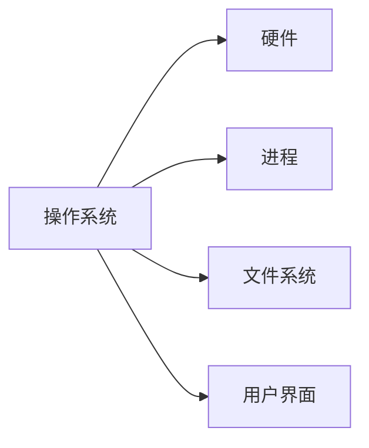

# D42. 操作系统 进程 线程

## 2.1. Windows、Linux、macOS 是常见的桌面操作系统
> 操作系统是计算机的“管家”，管理硬件资源并为应用程序提供运行环境。

### 三大主流操作系统对比
| 操作系统   | 内核类型       | 特点与典型场景                  |
|------------|----------------|-------------------------------|
| **Windows**| 单内核         | 广泛用于个人电脑和企业环境      |
| **Linux**  | 微内核（模块化）| 开源系统，服务器和嵌入式设备首选|
| **macOS**  | XNU混合内核    | 苹果设备专用，开发者工具友好    |

### 核心功能
- **资源管理**：分配CPU、内存、外设等硬件资源。
- **进程调度**：决定哪个程序优先使用CPU。
- **文件系统**：管理文件存储与访问权限。



:::tip
Linux的开源特性使其成为服务器和开发者的首选，而Windows的图形界面更易上手。
:::

## 2.2. Unix 系统的路径命名
> Unix系统（如Linux和macOS）使用**正斜杠 `/`** 分隔路径，路径名区分大小写。

### 路径类型
1. **绝对路径**：从根目录 `/` 开始的完整路径。
   ```bash
   /home/user/documents/report.txt
   ```
2. **相对路径**：相对于当前目录的路径。
   ```bash
   ../downloads/photo.jpg
   ```

### 关键概念
- **根目录**：`/` 表示文件系统的顶层目录。
- **当前目录**：`.` 表示当前目录，`..` 表示父目录。
- **符号链接**：类似Windows的快捷方式，用 `ln -s` 创建。

:::warning
Windows路径使用反斜杠 `\`，与Unix路径冲突！在跨平台编程时需注意转换。
:::

## 2.3. 操作系统的不同导致兼容性问题
> 不同操作系统间的差异可能导致程序无法运行，需通过适配或虚拟化解决。

### 常见兼容性问题
1. **文件路径分隔符**：
   ```python
   # Windows路径：'C:\\Program Files\\app\\data.txt'
   # Linux路径：'/usr/local/app/data.txt'
   ```
2. **API差异**：如Windows的注册表与Linux的配置文件管理方式不同。
3. **依赖库缺失**：如Windows缺少某些Linux特有的系统调用。

### 解决方案
- **跨平台框架**：如Python的 `os.path` 模块自动处理路径格式。
- **虚拟机/容器**：通过Docker或VirtualBox模拟目标环境。
- **编译适配**：如C/C++的 `#ifdef` 宏处理不同系统代码。

:::details 例：Python中跨平台路径处理
```python
import os
file_path = os.path.join("folder", "file.txt")  # 自动适配斜杠方向
```
:::

## 2.4. 操作系统提供程序运行的环境
> 程序运行前，操作系统会为其分配资源并创建**进程**。

### 进程的诞生
1. **程序 vs 进程**：
   - **程序**：静态的代码文件（如 `calculator.exe`）。
   - **进程**：程序的**动态实例**，拥有独立内存空间和资源。
2. **进程生命周期**：
   ```mermaid
   graph LR
       A[创建] --> B[运行]
       B --> C[阻塞]
       C --> D[终止]
   ```

### 关键资源
- **内存**：为进程分配独立的地址空间。
- **CPU时间片**：通过**调度算法**分配执行时间。
- **文件句柄**：管理进程对文件的访问权限。

:::tip
进程间通信（IPC）需通过共享内存、管道等机制，因内存隔离而无法直接访问彼此数据。
:::

## 2.5. 每个程序至少开启一个具有独立内存的进程
> 进程是操作系统分配资源的最小单位，每个进程都有自己的“独立王国”。

### 进程的特性
| 特性          | 描述                              |
|---------------|-----------------------------------|
| **独立内存**  | 每个进程拥有专属的堆栈和全局变量 |
| **资源隔离**  | 一个进程崩溃不影响其他进程        |
| **开销较大**  | 创建和切换进程消耗更多CPU和内存   |

### 多进程优势
- **稳定性**：浏览器标签常以独立进程运行，避免崩溃连锁反应。
- **资源隔离**：后台程序（如杀毒软件）与前台应用互不干扰。

```javascript
// Node.js中创建子进程示例
const { fork } = require('child_process');
const child = fork('worker.js');
child.on('message', (msg) => console.log('Received:', msg));
```

## 2.6. 每个进程可以开启多个能够并行执行的线程
> 线程是进程内的“轻量级工作者”，共享内存但需协调避免冲突。

### 线程与进程对比
| 特性          | 进程                                  | 线程                                  |
|---------------|---------------------------------------|---------------------------------------|
| **内存**      | 独立内存空间                          | 共享进程内存                          |
| **切换开销**  | 高（需切换地址空间）                  | 低（共享内存，仅切换寄存器）          |
| **并发性**    | 真正并行（多核CPU）                   | 依赖CPU调度（可能存在伪并行）         |

### 线程协作的挑战
- **竞态条件**：多个线程同时修改共享数据导致结果不可预测。
- **死锁**：线程互相等待资源导致僵局。

:::details 例：Python多线程与多进程
```python
# 多线程（共享内存，受GIL限制）
import threading
def worker():
    print("Thread working...")
thread = threading.Thread(target=worker)
thread.start()

# 多进程（独立内存，突破GIL）
import multiprocessing
def worker():
    print("Process working...")
process = multiprocessing.Process(target=worker)
process.start()
```
:::

## 2.7. 并行数量取决于 CPU 核心数和线程数
> 真正的并行需依赖多核CPU，而线程数超过核心数时会通过**时间片轮转**实现“伪并行”。

### 关键概念
- **CPU核心**：物理上独立的执行单元，可同时处理线程。
- **超线程技术**：通过模拟逻辑核心提升并发能力（如4核8线程）。
- **全局解释器锁（GIL）**：Python等语言限制多线程并行（仅单线程执行）。

### 性能优化原则
1. **计算密集型任务**：优先使用多进程（突破GIL限制）。
2. **IO密集型任务**：多线程效率更高（等待IO时切换线程）。


:::tip
使用`htop`或任务管理器观察CPU核心和线程的占用情况。
:::

## 知识回顾
1. 操作系统管理硬件资源，主流系统包括Windows、Linux和macOS。
2. Unix路径使用正斜杠 `/`，Windows使用反斜杠 `\`，需注意兼容性。
3. 进程是资源分配的最小单位，线程是进程内的轻量级执行单元。
4. 多线程共享内存但需避免竞态条件，多核CPU决定并行线程上限。

## 课后练习
1. （单选）以下哪个路径格式是Windows特有的？
   - A. `/home/user/file.txt`
   - B. `C:\Program Files\app\file.txt`
   - C. `~/Documents/report.md`
   - D. `/var/log/system.log`

2. （简答）解释“进程”与“线程”的区别，并举例说明适用场景。

3. （计算）假设某CPU有2个物理核心，支持超线程技术，最多可同时运行多少个线程？

:::details 参考答案
1. `B`
2. **进程**：独立内存空间，适合高隔离任务（如浏览器标签）。**线程**：共享内存，适合协作任务（如多任务下载）。
3. `4`（2核×2线程/核）
:::

## 扩展阅读
- [操作系统原理（五层模型）](https://en.wikipedia.org/wiki/Operating_system)
- [Python GIL详解](https://realpython.com/python-gil/)
