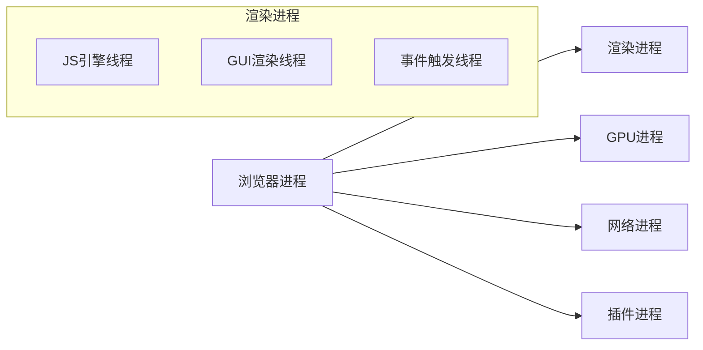

# D43. 事件循环

## 3.1. 浏览器创建多个工作进程
> 浏览器采用**多进程架构**隔离任务，提升性能和安全性。

### 进程类型与分工
| 进程类型       | 职责与特点                               |
| -------------- | ---------------------------------------- |
| **浏览器进程** | 管理界面、标签、进程间通信（主进程）     |
| **渲染进程**   | 解析HTML/CSS、执行JS、处理事件（单线程） |
| **GPU进程**    | 图形渲染与合成（提升页面平滑度）         |
| **网络进程**   | 管理HTTP请求与资源加载                   |
| **插件进程**   | 运行第三方插件（沙箱隔离，防止崩溃）     |

### 多进程优势
- **容错性**：单个标签崩溃不影响其他进程（如渲染进程沙箱）。
- **资源分配**：按需分配CPU/内存，避免单任务占用全部资源。



:::tip
Chrome默认为每个标签分配独立渲染进程，Edge通过优化减少进程数量以降低资源消耗。
:::

## 3.2. 浏览器的渲染主线程负责多种工作
> 渲染进程的主线程是浏览器的“核心执行者”，负责**单线程**处理关键任务。

### 主线程职责
1. **DOM/CSSOM构建**：解析HTML和CSS生成渲染树。
2. **JavaScript执行**：运行JS代码（单线程，阻塞UI）。
3. **事件处理**：监听并触发DOM事件（如click）。
4. **绘图与合成**：将渲染树转换为像素并提交给GPU。

### 线程协作机制
- **GUI渲染线程**：负责布局计算和绘制（与JS线程互斥）。
- **定时器线程**：管理`setTimeout/setInterval`（不受JS阻塞）。
- **异步线程**：处理网络请求、文件读写等耗时操作。

:::warning
JS阻塞主线程会导致页面无响应（如长循环），需通过Web Worker分离任务。
:::

## 3.3. 浏览器运用任务队列防止时间阻塞
> 事件循环通过**任务队列**将异步任务解耦，避免主线程被同步任务卡住。

### 任务队列类型
| 队列类型       | 触发场景                                          |
| -------------- | ------------------------------------------------- |
| **宏任务队列** | `setTimeout`、`setInterval`、`DOM事件`等          |
| **微任务队列** | `Promise.then`、`MutationObserver`等              |
| **渲染队列**   | 需要重新绘制的UI更新（如`requestAnimationFrame`） |

### 任务执行流程
1. 执行当前同步代码。
2. 执行微任务队列中的所有任务（直到清空）。
3. 执行一个宏任务（如`setTimeout`回调）。
4. 重复步骤2-3，直到队列为空。

```javascript
// 示例：微任务优先执行
setTimeout(() => console.log("宏任务"), 0);
Promise.resolve().then(() => console.log("微任务"));
// 输出顺序：微任务 → 宏任务
```

:::details 事件循环的核心逻辑
```mermaid
sequenceDiagram
    浏览器进程->>渲染进程: 发送网络请求结果
    渲染进程->>JS引擎线程: 执行JS代码
    JS引擎线程->>微任务队列: 添加Promise.then()
    JS引擎线程->>宏任务队列: 添加setTimeout()
    循环: 微任务清空后执行下一个宏任务
```
:::

## 3.4. 任务队列具有优先级顺序
> 不同任务类型按优先级分层执行，确保关键操作优先响应。

### 优先级规则
1. **微任务 > 宏任务**：微任务队列清空后才执行宏任务。
2. **渲染优先级**：`requestAnimationFrame`优先于普通宏任务。
3. **事件类型**：用户交互事件（如click）优先于定时器。

### 优先级示例
```javascript
setTimeout(() => console.log("setTimeout"), 0);
Promise.resolve().then(() => console.log("Promise"));
requestAnimationFrame(() => console.log("rAF"));
// 输出顺序：Promise → rAF → setTimeout
```

### 性能优化建议
- 避免在微任务队列中堆积大量任务（如递归Promise）。
- 耗时计算应放在`Web Worker`中，避免阻塞主线程。

:::tip
浏览器通过“任务调度器”动态调整优先级，例如高优先级的输入事件会中断低优先级任务。
:::

## 3.5. 典型代码执行先后顺序的分析
> 通过代码示例理解事件循环的执行逻辑。

### 案例：混合任务类型
```javascript
console.log("Start"); // 1. 同步代码

setTimeout(() => {
  console.log("Timeout"); // 4. 宏任务
  Promise.resolve().then(() => console.log("Nested Promise")); // 5. 微任务嵌套
}, 0);

Promise.resolve().then(() => console.log("First Promise")); // 2. 微任务
Promise.resolve().then(() => console.log("Second Promise")); // 3. 微任务

console.log("End"); // 6. 同步代码
```

### 执行顺序解析
1. 同步代码执行：`Start` → `End`。
2. 执行微任务队列：`First Promise` → `Second Promise` → `Nested Promise`。
3. 执行宏任务：`Timeout`。
4. 循环继续，直到所有队列清空。

:::details 关键点
- `setTimeout`的回调是宏任务，需等待微任务清空。
- `Nested Promise`在宏任务回调中被添加到微任务队列，需在该宏任务结束后执行。
:::

## 知识回顾
1. 浏览器通过多进程架构隔离任务，提升稳定性和安全性。
2. 渲染主线程单线程执行JS，需通过事件循环和任务队列避免阻塞。
3. 事件循环按「微任务优先于宏任务」的规则执行，优先级影响任务顺序。
4. 代码执行顺序需结合同步代码、微任务、宏任务的触发时机综合分析。

## 课后练习
1. （单选）以下哪个任务类型优先级最高？
   - A. `setTimeout`
   - B. `Promise.then`
   - C. `requestAnimationFrame`
   - D. DOM事件

2. （简答）解释为什么长时间运行的JavaScript会卡顿页面，并提出解决方案。

3. （分析）预测以下代码的输出顺序：
   ```javascript
   console.log(1);
   setTimeout(() => console.log(2), 0);
   Promise.resolve().then(() => console.log(3));
   console.log(4);
   ```

:::details 参考答案
1. `B`（微任务优先级最高）
2. **原因**：JS单线程阻塞事件循环，无法处理其他任务。**解决方案**：使用`Web Worker`分离计算任务。
3. 输出顺序：`1 → 4 → 3 → 2`
:::

## 扩展阅读
- [Chrome多进程架构详解](https://www.chromium.org/developers/design-documents/multi-process-architecture)
- [JavaScript事件循环机制](https://developer.mozilla.org/zh-CN/docs/Web/JavaScript/EventLoop)
- [浏览器渲染性能优化指南](https://web.dev/learn-performance/)
