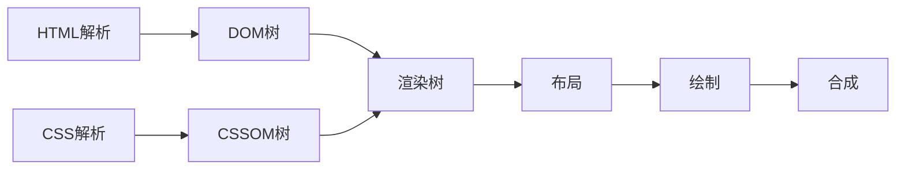

# D44. 浏览器渲染原理

## 4.1. 渲染流程概述
浏览器将HTML文本渲染为可见页面的过程称为**关键渲染路径**，核心步骤如下：



## 4.2. 核心步骤详解

### 4.2.1 HTML解析与DOM树构建
> 浏览器通过**HTML解析器**将HTML文本转换为**DOM树**。

- **解析过程**：
  - 按顺序解析HTML标签，构建节点层级结构（如`<div>`、`<p>`）。
  - 遇到未知标签时，会创建默认节点（如`<unknown>`）。
  - **阻塞因素**：
    - 遇到`<script>`标签时，DOM解析暂停，等待JS执行完毕。
    - 使用`defer`或`async`可避免阻塞。

```javascript
// 示例：脚本阻塞DOM解析
<script src="slow.js"></script> // DOM解析暂停，等待加载并执行
```

### 4.2.2 CSS解析与CSSOM树构建
> 浏览器通过**CSS解析器**将CSS样式转换为**CSSOM树**。

- **解析过程**：
  - 解析内联CSS、`<style>`标签及外部CSS文件。
  - 根据**级联规则**（如!important、选择器优先级）计算最终样式。
  - **阻塞因素**：
    - 外部CSS文件加载会阻塞渲染，直到CSSOM构建完成。

```css
/* 示例：样式覆盖规则 */
body { color: red; } /* 基础样式 */
#header { color: blue; } /* ID选择器优先级更高 */
```

### 4.2.3 渲染树构建

> 合并DOM树与CSSOM树，生成**渲染树（Render Tree）**。

- **过滤规则**：
  - 排除`display: none`的节点（不渲染）。
  - 添加伪元素（如`::before`）和匿名框（如文本换行生成的匿名块）。

```html
<!-- 示例：display: none 的节点不进入渲染树 -->
<div style="display: none">隐藏内容</div>
```

### 4.2.4 布局（Layout/Reflow）
> 计算渲染树中每个节点的**几何信息**（位置、尺寸）。

- **关键步骤**：
  1. 确定根元素尺寸（如视口宽度）。
  2. 从根节点开始递归计算子节点的宽高、坐标。
  3. **触发条件**：
     - 修改元素尺寸（如`width`、`height`）。
     - 添加/删除可见子元素。
     - 窗口大小变化（如浏览器窗口拖动）。

```javascript
// 示例：修改宽度触发回流
document.querySelector(".box").style.width = "200px"; // 触发布局重新计算
```

### 4.2.5 绘制（Painting/Repaint）
> 将渲染树节点转换为**像素矩阵**，最终输出到屏幕。

- **绘制流程**：
  1. 将渲染树划分为**绘制层**（Layer）。
  2. 每个层生成位图（Bitmap）。
  3. **触发条件**：
     - 修改非几何属性（如`color`、`background-color`）。
     - 显示/隐藏元素（如`visibility: hidden`）。

```javascript
// 示例：修改颜色仅触发重绘
document.querySelector(".text").style.color = "red"; // 不触发回流，仅重绘
```

### 4.2.6 合成（Compositing）
> 通过GPU加速将多个层合并为最终图像。

- **优化策略**：
  - 将频繁变化的元素（如动画）提升为独立层（如`will-change: transform`）。
  - 使用`requestAnimationFrame`在合成阶段执行更新。

```css
/* 示例：启用层隔离 */
.layer {
  transform: translateZ(0); /* 强制创建新层 */
}
```

## 4.3. 回流（Reflow）与重绘（Repaint）

| **概念** | **定义**                     | **性能影响**           | **触发场景**       |
| -------- | ---------------------------- | ---------------------- | ------------------ |
| **回流** | 重新计算布局（位置、尺寸）   | 高（需重新布局和绘制） | 修改尺寸、添加元素 |
| **重绘** | 仅更新外观（颜色、透明度等） | 中（仅需绘制）         | 修改颜色、背景色   |

:::tip
**优化建议**：
- 避免循环中频繁操作DOM（如`element.style.width`）。
- 使用`DocumentFragment`批量操作DOM。
- 通过`getComputedStyle`缓存样式查询。
:::

## 4.4. 渲染性能优化
> 通过减少回流和重绘提升页面流畅度。

### 4.4.1 关键优化策略

1. **减少强制同步布局**：
   ```javascript
   // 避免连续读写布局属性
   const width = element.offsetWidth; // 触发回流
   element.style.width = (width + 10) + "px"; // 再次触发回流
   ```
   → 改用`getBoundingClientRect()`或直接修改`transform`。

2. **使用Web Workers**：
   ```javascript
   // 将计算任务移出主线程
   const worker = new Worker('worker.js');
   worker.postMessage({ data: '计算任务' });
   ```

3. **层隔离与GPU加速**：
   ```css
   .smooth-animation {
     transform: translate3d(0,0,0); /* 启用GPU层 */
     will-change: transform; /* 预分配资源 */
   }
   ```

### 4.4.2 开发者工具辅助

- **性能面板**：分析JS执行、回流/重绘事件。
- **Layers面板**：查看层划分与合成信息。

## 4.5. 典型场景分析
> 以下代码的渲染流程：

```html
<div id="box" style="width: 100px; background: red;"></div>
<script>
  document.getElementById("box").style.width = "200px"; // ①
  document.getElementById("box").style.color = "white"; // ②
</script>
```

**执行步骤**：

1. **初始渲染**：
   - 构建DOM树，解析CSS生成CSSOM。
   - 渲染树包含`<div>`节点，尺寸`100px`，背景红色。
   - 布局计算位置，绘制背景色。

2. **修改宽度（①）**：
   - 触发**回流**：重新计算`div`的尺寸及子元素布局。
   - 触发**重绘**：更新背景色区域。

3. **修改颜色（②）**：
   - 仅触发**重绘**：更新文本颜色（假设`div`有文本）。

## 知识回顾
1. 渲染流程：HTML→DOM，CSS→CSSOM →渲染树→布局→绘制→合成。
2. 回流成本 > 重绘，需避免频繁操作布局属性。
3. 优化手段：层隔离、Web Workers、减少直接DOM操作。

## 课后练习
1. （简答）解释“回流”与“重绘”的区别，并举例说明。
2. （分析）以下代码会触发几次回流？
   ```javascript
   element.style.padding = "20px"; // ①
   element.offsetWidth; // ②
   element.style.margin = "10px"; // ③
   ```
3. （优化建议）如何减少以下代码的性能开销？
   ```javascript
   for(let i=0; i<1000; i++) {
     element.style.left = i + "px"; // 动画实现
   }
   ```

:::details 参考答案
1. **回流**：重新计算布局（如修改宽高），触发重绘。**重绘**：仅更新外观（如颜色）。
2. **两次回流**：①修改padding触发回流，③修改margin触发第二次回流。
3. **优化**：使用`transform`替代`left`，或通过`requestAnimationFrame`批量更新。
:::

## 扩展阅读
- [浏览器渲染性能优化指南](https://web.dev/learn-performance/)
- [Chrome DevTools性能分析](https://developer.chrome.com/docs/devtools/evaluate-performance/)
- [CSS层合成与GPU加速](https://web.dev/learn-performance/rendering/compositing/)
