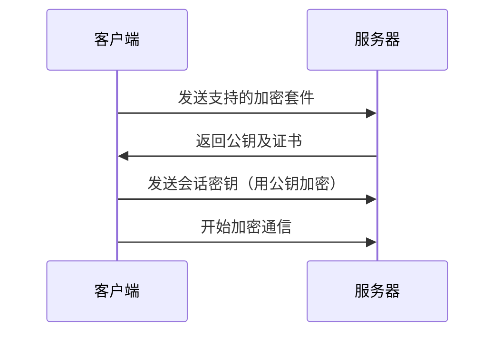

# E14. 密码学基础

## 4.1. 密码不可明文传输和存储

> **明文密码如同裸奔，黑客只需一瞥就能窃取所有秘密！**

### 4.1.1. 明文存储的灾难案例
```python
# 错误示例：直接存储明文密码
users = {
    "admin": "123456",  # 密码直接暴露！
    "user1": "password"
}

# 攻击者只需访问数据库即可获取所有密码
```

### 4.1.2. 正确方案：哈希+盐值
```python
import hashlib
import os

def hash_password(password: str, salt: bytes = None):
    if salt is None:
        salt = os.urandom(16)  # 生成16字节随机盐值
    return hashlib.pbkdf2_hmac('sha256', password.encode(), salt, 100000)

# 存储格式：salt + hash_value
```

:::warning
**永远不要存储明文密码！即使管理员也需要通过重置流程获取新密码！**
:::

## 4.2. 哈希散列为保护密码安全奠定基础

### 4.2.1. 哈希算法特性对比
| 算法        | 安全性 | 输出长度 | 典型用途              |
| ----------- | ------ | -------- | --------------------- |
| **MD5**     | 已破解 | 128位    | 过期的文件校验        |
| **SHA-1**   | 不安全 | 160位    | Git版本控制（已弃用） |
| **SHA-256** | 安全   | 256位    | 数字签名、密码存储    |

### 4.2.2. 哈希不可逆的数学原理

$$
H(m) = \text{单向函数} \quad \Rightarrow \quad \text{无法通过} \ H(m) \ \text{反推} \ m
$$

:::tip
**盐值（Salt）作用**：
- 每个密码对应唯一随机盐值
- 防止彩虹表攻击
- 盐值明文存储但无法单独破解
:::

## 4.3. HTTPS 协议应用非对称加密实现安全连接

### 4.3.1. 非对称加密流程
1. **密钥交换**：客户端用服务器公钥加密对称密钥
2. **数据传输**：后续通信使用 AES 等对称算法
3. **证书验证**：CA 签名确保公钥真实性

```bash
# 查看网站证书命令
openssl s_client -connect example.com:443 -showcerts
```

### 4.3.2. SSL/TLS 握手过程


## 4.4. 早期网站使用 cookies 进行身份认证

### 4.4.1. Cookies 工作原理
```http
# 响应头携带 Set-Cookie
Set-Cookie: session_id=abc123; Path=/; HttpOnly

# 后续请求自动携带
Cookie: session_id=abc123
```

### 4.4.2. 安全缺陷
```mermaid
graph LR
    A[跨站脚本(XSS)] --> B[窃取 Cookie]
    B --> C[会话劫持]
    D[无 HttpOnly 标志] --> C
```

## 4.5. JSON Web Token (JWT) 新兴身份认证方案

### 4.5.1. JWT 与 Cookies 对比
| 特性       | Cookies            | JWT                     |
| ---------- | ------------------ | ----------------------- |
| 存储位置   | 服务端维护会话     | 客户端存储令牌          |
| 跨域支持   | 需 CORS 配置       | 自带跨域能力            |
| 令牌有效期 | 依赖服务器 Session | 令牌自带过期时间（exp） |
| 安全性     | 依赖服务端验证     | 需严格保护私钥          |

### 4.5.2. JWT 结构示例
```json
// Header
{
  "alg": "HS256",
  "typ": "JWT"
}

// Payload（用户数据）
{
  "user_id": 1,
  "role": "admin",
  "exp": 1705000000
}

// Signature（签名）
HMACSHA256(base64UrlEncode(header) + "." + base64UrlEncode(payload), 密钥)
```

:::warning
**风险警示**：
- 私钥泄露会导致令牌伪造
- 不应存储敏感信息（如密码明文）
- 需配合 refresh token 管理生命周期
:::

## 4.6. 经过认证的用户拥有不同的访问权限

### 4.6.1. RBAC 权限模型示例
```sql
-- 用户表
CREATE TABLE users (
    id INT PRIMARY KEY,
    username VARCHAR(50),
    role_id INT REFERENCES roles(id)
);

-- 角色表
CREATE TABLE roles (
    id INT PRIMARY KEY,
    name VARCHAR(20)  -- 如 "admin", "user"
);

-- 权限表
CREATE TABLE permissions (
    role_id INT REFERENCES roles(id),
    resource VARCHAR(50),  -- 如 "delete_post"
    allowed BOOLEAN
);
```

### 4.6.2. 程序实现示例
```python
def check_permission(user, action):
    if user.role == "admin":
        return True
    return db.query(f"SELECT allowed FROM permissions WHERE role_id={user.role_id} AND resource='{action}'")
```

## 4.7. 双因素认证 (2FA) 进一步增强安全性

### 4.7.1. 2FA 实现方式
| 认证因素类型         | 示例                            | 安全性等级 |
| -------------------- | ------------------------------- | ---------- |
| **密码（知识）**     | 用户设置的密码                  | 基础       |
| **手机（拥有）**     | 验证码短信/Google Authenticator | 中等       |
| **生物特征（内在）** | 指纹/面部识别                   | 高         |

### 4.7.2. TOTP 协议示例
```python
import pyotp

# 生成密钥
secret_key = pyotp.random_base32()

# 客户端生成验证码
totp = pyotp.TOTP(secret_key)
current_code = totp.now()  # 每30秒更新

# 服务端验证
if totp.verify(user_input_code):
    print("认证成功！")
```

## 知识回顾
1. **密码安全原则**：哈希+盐值存储，杜绝明文传输。
2. **HTTPS 核心**：非对称加密建立对称密钥，CA 证书验证身份。
3. **JWT 优势**：无状态、跨域，但需严格保护私钥。
4. **权限控制**：基于角色的访问控制（RBAC）是常见方案。
5. **2FA 价值**：结合两种因素，显著降低被盗风险。

## 课后练习
1. **（单选）以下哪种哈希算法目前仍被认为是安全的？**
   - A. MD5
   - B. SHA-256
   - C. SHA-1
   - D. 都不安全

2. **（操作）编写 Python 代码，使用 SHA-256 对字符串 "Hello" 进行哈希，并添加随机盐值。**

3. **（分析）为什么说 JWT 的无状态特性既是优势也是潜在风险？**

:::details 参考答案
1. B
2. ```python
   import hashlib
   import os

   password = "Hello"
   salt = os.urandom(16)
   hash_obj = hashlib.sha256(password.encode() + salt)
   print(f"Salt: {salt.hex()}, Hash: {hash_obj.hexdigest()}")
   ```
3. **优势：服务端无需维护会话状态；风险：若私钥泄露，所有令牌可伪造。**
:::

## 扩展阅读

- [JWT 安全最佳实践](https://cheatsheetseries.owasp.org/cheatsheets/JSON_Web_Token_for_Java_Cheat_Sheet.html)
- [HTTPS 握手过程详解](https://letsencrypt.org/how-it-works/)
