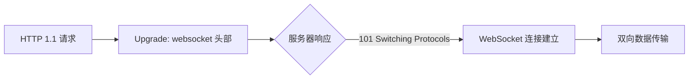

# E23. WebSocket 双向即时通信
## 3.1. 🌟 WebSocket 解决 HTTP 的核心问题

> WebSocket 是 HTML5 标准协议，通过持久连接解决 HTTP 协议的单向请求-响应模式缺陷，实现全双工实时通信。

### HTTP 的局限性
```javascript
// 传统轮询示例（高延迟、高开销）
setInterval(() => {
  fetch('/api/data')
    .then(res => res.json())
    .then(data => console.log(data));
}, 2000); // 每 2 秒轮询
```

### WebSocket 的优势
```diff
+ 全双工通信：客户端与服务器可随时双向传输数据
+ 持久连接：连接建立后无需重复握手（减少 TCP 握手开销）
+ 低协议开销：数据帧头部仅 2-10 字节（HTTP 头部可达 KB 级）
```

### WebSocket 与 HTTP 的关系

## 3.2. 🌟 WebSocket 工作原理与握手流程

> WebSocket 通过 HTTP 协议升级实现连接建立，后续通信基于 TCP 二进制帧。

### 握手过程详解
```text
// 客户端请求
GET /chat HTTP/1.1
Host: server.example.com
Upgrade: websocket
Connection: Upgrade
Sec-WebSocket-Key: dGhlIHNhbXBsZSBub25jZQ==
Sec-WebSocket-Version: 13

// 服务端响应
HTTP/1.1 101 Switching Protocols
Upgrade: websocket
Connection: Upgrade
Sec-WebSocket-Accept: s3pPLMBiTxaQ9kYGzzhZRbK+xOo=
```

### 数据帧格式
```javascript
// WebSocket 数据帧结构（二进制）
{
  fin: 1,       // 是否为最后一个分片
  rsv: 0,       // 扩展位（需协商）
  opcode: 1,    // 操作码（1=文本，2=二进制）
  mask: true,   // 客户端发送需掩码（服务端不需）
  payload: 'Hello' // 加密或未加密数据
}
```
## 3.3. 🌟 socket.io：WebSocket 的增强实现

> socket.io 是基于 WebSocket 的库，提供自动降级、事件绑定、命名空间等特性。

### 核心功能对比
| 特性                | WebSocket 原生 | socket.io          |
|---------------------|----------------|--------------------|
| 连接协议            | ws/wss         | ws/wss（或长轮询） |
| 事件驱动            | 需自行封装     | 内置事件系统       |
| 自动重连            | 需手动实现     | 内置支持           |
| 命名空间            | 不支持         | 支持               |

### socket.io 服务端示例
```javascript
// server.mjs
import { Server } from 'socket.io';

const io = new Server({ cors: true });

io.on('connection', (socket) => {
  console.log('客户端连接:', socket.id);

  socket.on('chat message', (msg) => {
    io.emit('chat message', msg); // 广播消息
  });

  socket.on('disconnect', () => {
    console.log('客户端断开:', socket.id);
  });
});

io.listen(3000);
```
## 3.4. 🌟 WebSocket 典型应用场景

### 实时聊天系统
```javascript
// 客户端代码（浏览器）
const socket = new WebSocket('ws://localhost:3000');

socket.addEventListener('open', () => {
  socket.send('Hello Server');
});

socket.addEventListener('message', (event) => {
  console.log('收到消息:', event.data);
});
```

### 实时数据仪表盘
```javascript
// 服务端推送实时数据
setInterval(() => {
  const data = generateRealtimeData();
  io.emit('realtime-data', data);
}, 1000);
```

### 游戏多人同步
```javascript
// 命名空间隔离游戏房间
io.of('/game').on('connection', (socket) => {
  socket.join('room1');
  socket.on('player-move', (position) => {
    socket.to('room1').emit('player-update', position);
  });
});
```
## 3.5. ⚠️ WebSocket 安全与优化

### 安全措施
```diff
+ 使用 wss:// 加密传输（TLS）
+ 验证客户端身份（Token 鉴权）
+ 限制消息频率（防洪水攻击）
- 避免明文传输敏感数据
```

### 性能优化
```javascript
// 压缩数据（需服务端支持）
const socket = new WebSocket('ws://server', ['permessage-deflate']);

// 服务端配置心跳检测
io.listen(3000).httpServer;
io.engine.config.timeout = 60000; // 60秒超时
```
## 知识回顾

1. **核心优势**：全双工、低延迟、持久连接，解决 HTTP 轮询的高开销问题。
2. **握手流程**：通过 HTTP Upgrade 头部升级协议，服务端返回 101 状态码。
3. **数据格式**：二进制帧包含分片、掩码、操作码等字段。
4. **socket.io 扩展**：自动降级、事件系统、命名空间等高级特性。
5. **典型场景**：实时聊天、游戏同步、数据仪表盘等需要双向通信的场景。
## 课后练习

1. （单选）WebSocket 连接建立时，服务端响应的 HTTP 状态码是：
   - A. 200 OK
   - B. 101 Switching Protocols
   - C. 404 Not Found
   - D. 500 Internal Server Error

2. （填空）WebSocket 数据帧中，客户端发送的数据需经过 ______ 处理。

3. （编程）使用 socket.io 实现一个简单聊天室：
   - 客户端输入消息后广播给所有在线用户。
   - 服务端记录并显示在线用户数量。

:::details 参考答案
1. B
2. **掩码（mask）**
3. ```javascript
   // 服务端（server.mjs）
   import { Server } from 'socket.io';
   const io = new Server({ cors: true });
   let users = 0;

   io.on('connection', (socket) => {
     users++;
     socket.emit('online-count', users);
     socket.broadcast.emit('new-user', users);

     socket.on('chat-message', (msg) => {
       io.emit('chat-message', msg);
     });

     socket.on('disconnect', () => {
       users--;
       io.emit('online-count', users);
     });
   });

   io.listen(3000);

   // 客户端（client.js）
   const socket = io('http://localhost:3000');

   socket.on('connect', () => {
     console.log('Connected:', socket.id);
   });

   socket.on('chat-message', (msg) => {
     console.log('收到消息:', msg);
   });

   socket.on('online-count', (count) => {
     console.log('当前在线:', count);
   });

   document.querySelector('button').addEventListener('click', () => {
     const msg = document.getElementById('message').value;
     socket.emit('chat-message', msg);
   });
   ```
:::
## 扩展阅读
- [WebSocket RFC 6455 标准](https://tools.ietf.org/html/rfc6455)
- [socket.io 官方文档](https://socket.io/docs/v4/)
- [WebSocket 安全指南](https://developer.mozilla.org/zh-CN/docs/Web/API/WebSocket#安全考虑)
