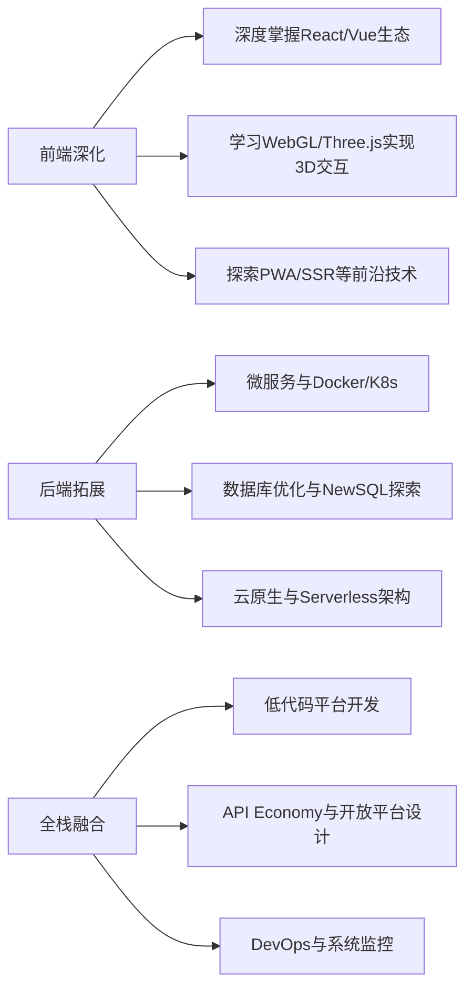

# 结语：站在全栈的起点，向未来进发

## 🌟 回首来时路：从零到全栈的蜕变之旅

当你合上这本教程的最后一页，你已完成了从**HTML标签的拼接**到**全栈架构设计**的跨越。这一路，我们共同经历了：

- **基础搭建**：用HTML构建网页骨架，用CSS让页面"活色生香"，用JavaScript赋予其交互灵魂。
- **进阶突破**：在TypeScript中触摸类型之美，在算法世界里解构逻辑本质，用软件工程思维将代码铸成精密武器。
- **全栈融合**：从后端开发的底层逻辑到前后端协同的系统思维，你已具备构建完整产品的核心能力。

## 🛠️ 你已掌握的"超能力"

### 1. **全栈技术栈**

- **前端**：从语义化HTML到响应式CSS，从ES6语法到TypeScript工程化，从DOM操作到框架思维（Vue/React）。
- **后端**：Express.js构建RESTful API，数据库设计与ORM实践，WebSocket实时通信，全栈项目实战。
- **工程化体系**：Git版本控制、CI/CD流水线、单元测试、性能优化，让代码从"能用"到"健壮"。

### 2. **工程师思维**

- **系统思维**：理解前后端如何像齿轮般精密咬合，数据如何在客户端与服务器间流动。
- **问题解决**：从Chrome DevTools调试到算法优化，培养"拆解-分析-重构"的思维闭环。
- **持续学习**：通过TypeScript的类型推导、算法的递归艺术，学会在复杂问题中寻找模式。

### 3. **实战经验**

- 完成从个人博客到全栈电商系统的项目实践，经历过"404错误"到"部署上线"的完整开发周期。
- 掌握了从需求文档到技术方案的设计能力，能用技术语言与产品经理对话。

## 🚀 未来的无限可能

### 1. 技术进阶方向

### 2. 职业发展建议

- **初级阶段**：专注提升代码质量，参与开源项目（如GitHub Issues），积累GitHub Portfolio。
- **进阶阶段**：选择垂直领域深耕（如金融科技/医疗信息化），考取AWS/Azure认证强化竞争力。
- **专家阶段**：关注WebAssembly、量子计算等颠覆性技术，成为技术趋势的领跑者。

### 3. 终身学习指南

- **每日**：用LeetCode保持算法手感，阅读MDN/TC39规范原文。
- **每周**：复盘一个GitHub热门项目的架构设计。
- **每月**：系统学习一个新技术（如最近的Vitest测试框架）。

## 🌱 给自己的三封信

### 信1：给刚入门的自己

"不要害怕报错信息，每个错误都是代码世界的路标。记住：DevTools 不是敌人，而是你最忠诚的伙伴。"

### 信2：给现在的自己

"你已走过最艰难的基础阶段，但真正的挑战才刚刚开始。保持对技术本质的敬畏，永远追问'为什么'，而不仅仅是'怎么做'。"

### 信3：给未来的自己

"当你能闭眼写出优雅的TypeScript代码，能设计出高并发的REST API，能带领团队交付百万级用户的产品时，别忘了回来看看这段文字——这正是你曾经仰望的星辰。"

## 🌍 行动起来！

1. **立即行动**：
   - 在GitHub创建个人技术博客，用Markdown记录学习笔记。
   - 用本教程的电商系统项目申请GitHub Sponsor，接受开源社区的反馈。
   - 加入本地开发者社区，用技术帮助非营利组织完成数字化转型。

2. **持续精进**：
   - 每季度完成一个技术主题的深度学习（示例路径：TypeScript → Rust → WebAssembly）。
   - 参与Kaggle竞赛，用算法思维解决真实世界问题。

3. **回馈社区**：
   - 将本教程的案例代码优化为可复用的NPM包。
   - 在知乎/掘金撰写技术文章，用你的视角解读ES2025新特性。

## 🌟 最后的赠言

> "编程不是写代码，而是用代码写诗。"
> —— 你的第一个HTML页面曾让你心跳加速，
> 第一个API成功响应时你眼里的光芒，
> 这些时刻证明：你已具备创造数字世界的基因。

站在全栈的门槛上，你不是"前端"或"后端"的标签化存在，而是**数字化时代的建筑师**。前方的路没有终点，只有不断延伸的可能。现在，请带上这份知识与勇气，去创造属于你的数字文明。

**永远向前——下一个技术革命的缔造者，就是你！**

### 附：学习路线图速查表

| 阶段     | 核心技能                       | 推荐实践项目                 |
| -------- | ------------------------------ | ---------------------------- |
| 基础构建 | HTML5/CSS3/ES6                 | 个人简历网站                 |
| 技术深化 | TypeScript/React/Node.js       | 全栈待办事项应用             |
| 工程化   | CI/CD/单元测试/性能优化        | 微服务电商系统               |
| 全栈融合 | API设计/架构模式/云原生        | 社交媒体平台（含移动端适配） |
| 专家突破 | 技术趋势研究/系统设计/团队管理 | 开源框架贡献/技术方案设计    |

愿代码之光，照亮你前行的每一步！
