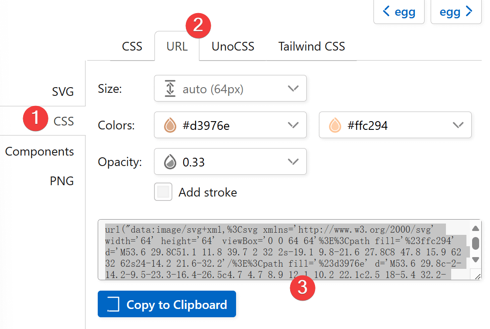

# Project 05: 快乐母鸡 (JS)

> 接下来完成一个简单的 JavaScript 项目：快乐母鸡。
>
> 【致敬 Peppa Pig —— 快乐小鸡】
>
> 代码量：**127 Loc**

## 效果图


[在 bi.cool 中查看效果](https://bi.cool/project/KiAudS0)

## 涉及知识点

### 基础知识点

- [A1. HTML 基础](../A1/index.md)
- [A2. CSS 基础](../A2/index.md)
- [A3. JavaScript 基础](../A3/index.md)

### 学习知识点

- [B31.2. 图片背景](../B3/B31.md#12-background-image)
- [B31.5. 过渡](../B3/B31.md#15-transition)
- [B33.2. 定位 position](../B3/B33.md#32-position)
- [B41.5. 数学模块](../B4/B41.md#15-math)
- [B42. 定时器](../B4/B42.md)

## 制作步骤

### Step 1：创建页面结构

> 结构是项目的根本。
>
> 目标：完成 HTML 骨架、CSS 样式基础。

主体界面全屏，背景为蓝色

::: code-group

``` html [index.html]
<!DOCTYPE html>
<html lang="zh-CN">
<head>
  <meta charset="UTF-8">
  <meta name="viewport" content="width=device-width, initial-scale=1.0">
  <link rel="stylesheet" href="./style.css">
  <title>快乐母鸡</title>
</head>
<body>
  <main>
    <div class="container"></div>
  </main>
  <script src="./index.js"></script>
</body>
</html>
```

``` css [style.css]
body {
  background-color: skyblue;
}
```

:::

### Step 2：设计程序逻辑

> 对于稍微复杂一些的 JavaScript 项目，必须先对项目有整体性的构想，才能为代码实现提供清晰的思路。
>
> 目标：定义程序的基本操作逻辑。

1. 基本元素
   - 母鸡：随机移动，移动后会下蛋。
   - 蛋：点击后消失，孵化出新的母鸡，重复上述过程。
2. 基本逻辑
   - 初始化：创建母鸡，随机设定初始位置。
   - 创建母鸡后定期随机移动母鸡，然后下蛋。
   - 对生成的蛋绑定点击事件，点击后再调用创建母鸡的函数。

::: code-group

``` javascript [index.js]
const container = document.querySelector('.container');

function createHen() {
  // ...
}

function moveHen() {
  // ...
}

function layEgg() {
  // ...
}

function hatchEgg() {
  // ...
}

function init() {
  createHen();
}

init();
```

:::

::: warning

本项目采取直接执行 JS 代码，而不是等待页面加载完成后再执行的方式。所以在 `index.html` 中，需要**将 `<script>` 放在 `body` 标签的最后面**。
:::

### Step 3：寻找图片素材

> 图片素材是现代前端项目中不可或缺的一部分，它们可以为项目增添生动的效果。
>
> 目标：寻找并导入合适的图片素材。

本教程延续传统采用 `iconify` 图标库，导入图片素材。

搜索 `egg` 关键词，采用 `emojione` 图标库的 `egg` 图标，导入图片素材。

搜索 `chick` 关键词（因为找不到 `hen`），同样采用 `emojione` 图标库的 `chicken` 图标，导入图片素材。

此次采用 `CSS > URL` 方式，复制 URL，作为 `background-image` 的属性：



::: code-group

``` css [style.css]
.egg {
  width: 32px;
  height: 32px;
  background-image: url("data:image/svg+xml,%3Csvg xmlns='http://www.w3.org/2000/svg' width='64' height='64' viewBox='0 0 64 64'%3E%3Cpath fill='%23ffc294' d='M53.6 29.8C51.1 11.8 39.7 2 32 2s-19.1 9.8-21.6 27.8C8 47.8 15.9 62 32 62s24-14.2 21.6-32.2'/%3E%3Cpath fill='%23d3976e' d='M53.6 29.8c-2-14.2-9.5-23.3-16.4-26.5c4.7 4.7 8.9 12.1 10.2 22.1c2.5 18-5.4 32.2-21.6 32.2c-3.5 0-6.6-.7-9.2-1.9c3.7 4 8.9 6.3 15.4 6.3c16.1 0 24-14.2 21.6-32.2' opacity='0.33'/%3E%3C/svg%3E");
}

.hen {
  width: 96px;
  height: 96px;
  background-image: url("data:image/svg+xml,%3Csvg xmlns='http://www.w3.org/2000/svg' width='64' height='64' viewBox='0 0 64 64'%3E%3Cpath fill='%23f29a2e' d='M7.6 20.4c1.8 2.9 3.8 3.3 5.2 1.6c2.2-2.6-.2-5.9-2.8-6.8c-4.3-1.7-8 3.1-8 3.1s4.1-.4 5.6 2.1'/%3E%3Cpath fill='%23e1eaf2' d='M42.8 10.2c-7.7 4.5-1.3 15.3-15.2 18.2l14.8 7.3c3 5.2 11.3 5.6 11.3 5.6s2.1-6.2.4-10.8c4.6 0 7.8-2.8 7.8-2.8s-2.6-9.2-10.5-9.2c7.8-3.2 9.2-9.8 9.2-9.8s-6.9-4.8-17.8 1.5'/%3E%3Cpath fill='%23f4bc58' d='M35.7 62H21.4c0-1.2 8.4-1.4 8.8-9.4c1.3 8.9 5.5 8.2 5.5 9.4'/%3E%3Cg fill='%23d1dce6'%3E%3Cpath d='M49.4 30.6c0 11.5-9.4 23.3-21 23.3s-21-11.8-21-23.3c0-7.7 16.6-2.3 21-2.3c11.6-.1 21-9.3 21 2.3'/%3E%3Cpath d='M36.4 49.2c0 2.3-3.3 7.3-6.2 7.3S24 53.1 24 50.8s12.4-2.7 12.4-1.6'/%3E%3C/g%3E%3Cpath fill='%23e1eaf2' d='M6.5 26.3c0 3 .6 11.7.6 11.7l2.7-3.4l3.2 3.8l.7-5.3l4.9 3.5l-.9-5.2l5.9.6l-2.7-3.2l4.1-2.7s-5 1.1-4.9-2s2.6-11.9-.5-13.2C13.9 8.8 6.5 13.6 6.5 26.3'/%3E%3Cg fill='%233e4347'%3E%3Cellipse cx='6.5' cy='16.1' rx='.7' ry='.3'/%3E%3Ccircle cx='11.5' cy='16.7' r='1.5'/%3E%3C/g%3E%3Cg fill='%23e24b4b'%3E%3Cpath d='M7.8 23.6c0 3.2-2.1.9-2.1.9c-.7 0-3.6 2.2-2.6-1.5c1.3-4.8 6.3-8 6.3-8s-1.6 2.8-1.6 8.6'/%3E%3Cpath d='M20.8 10.6V9.4c-.2-2.5 3.4-3.5 3-4.8c-.6-1.7-5.3-.6-7.6 3.1q-.45.6-.6 1.5c-.1-.4-.2-.8-.4-1.2c-1.1-2.3 2.2-4.4 1.2-5.5c-1.3-1.5-5.2 1.1-6.1 5.4c-.2.9-.2 1.8.1 2.7c-.1-.1-.2-.2-.3-.2c-1.7-1.3 0-4-1.2-4.6c-1.8-.8-3.4 2.8-2.5 6.3c.6 2 2.8 4.1 4.6 2.4c.6-.5 2-1.3 2.8-1.6c.6-.2 2.2-.1 3.2.6c.9.6 1.6 1.8 2.9 1.8c5.7.2 8.8-5.3 6.7-6.5c-1.1-.8-2.8 1.2-5.8 1.8'/%3E%3C/g%3E%3Cpath fill='%23e1eaf2' d='M42.5 43.9c-.9-2.2-3.5-3.4-3.5-3.4c2.7-1.4 4.3-4.4 4.3-4.4c-1.4-.6-6.8-1-6.8-1c1.2-1.2 2.2-2.9 2.2-2.9s-6.2-1.5-11.4 1.3c-6.8 3.8-4.8 12.8 2.9 13.8c8.5 1.1 12.3-3.4 12.3-3.4'/%3E%3C/svg%3E");
}

.egg,
.hen {
  background-size: contain;
  background-repeat: no-repeat;
}
```

:::

### Step 4：项目原型编写

> “Make it work, Make it right, Make it fast.” 这是当代软件工程开发“三部曲”。先让程序“跑起来”，接着优化细节，最后优化性能。顶层设计完毕，便不要再被细节束手束脚，先完成一版能运行的简易程序，即“原型”（prototype）。
>
> 目标：依照基本逻辑编写程序原型。

先按照 DOM 操作流程写出 JavaScript 代码。参考：

1. 元素操作
   1. `element.classList.add('class-name')`：添加类名。
   2. `element.append(childElement)`：添加子元素（或文本）。
2. 浏览器 API
   1. `setInterval(callback, interval)`：设置定时器。[B42. 定时器](../B4/B42.md)
   2. `document.documentElement.clientWidth`：获取浏览器窗口的宽度。
   3. `document.documentElement.clientHeight`：获取浏览器窗口的高度。
   4. `Math.random()`：生成一个 `[0,1)` 的随机数。

回到 CSS 上，我们发现，母鸡的移动的位置改变需要通过坐标体现出来。所以我们不能让母鸡的位置在常规布局流中堆叠，而是采用**绝对定位**。同时为了使绝对定位起效，我们给 `<main>` 元素添加相对定位。

::: code-group

``` javascript [index.js]
function createHen() {
  const hen = document.createElement("div"); // [!code ++]
  hen.classList.add('hen'); // [!code ++]
  container.append(hen); // [!code ++]
  setInterval(() => moveHen(hen), 2000); // [!code ++]
}

function moveHen(hen) {
  const x = Math.random() * document.documentElement.clientWidth; // [!code ++]
  const y = Math.random() * document.documentElement.clientHeight; // [!code ++]
  hen.style.left = `${x}px`; // [!code ++]
  hen.style.top = `${y}px`; // [!code ++]
  layEgg(x, y); // [!code ++]
}

function layEgg(x, y) {
  const egg = document.createElement("div"); // [!code ++]
  egg.classList.add('egg'); // [!code ++]
  container.append(egg); // [!code ++]
  egg.style.left = `${x}px`; // [!code ++]
  egg.style.top = `${y}px`; // [!code ++]
  egg.addEventListener('click', hatchEgg); // [!code ++]
}

function hatchEgg(event) {
  event.target.remove(); // [!code ++]
  createHen(); // [!code ++]
}
```

``` css [style.css]
main { /* [!code ++] */
  position: relative; /* [!code ++] */
} /* [!code ++] */

.egg,
.hen {
  background-size: contain;
  background-repeat: no-repeat;
  position: absolute; /* [!code ++] */
}
```

:::

### Step 5：添加计数功能

> 游戏很重要的一点是需要给用户即时量化反馈，比如“得分”。
>
> 目标：添加母鸡数目的计数功能。

在 JavaScript 代码中设置 `counter` 变量，用于记录母鸡的数量。

在 HTML 中则需将计数器元素使用绝对定位加在右上角。

每当 `counter` 发生变化，就更新计数器元素。

参考：

1. `String.prototype.padStart(targetLength, padString)`：用于在字符串前面填充指定字符，达到指定长度。例如，`"1".padStart(3, '0')` 会返回 `"001"`。
2. `Consolas` 字体：编程最经典的等宽字体，可以让数字宽度不随内容发生变化。

::: code-group

``` html [index.html]
  <main>
    <div class="container"></div>
    <div id="counter">000</div> <!-- [!code ++] -->
  </main>
```

``` css [style.css] {7}
#counter {
  position: absolute;
  right: 0.5rem;
  top: 0.25rem;
  padding: 0.5rem 1rem;
  font-size: 2rem;
  font-family: Consolas, 'Cambria Math', sans-serif;
  background-color: rgba(128, 128, 128, 0.3);
  border-radius: 2rem;
}
```

``` javascript [index.js]
let counter = 0; // [!code ++]

function setCounter(newValue) { // [!code ++]
  counter = newValue; // [!code ++]
  document.querySelector("#counter").textContent = counter.toString().padStart(3, '0'); // [!code ++]
} // [!code ++]

function createHen() {
  const hen = document.createElement("div");
  hen.classList.add('hen');
  container.append(hen);
  setCounter(counter + 1); // [!code ++]
  setInterval(() => moveHen(hen), 2000);
}
```

:::

### Step 6：动画效果优化

> 动画使用户体验更加流畅。
>
> 目标：给母鸡移动添加动画。

添加完 CSS 过渡后，我们又会发现母鸡下蛋的时机过早了，所以还得调整 JavaScript 代码，让母鸡到位后再下蛋。

参考：

1. `transition` 过渡功能。见 [B31.5. 过渡](../B3/B31.md#15-transition)。
2. `setTimeout` 定时任务。见 [B42. 定时器](../B4/B42.md)。

::: code-group
``` css [style.css]
.hen {
  width: 96px;
  height: 96px;
  background-image: url("..."); /* 此处省略，不要拿这一行覆盖源代码！ */
  transition-property: left, top; /* [!code ++] */
  transition-duration: 1s; /* [!code ++] */
  transition-timing-function: ease-in-out; /* [!code ++] */
}
```

``` javascript [index.js]
function createHen() {} // [!code --]
function createHen(x, y) { // [!code ++]
  const hen = document.createElement("div");
  hen.classList.add('hen');
  container.append(hen);
  hen.style.left = `${x}px`; // [!code ++]
  hen.style.top = `${y}px`; // [!code ++]
  setCounter(counter + 1);
  setInterval(() => moveHen(hen), 2000);
}

function moveHen(hen) {
  const x = randomX();
  const y = randomY();
  hen.style.left = `${x}px`;
  hen.style.top = `${y}px`;
  layEgg(x, y); // [!code --]
  setTimeout(() => layEgg(x, y), 1200); // [!code ++]
}

function init() {
  createHen(); // [!code --]
  createHen(randomX(), randomY()); // [!code ++]
}
```
:::

### Step 7：位置细节优化

> 基础内容已经完成，可是母鸡下蛋的时机和位置都不太对？蛋孵化的位置似乎也有一些问题。
>
> 目标：优化蛋与母鸡位置细节。

::: code-group
``` javascript [index.js]
function moveHen(hen) {
  const x = randomX();
  const y = randomY();
  hen.style.left = `${x}px`;
  hen.style.top = `${y}px`;
  setTimeout(() => layEgg(x, y), 1200); // [!code --]
  setTimeout(() => layEgg(x + 64, y + 72), 1200); // [!code ++]
}

function hatchEgg(event) {
  event.target.remove();
  createHen(event.clientX, event.clientY); // [!code ++]
  createHen(event.clientX - 16, event.clientY - 16); // [!code ++]
}

function randomX() { // [!code ++]
  return Math.random() * (document.documentElement.clientWidth - 96); // [!code ++]
} // [!code ++]

function randomY() { // [!code ++]
  return Math.random() * (document.documentElement.clientHeight - 96); // [!code ++]
} // [!code ++]
```
:::

### Step 8：配置衰减停止

> 随着母鸡数量不断增多，鸡蛋数量呈指数级增长。为了防止浏览器资源过载，我们需要让母鸡移位后下蛋成为随机事件，且母鸡数量越多概率越低。
>
> 量化的另一个重点是设定停止条件，即“游戏结束”。这既可以避免浏览器资源过载，也可以让用户更有成就感。

此处我们使用一个简单的数学模型：它在母鸡数量为 1 时保证一定下蛋，在母鸡数量增多时下蛋概率趋于 `0.1`，但母鸡数量越多，总期望保持递增。

概率函数：`prob(x)=0.1+0.9/x`。

而游戏结束可以通过限时实现。此处以限时 120s（2 分钟）为例。

参考：

1. 因为 `Math.random()` 返回 `[0,1)` 之间的随机数，故其返回值小于 `p` 的概率就是 `p`，即 `P(x<p)=p`。（举例：小于 0.3 的概率为 30%）
2. 函数守卫（guard）：在函数开始判断条件是否满足，不满足直接 `return`，不执行下方代码。


::: code-group

```javascript [index.js]
let running = true; // [!code ++]

const intervalHandles = []; // [!code ++]

function createHen(x, y) {
  const hen = document.createElement("div");
  hen.classList.add('hen');
  container.append(hen);
  hen.style.left = `${x}px`;
  hen.style.top = `${y}px`;
  setCounter(counter + 1);
  setInterval(() => moveHen(hen), 2000); // [!code --]
  const intervalHandle = setInterval(() => moveHen(hen), 2000); // [!code ++]
  intervalHandles.push(intervalHandle); // [!code ++]
}

function moveHen(hen) {
  const x = randomX();
  const y = randomY();
  hen.style.left = `${x}px`;
  hen.style.top = `${y}px`;
  if (Math.random() < 0.1 + 0.9 / counter) { // [!code ++]
    setTimeout(() => layEgg(x + 64, y + 72), 1200);
  } // [!code ++]
}

function layEgg(x, y) {
  if (!running) { // [!code ++]
    return; // [!code ++]
  } // [!code ++]
  const egg = document.createElement("div");
  egg.classList.add('egg');
  container.appendChild(egg);
  egg.style.left = `${x}px`;
  egg.style.top = `${y}px`;
  egg.addEventListener('click', hatchEgg);
}

function hatchEgg(event) {
  if (!running) { // [!code ++]
    return; // [!code ++]
  } // [!code ++]
  event.target.remove();
  createHen(event.clientX - 16, event.clientY - 16);
}

function init() {
  createHen(randomX(), randomY());
  setTimeout(shutDown, 120 * 1000); // [!code ++]
}

function shutDown() { // [!code ++]
  running = false; // [!code ++]
  const counterElement = document.querySelector("#counter"); // [!code ++]
  counterElement.style.color = "green"; // [!code ++]
  for (const intervalHandle of intervalHandles) { // [!code ++]
    clearInterval(intervalHandle); // [!code ++]
  } // [!code ++]
} // [!code ++]
```

:::

### Step 9：提取配置常量

> 之前我们的项目将各类数字镶嵌在了代码之中，可这些数字是我们根据经验得来的，会让代码阅读者（甚至是未来的我们）感到十分困惑。这类数字我们称之为“**魔法数字**”（Magic Number，即没有任何阐释就出现在代码中的数字），应当尽量避免。
>
> 在项目的开发过程中，出现这些数字当然是正常的。但在开发告一段落后，**将所有意义不明的数字提取到程序开头的常量中，是一个良好的编程习惯**。它既增强了可配置性，也用代码名注释数字，增强了代码可读性。
>
> 目标：提取所有意义不明的数字到程序开头的常量中。

::: code-group
```javascript [index.js]
// 常量配置区 // [!code ++]
const PERIOD = 2000; // ms // [!code ++]
const LAY_EGG_DELAY = 1200; // ms // [!code ++]
const GAME_LENGTH = 120 * 1000; // [!code ++]
const PROB = (cnt) => 0.1 + 0.9 / cnt; // [!code ++]
const DIGITS = 3; // [!code ++]
const EGG_X_OFFSET = 64; // [!code ++]
const EGG_Y_OFFSET = 72; // [!code ++]
const HATCH_X_OFFSET = -16; // [!code ++]
const HATCH_Y_OFFSET = -16; // [!code ++]
const HEN_SIZE = 96; // [!code ++]

function setCounter(newValue) {
  counter = newValue;
  document.querySelector("#counter").textContent = counter.toString().padStart(3, '0'); // [!code --]
  document.querySelector("#counter").textContent = counter.toString().padStart(DIGITS, '0'); // [!code ++]
}

function createHen(x, y) {
  const hen = document.createElement("div");
  hen.classList.add('hen');
  container.append(hen);
  hen.style.left = `${x}px`;
  hen.style.top = `${y}px`;
  setCounter(counter + 1);
  const intervalHandle = setInterval(() => moveHen(hen), 2000); // [!code --]
  const intervalHandle = setInterval(() => moveHen(hen), PERIOD); // [!code ++]
  intervalHandles.push(intervalHandle);
}

function moveHen(hen) {
  const x = randomX();
  const y = randomY();
  hen.style.left = `${x}px`;
  hen.style.top = `${y}px`;
  if (Math.random() < 0.1 + 0.9 / counter) { // [!code --]
    setTimeout(() => layEgg(x + 64, y + 72), LAY_EGG_DELAY); // [!code --]
  } // [!code --]
  if (Math.random() < PROB(counter)) { // [!code ++]
    setTimeout(() => layEgg(x + EGG_X_OFFSET, y + EGG_Y_OFFSET), LAY_EGG_DELAY); // [!code ++]
  }
}

function hatchEgg(event) {
  if (!running) {
    return;
  }
  event.target.remove();
  createHen(event.clientX - 16, event.clientY - 16); // [!code --]
  createHen(event.clientX + HATCH_X_OFFSET, event.clientY + HATCH_Y_OFFSET); // [!code ++]
}

function init() {
  createHen(randomX(), randomY());
  setTimeout(shutDown, 120 * 1000); // [!code --]
  setTimeout(shutDown, GAME_LENGTH); // [!code ++]
}

function randomX() {
  return Math.random() * (document.documentElement.clientWidth - 96); // [!code --]
  return Math.random() * (document.documentElement.clientWidth - HEN_SIZE); // [!code ++]
}

function randomY() {
  return Math.random() * (document.documentElement.clientHeight - 96); // [!code --]
  return Math.random() * (document.documentElement.clientHeight - HEN_SIZE); // [!code ++]
}
```
:::

### Step 10：更多功能

> 发挥你的想象力，给项目添加更多功能吧！

本教程对项目的基本步骤指导到此结束。希望读者能在此基础上对项目进行扩展，或者自己设计一个类似而不雷同的项目。

## 完整代码

::: code-group

```html [index.html]
<!DOCTYPE html>
<html lang="zh-CN">
<head>
  <meta charset="UTF-8">
  <meta name="viewport" content="width=device-width, initial-scale=1.0">
  <link rel="stylesheet" href="./style.css">
  <title>快乐母鸡</title>
</head>
<body>
  <main>
    <div class="container"></div>
    <div id="counter">000</div>
  </main>
  <script src="./index.js"></script>
</body>
</html>
```

```css [style.css]
body {
  background-color: skyblue;
  overflow: hidden;
}

main {
  position: relative;
}

#counter {
  position: absolute;
  right: 0.5rem;
  top: 0.25rem;
  padding: 0.5rem 1rem;
  font-size: 2rem;
  font-family: Consolas, 'Cambria Math', sans-serif;
  background-color: rgba(128, 128, 128, 0.3);
  border-radius: 2rem;
}

.egg {
  width: 32px;
  height: 32px;
  background-image: url("data:image/svg+xml,%3Csvg xmlns='http://www.w3.org/2000/svg' width='64' height='64' viewBox='0 0 64 64'%3E%3Cpath fill='%23ffc294' d='M53.6 29.8C51.1 11.8 39.7 2 32 2s-19.1 9.8-21.6 27.8C8 47.8 15.9 62 32 62s24-14.2 21.6-32.2'/%3E%3Cpath fill='%23d3976e' d='M53.6 29.8c-2-14.2-9.5-23.3-16.4-26.5c4.7 4.7 8.9 12.1 10.2 22.1c2.5 18-5.4 32.2-21.6 32.2c-3.5 0-6.6-.7-9.2-1.9c3.7 4 8.9 6.3 15.4 6.3c16.1 0 24-14.2 21.6-32.2' opacity='0.33'/%3E%3C/svg%3E");
}

.hen {
  width: 96px;
  height: 96px;
  background-image: url("data:image/svg+xml,%3Csvg xmlns='http://www.w3.org/2000/svg' width='64' height='64' viewBox='0 0 64 64'%3E%3Cpath fill='%23f29a2e' d='M7.6 20.4c1.8 2.9 3.8 3.3 5.2 1.6c2.2-2.6-.2-5.9-2.8-6.8c-4.3-1.7-8 3.1-8 3.1s4.1-.4 5.6 2.1'/%3E%3Cpath fill='%23e1eaf2' d='M42.8 10.2c-7.7 4.5-1.3 15.3-15.2 18.2l14.8 7.3c3 5.2 11.3 5.6 11.3 5.6s2.1-6.2.4-10.8c4.6 0 7.8-2.8 7.8-2.8s-2.6-9.2-10.5-9.2c7.8-3.2 9.2-9.8 9.2-9.8s-6.9-4.8-17.8 1.5'/%3E%3Cpath fill='%23f4bc58' d='M35.7 62H21.4c0-1.2 8.4-1.4 8.8-9.4c1.3 8.9 5.5 8.2 5.5 9.4'/%3E%3Cg fill='%23d1dce6'%3E%3Cpath d='M49.4 30.6c0 11.5-9.4 23.3-21 23.3s-21-11.8-21-23.3c0-7.7 16.6-2.3 21-2.3c11.6-.1 21-9.3 21 2.3'/%3E%3Cpath d='M36.4 49.2c0 2.3-3.3 7.3-6.2 7.3S24 53.1 24 50.8s12.4-2.7 12.4-1.6'/%3E%3C/g%3E%3Cpath fill='%23e1eaf2' d='M6.5 26.3c0 3 .6 11.7.6 11.7l2.7-3.4l3.2 3.8l.7-5.3l4.9 3.5l-.9-5.2l5.9.6l-2.7-3.2l4.1-2.7s-5 1.1-4.9-2s2.6-11.9-.5-13.2C13.9 8.8 6.5 13.6 6.5 26.3'/%3E%3Cg fill='%233e4347'%3E%3Cellipse cx='6.5' cy='16.1' rx='.7' ry='.3'/%3E%3Ccircle cx='11.5' cy='16.7' r='1.5'/%3E%3C/g%3E%3Cg fill='%23e24b4b'%3E%3Cpath d='M7.8 23.6c0 3.2-2.1.9-2.1.9c-.7 0-3.6 2.2-2.6-1.5c1.3-4.8 6.3-8 6.3-8s-1.6 2.8-1.6 8.6'/%3E%3Cpath d='M20.8 10.6V9.4c-.2-2.5 3.4-3.5 3-4.8c-.6-1.7-5.3-.6-7.6 3.1q-.45.6-.6 1.5c-.1-.4-.2-.8-.4-1.2c-1.1-2.3 2.2-4.4 1.2-5.5c-1.3-1.5-5.2 1.1-6.1 5.4c-.2.9-.2 1.8.1 2.7c-.1-.1-.2-.2-.3-.2c-1.7-1.3 0-4-1.2-4.6c-1.8-.8-3.4 2.8-2.5 6.3c.6 2 2.8 4.1 4.6 2.4c.6-.5 2-1.3 2.8-1.6c.6-.2 2.2-.1 3.2.6c.9.6 1.6 1.8 2.9 1.8c5.7.2 8.8-5.3 6.7-6.5c-1.1-.8-2.8 1.2-5.8 1.8'/%3E%3C/g%3E%3Cpath fill='%23e1eaf2' d='M42.5 43.9c-.9-2.2-3.5-3.4-3.5-3.4c2.7-1.4 4.3-4.4 4.3-4.4c-1.4-.6-6.8-1-6.8-1c1.2-1.2 2.2-2.9 2.2-2.9s-6.2-1.5-11.4 1.3c-6.8 3.8-4.8 12.8 2.9 13.8c8.5 1.1 12.3-3.4 12.3-3.4'/%3E%3C/svg%3E");
  transition-property: left, top;
  transition-duration: 1s;
  transition-timing-function: ease-in-out;
}

.egg,
.hen {
  background-size: contain;
  background-repeat: no-repeat;
  position: absolute;
}
```

```js [index.js]
// 常量配置区
const PERIOD = 2000; // ms
const LAY_EGG_DELAY = 1200; // ms
const GAME_LENGTH = 120 * 1000;
const PROB = (cnt) => 0.1 + 0.9 / cnt;
const DIGITS = 3;
const EGG_X_OFFSET = 64;
const EGG_Y_OFFSET = 72;
const HATCH_X_OFFSET = -16;
const HATCH_Y_OFFSET = -16;
const HEN_SIZE = 96;

const container = document.querySelector('.container');

let counter = 0;
let running = true;

const intervalHandles = [];

function setCounter(newValue) {
  counter = newValue;
  document.querySelector("#counter").textContent = counter.toString().padStart(DIGITS, '0');
}

function createHen(x, y) {
  const hen = document.createElement("div");
  hen.classList.add('hen');
  container.append(hen);
  hen.style.left = `${x}px`;
  hen.style.top = `${y}px`;
  setCounter(counter + 1);
  const intervalHandle = setInterval(() => moveHen(hen), PERIOD);
  intervalHandles.push(intervalHandle);
}

function moveHen(hen) {
  const x = randomX();
  const y = randomY();
  hen.style.left = `${x}px`;
  hen.style.top = `${y}px`;
  if (Math.random() < PROB(counter)) {
    setTimeout(() => layEgg(x + EGG_X_OFFSET, y + EGG_Y_OFFSET), LAY_EGG_DELAY);
  }
}

function layEgg(x, y) {
  if (!running) {
    return;
  }
  const egg = document.createElement("div");
  egg.classList.add('egg');
  container.appendChild(egg);
  egg.style.left = `${x}px`;
  egg.style.top = `${y}px`;
  egg.addEventListener('click', hatchEgg);
}

function hatchEgg(event) {
  if (!running) {
    return;
  }
  event.target.remove();
  createHen(event.clientX + HATCH_X_OFFSET, event.clientY + HATCH_Y_OFFSET);
}

function init() {
  createHen(randomX(), randomY());
  setTimeout(shutDown, GAME_LENGTH);
}

function shutDown() {
  running = false;
  const counterElement = document.querySelector("#counter");
  counterElement.style.color = "green";
  for (const intervalHandle of intervalHandles) {
    clearInterval(intervalHandle);
  }
}

function randomX() {
  return Math.random() * (document.documentElement.clientWidth - HEN_SIZE);
}

function randomY() {
  return Math.random() * (document.documentElement.clientHeight - HEN_SIZE);
}

init();
```

:::
