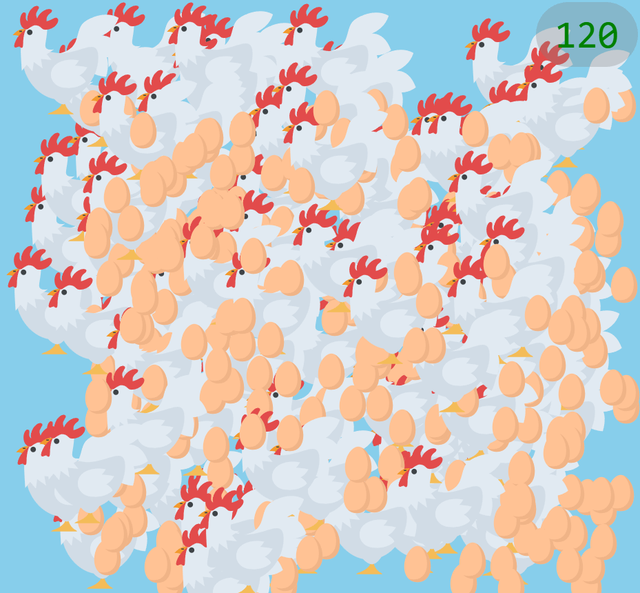

# Project 05: 快乐母鸡 (JS)

> 代码量：**88 Loc**

## 效果图



[在 bi.cool 中查看效果](https://bi.cool/project/KiAudS0)

## 涉及知识点

### 基础知识点

- [A1. HTML 基础](../A1/index.md)
- [A2. CSS 基础](../A2/index.md)
- [A3. JavaScript 基础](../A3/index.md)

### 学习知识点

<!-- 背景、过渡、绝对定位、层叠上下文 / 数学模块、定时器、简单对象 -->

- [B31.2. 图片背景](../B3/B31.md#13-background-image)
- [B31.5. 过渡](../B3/B31.md#15-transition)
- [B33.2. 定位 position](../B3/B33.md#32-position)
- [B41.5. 数学模块](../B4/B41.md#15-math)
- [B42. 定时器](../B4/B42.md)
- [B44.1~2. 简单对象的创建与访问](../B4/B44.md#41-object-creation)

## 制作步骤

TODO

## 完整代码

::: code-group

```html [index.html]
<!DOCTYPE html>
<html lang="zh-CN">

<head>
    <meta charset="UTF-8">
    <meta name="viewport" content="width=device-width, initial-scale=1.0">
    <title>快乐母鸡</title>
    <link rel="stylesheet" href="./style.css">
</head>

<body>
    <div id="counter">000</div>
    <script src="./index.js"></script>
</body>

</html>
```

```css [style.css]
body {
    margin: 0;
    overflow: hidden;
    background-color: #a9d8e6;
    font-family: Arial, sans-serif;
    display: flex;
    justify-content: center;
    align-items: center;
    height: 100vh;
}

.hen,
.egg {
    position: absolute;
    cursor: pointer;
}

.hen {
    width: 100px;
    height: 100px;
    background: url('https://vanilla.cup11.top/hen-egg/hen.png') no-repeat center center;
    background-size: cover;
    transition-property: top, left;
    transition-duration: 1s;
    transition-timing-function: ease-in-out;
}

.egg {
    width: 30px;
    height: 30px;
    background: url('data:image/svg+xml;base64,PHN2ZyB4bWxucz0iaHR0cDovL3d3dy53My5vcmcvMjAwMC9zdmciIHdpZHRoPSIxMjgiIGhlaWdodD0iMTI4IiB2aWV3Qm94PSIwIDAgMTI4IDEyOCI+PHBhdGggZmlsbD0iI2Y4ZDhjMCIgZD0iTTY0IDMuNzhjLTI1LjA5IDAtNDcuMzYgMzIuNjItNDcuMzYgNzAuODljMCAzMS45OSAyMS45NiA0OS41NiA0Ny4zNiA0OS41NnM0Ny4zNi0xNy41NyA0Ny4zNi00OS41NkMxMTEuMzYgMzYuNCA4OS4wOSAzLjc4IDY0IDMuNzgiLz48cGF0aCBmaWxsPSIjZWZiNzhlIiBkPSJNMTAwLjMzIDMwLjE3Yy4zIDE4Ljc4LTQuMzkgMzkuODUtMTYuOTkgNTUuMTZjLTE4LjkxIDIyLjk5LTQ5LjQgMjAuMjQtNjAuOTMgMTQuODFjOC4xNiAxNS43MSAyNC4wNSAyNC4wOSA0MS41OSAyNC4wOWMyNS40MSAwIDQ3LjM2LTE3LjU3IDQ3LjM2LTQ5LjU2YzAtMTYuNjQtNC4yMS0zMi4yMS0xMS4wMy00NC41Ii8+PC9zdmc+') no-repeat center center;
    background-size: cover;
}

#counter {
    z-index: 2;
    position: absolute;
    right: 2rem;
    top: 2rem;
    font-size: 2.5rem;
    background-color: rgba(175, 175, 175, 0.5);
    padding: 0.25rem 0.75rem;
    border-radius: 2rem;
}
```

```js [index.js]
let counter = 0;

function createHen(pos) {
    const hen = document.createElement('div');
    hen.classList.add('hen');
    hen.style.left = pos?.x ?? `${Math.random() * (window.innerWidth - 100)}px`;
    hen.style.top = pos?.y ?? `${Math.random() * (window.innerHeight - 100)}px`;
    document.body.appendChild(hen);
    moveHen(hen);
}

function moveHen(hen) {
    setInterval(() => {
        const x = Math.random() * (window.innerWidth - 100);
        const y = Math.random() * (window.innerHeight - 100);
        hen.style.left = `${x}px`;
        hen.style.top = `${y}px`;
        if (Math.random() < 0.8 / (counter + 1) + 0.2) {
            setTimeout(() => layEggs(hen), 1200);
        }
    }, 2000);
}

function layEggs(hen) {
    const egg = document.createElement('div');
    egg.classList.add('egg');
    egg.style.left = `${parseFloat(hen.style.left)}px`;
    egg.style.top = `${parseFloat(hen.style.top) + 70}px`;
    document.body.appendChild(egg);
    egg.onclick = () => hatchEgg(egg);
}

function hatchEgg(egg) {
    egg.remove();
    createHen({ x: egg.style.left, y: egg.style.top });
    counter++;
    document.getElementById('counter').innerText = counter.toString().padStart(3, '0');
}

createHen();
```

:::
