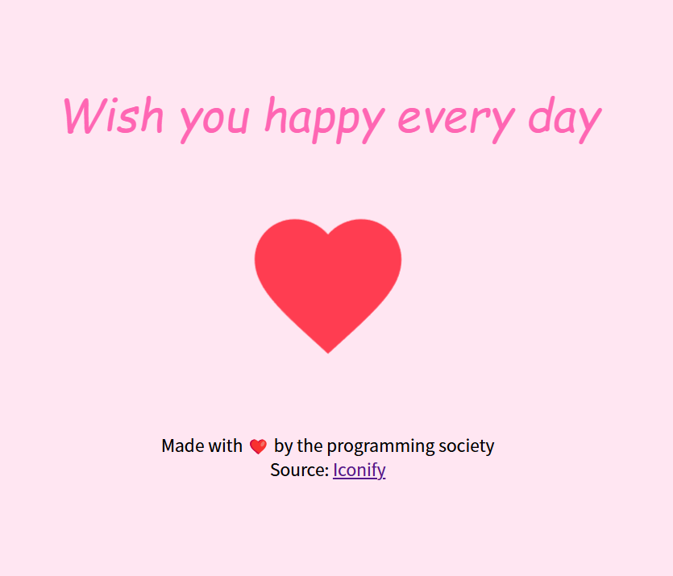
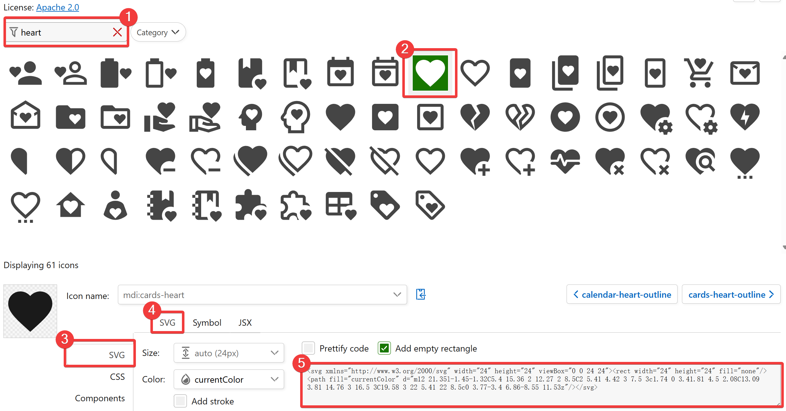

# Special 02: CSS Project (I) 爱心跳动

> 单纯的学习还是有些枯燥的，我们来做些项目吧！第一个项目，我们来做一个跳动的爱心！

::: tip
在本文及此后的项目中，你不必严格遵照本文使用的代码，并且**鼓励进行替换**，加入自己的想法，创造出个性化的项目。
:::

## 效果图



[在 bi.cool 中查看效果](https://bi.cool/project/ClYEAp9)

## 涉及知识点

### 基础知识点

这些知识点是应当预先掌握的，不然此项目可能远超你的能力范围。

- [A1. HTML 入门](../A1)
- [A2. CSS 入门](../A2)

### 学习知识点

这些知识点是可以在做项目时再同步学习的，不需要太过担心。

- [B33. 布局流 定位](../A3/A33.md) / `flex` 布局
- [C53. CSS 动画](../C5/C53.md) / CSS 动画基础

## 制作步骤

### Step 1 / 创建项目结构

> 结构是项目的根本。

目标：完成 HTML、CSS 骨架

- HTML 中，`main` 用于包括页面主要内容（祝福语、爱心）；`footer` 用于包含版权信息等。
- CSS 中，先重置 `padding`、`margin` 以便布局；然后给 `body` 添加基础颜色和文本居中。

:::code-group

```html [index.html]
<!DOCTYPE html>
<html lang="en">

<head>
  <meta charset="UTF-8">
  <meta name="viewport" content="width=device-width, initial-scale=1.0">
  <link rel="stylesheet" href="./style.css">
  <title>Heart</title>
</head>

<body>
  <main>
    <section class="wish">Wish you happy every day</section>
    <section class="svg"></section>
  </main>
  <footer>
  </footer>
</body>

</html>
```

```css [style.css]
body, p {
  margin: 0;
  padding: 0;
} /* CSS Reset */

body {
  background-color: #ffe6f2;
  text-align: center;
}
```
:::

### Step 2 / 添加爱心

> 简单的图标，当然选择矢量图 SVG 啦！

常见的 SVG 图标，可以在 Iconify 中查找。其中 [Material Design Icon](https://icon-sets.iconify.design/mdi/) 是一个很好的开源图表集。

操作如下图：



1. 输入关键字（英文）以筛选
2. 选中你感兴趣的图标
3. 在左边选择 `SVG`
4. 在上方选择 `SVG`
5. 单击代码以复制

在 HTML 中加入以下内容：

```html [index.html]
    <section class="svg">
      <svg xmlns="http://www.w3.org/2000/svg" width="120" height="120" viewBox="0 0 24 24"> <!--[!code ++]-->
        <rect width="24" height="24" fill="none" /> <!--[!code ++]-->
        <path fill="currentColor" d="m12 21.35l-1.45-1.32C5.4 15.36 2 12.27 2 8.5C2 5.41 4.42 3 7.5 3c1.74 0 3.41.81 4.5 2.08C13.09 3.81 14.76 3 16.5 3C19.58 3 22 5.41 22 8.5c0 3.77-3.4 6.86-8.55 11.53z"/> <!--[!code ++]-->
      </svg> <!--[!code ++]-->
    </section>
```

需要注意的是，Material Design Icon 遵循 Apache 2.0 开源协议，需要署名标注。所以我们在 `footer` 中标注：

```html [index.html]
  <footer>
    <p>Made with ❤️ by the programming society</p> <!--[!code ++]-->
    <p>Image source: <a href="https://icon-sets.iconify.design/mdi/">Iconify MDI</a></p> <!--[!code ++]-->
  </footer>
```

### Step 3 / 居中界面

> 让界面上下居中，更加美观。

竖直居中比水平居中更加复杂一些，仅仅用 `text-align` 是不够的。

常见的解决方法是利用 `flex` 布局。

请学习：[B33. 布局流 定位](../A3/A33.md) / `flex` 布局

若将 `flex-direction` 设置为 `column`，就可使元素竖直排列；这时再设置 `justify-content: center;`，即可使元素在主轴方向（竖直方向）居中。

同时，`body` 默认高度是由内容撑开的；若欲使内容在整个界面中居中，就应设置 `height: 100vh;`。

添加代码：

```css [style.css]
body {
  background-color: #ffe6f2;
  text-align: center;
  display: flex; /* [!code ++] */
  flex-direction: column; /* [!code ++] */
  justify-content: center; /* [!code ++] */
  height: 100vh; /* [!code ++] */
}
```

### Step 4 / 创建动画

> 动画是这个项目的核心。让爱心跳起来，让界面充满动感。

请先学习：[C53. CSS 动画](../C5/C53.md) / CSS 动画基础

本项目动画效果主要有两方面：颜色变化、大小变化。

在关键帧定义中，`color` 即可实现颜色变化；大小变化则需要使用 `transform` 属性。

```css [style.css]
section.svg > svg {
  animation: 2s ease heartbeat infinite;
}

@keyframes heartbeat {
  0% {
    transform: scale(0.8);
    color: #FF99CC;
  }
  50% {
    transform: scale(1.2);
    color: #FF0000;
  }
  100% {
    transform: scale(0.8);
    color: #FF99CC;
  }
}
```

### Step 5 / 美化文字样式

### Step 6 / 调试与优化

## 拓展挑战

## 完整代码

:::code-group

```html [index.html]
<!DOCTYPE html>
<html lang="en">

<head>
  <meta charset="UTF-8">
  <meta name="viewport" content="width=device-width, initial-scale=1.0">
  <link rel="stylesheet" href="./style.css">
  <title>Heart</title>
</head>

<body>
  <main>
    <section class="wish">Wish you happy every day</section>
    <section class="svg">
      <svg xmlns="http://www.w3.org/2000/svg" width="120" height="120" viewBox="0 0 24 24">
        <rect width="24" height="24" fill="none" />
        <path fill="currentColor" d="m12 21.35l-1.45-1.32C5.4 15.36 2 12.27 2 8.5C2 5.41 4.42 3 7.5 3c1.74 0 3.41.81 4.5 2.08C13.09 3.81 14.76 3 16.5 3C19.58 3 22 5.41 22 8.5c0 3.77-3.4 6.86-8.55 11.53z"/>
      </svg>
    </section>
  </main>
  <footer>
    <p>Made with ❤️ by the programming society</p>
    <p>Image source: <a href="https://icon-sets.iconify.design/mdi/">Iconify MDI</a></p>
  </footer>
</body>

</html>
```

```css [style.css]
body, p {
  margin: 0;
  padding: 0;
}

body {
  background-color: #ffe6f2;
  text-align: center;
  display: flex;
  flex-direction: column;
  justify-content: center;
  height: 100vh;
}

section.wish {
  font-family: 'Comic Sans MS', tahoma, sans-serif;
  font-style: italic;
  font-size: 2rem;
  color: #ff66b3;
}

section.svg {
  margin: 2.5rem 0;
}

section.svg > svg {
  animation: 2s ease heartbeat infinite;
}

footer {
  font-size: 0.75rem;
}

@keyframes heartbeat {
  0% {
    transform: scale(0.8);
    color: #FF99CC;
  }
  50% {
    transform: scale(1.2);
    color: #FF0000;
  }
  100% {
    transform: scale(0.8);
    color: #FF99CC;
  }
}
```

:::
