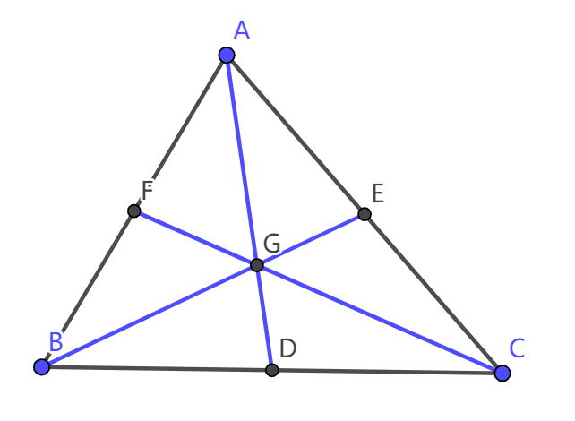
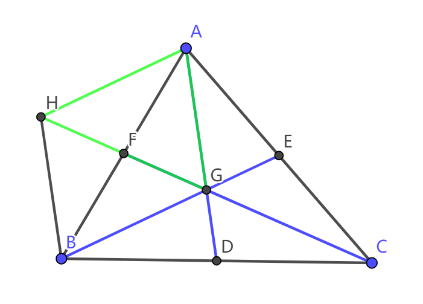

# 三角形三条中线围成的面积

> 初中数学·相似三角形

## 题目

在 $\triangle \text{ABC}$ 中，$\text{AD, BE, CF}$ 分别是 $\text{BC, AC, AB}$ 边上的中线，且三线交于点 $\text{G}$。设 $\text{S}_{\triangle\text{ABC}}=S$，求 $\text{AD, BE, CF}$ 三边围成的三角形面积，用 $\text{S}$ 表示。

来，上图！（就是这三条蓝色的边）：

## 解答

此题解法有很多，这里选取一种计算比较简单的解法：

首先，由三角形重心的性质中“重心到顶点的距离是重心到对边中点的距离的2倍”，可得 $\text{FG}=\frac12\text{CG}$。

由于这三条边并不能简单地组成一个三角形，因此考虑进行平移。

在此之前，由于三条线段太长，先考虑能否放缩。这里当然可以，因为由上述性质，$\frac{\text{AG}}{\text{AD}}=\frac{\text{BG}}{\text{BE}}=\frac{\text{CG}}{\text{CF}}=\frac23$，可以用海伦公式或者三角形的相似证明$\text{AG, BG, CG}$组成的三角形的面积是$\text{AD, BE, CF}$组成的三角形的 $(\frac{2}{3})^2=\frac{4}{9}$。

由于 $\text{F}$ 点是中点，考虑进行中线加倍。
而且恰巧，如果对 $\text{GF}$ 延长（加倍）至 $\text{H}$ 可以使 $\text{CG}$ 转移至 $\text{GH}$。

如图：

通过简单的中线加倍，我们成功地把$\text{CG}$移到了$\text{HG}$，把$\text{BG}$移到了$\text{AH}$。

**这样一来，我们就构造了一个和原来三条边具有强关联性的$\triangle\text{AGH}$**。

接下来就比较简单了：

由于 $\text F$ 是 $\text{HG}$ 的中点，得 $\text{S}_{\triangle\text{AGH}}=2\text{S}_{\triangle\text{AGF}}$。

再由 $\text{D, E, F}$ 三个中点以及 $\text G$ 重心的性质，易推出 $S_{\triangle\text{AGF}}=\frac16 \text{S}_{\triangle\text{ABC}}=\frac16 S$。

因此，$S_{\triangle\text{AGH}}=\frac13 S$。

接下来，由于

> $\text{AG, BG, CG}$ 组成的三角形的面积是 $\text{AD, BE, CF}$ 组成的三角形的 $(\frac{2}{3})^2=\frac{4}{9}$。

这一条结论，以及$\text{AG, BG, CG}$组成的三角形其实就是$\triangle\text{AGH}$，我们可以得出题目的答案为$\frac13 S\div\frac49=\frac34 S$。

因此，有结论：
**三角形的三条中线所围成的三角形的面积，等于原三角形的$\frac34$。**
