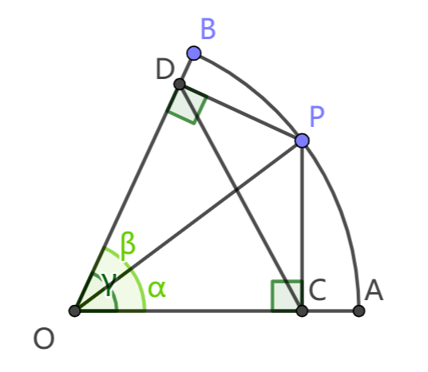

# 几何证明：扇形弧上任意一点到两边的垂线的垂足间的距离为一定值

> 中学数学·平面几何·四点共圆
>
> 高中数学·三角恒等变换·正弦两角和公式

证明：

如图，设 $\angle \text{POA}=\alpha,\ \angle \text{POB}=\beta,\ \angle \text{AOB}=\gamma,\ \text{PO}=r$。 则：

$$
\text{OC}=r\cos\alpha,\ \text{OD}=r\cos\beta,\\
\text{CP}=r\sin\alpha,\ \text{DP}=r\sin\alpha
$$

由 $\angle \text{PDO}+\angle \text{PCO}=180^\circ$ 得 $\text{O,C,P,D}$ 四点共圆。

由托勒密定理得：

$$
\begin{align}
\text{OP}\cdot \text{CD}&=\text{DP}\cdot \text{OC}+\text{OD}\cdot PC\\
r\cdot \text{CD}&=r\sin\alpha\cdot r\cos\alpha+r\cos\beta\cdot r\sin\alpha\\
\text{CD}&=r(\sin\alpha\cos\alpha+\cos\beta\sin\alpha)
\end{align}
$$

由正弦两角和公式 $\sin(\alpha+\beta)=\sin\alpha\cos\alpha+\cos\beta\sin\alpha$ 得

$$\text{CD}=r\sin(\alpha+\beta)=r\sin\gamma$$

由于半径 $r$ 和扇形圆心角 $\gamma$ 都是定值，所以在圆心角不超过180°的扇形中，弧上任意一点到两边的垂线的垂足间的距离为定值，恒为半径与圆心角正弦值的乘积 $r\sin\gamma$。
