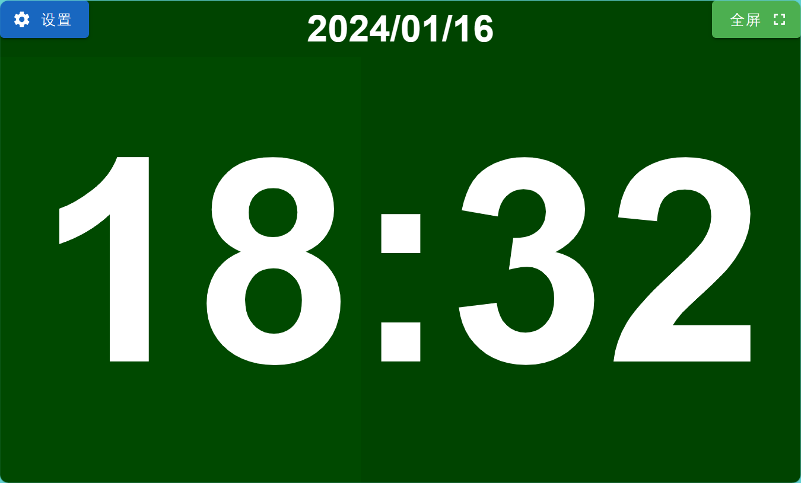

# full-clock 一个开源可配置的全屏网页时钟

## 软件名称

全屏时钟 (full-clock)

## 应用平台

网页（全平台）

## 一句话简介

这是一个开源可配置、可全屏的纯前端网页时钟，适合用于考试等场景。

## 应用简介

本项目起源于考试时没有戴手表的同学提供在电脑上显示时间的功能，但各种网站界面复杂，或是不支持全屏，或是广告太多，因此做了一个网页围绕这个核心应用场景开发。

开发框架：`Vue` (UI: `Vuetify`)

- 已开发功能：
  1. 支持全屏自适应窗口显示时间
  2. 支持显示标题信息
  3. 支持全屏显示
  4. 支持设置秒钟样式（显示数字/关闭/显示为背景条）
  5. 支持设置颜色和字体（由于框架原因暂时只能手动输入）

## 网站

### 开源仓库

[cup113/full-clock (github.com)](https://github.com/cup113/full-clock)

License: Apache-2.0

### 已部署网站

[全屏时钟 (full-clock.netlify.app)](https://full-clock.netlify.app/)

## 预览

> 默认配色：黑板
> 默认显示标题为日期

